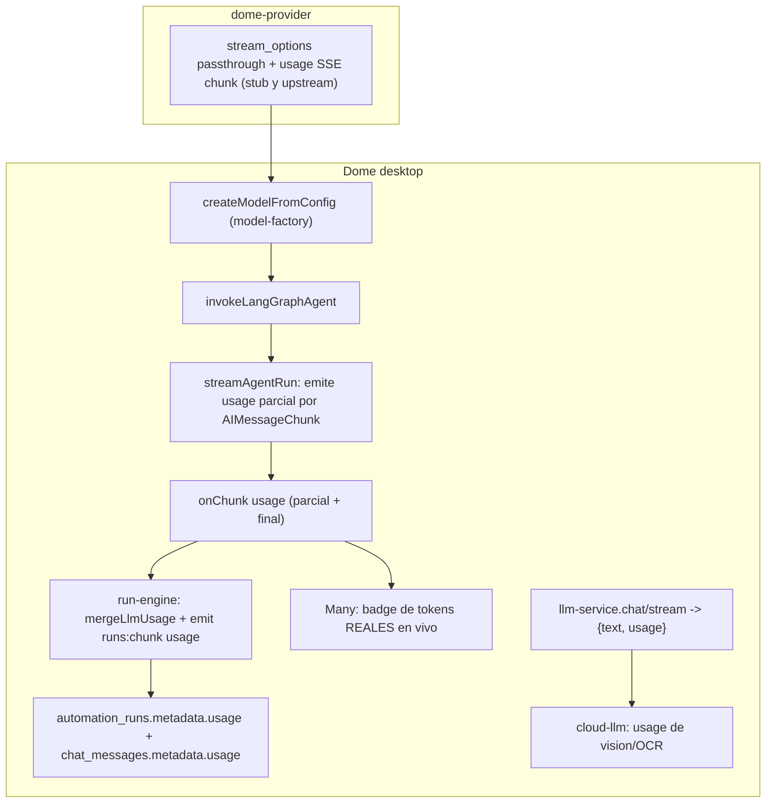

# Auditoría de agente (deepagents/langchain/langgraph) + tokens reales

## Contexto confirmado

Dome usa `langchain.createAgent` (no `deepagents.createDeepAgent`); el stack de middleware está centralizado en [agent-middleware.cjs](electron/agent-middleware.cjs); de deepagents solo se usan `createSkillsMiddleware` y `createFilesystemMiddleware`. El tracking de tokens tiene **dos sistemas distintos** que se confunden:

- **Estimado** (char/4): `measurePrompt` en [prompt-budget.cjs](electron/prompt-budget.cjs) → chunk `budget` → `TokenBudgetBadge` (lo que el usuario ve como "≈ N tok").
- **Real**: `usage_metadata` de los `AIMessage` → `aggregateUsageFromMessages` en [langgraph-agent.cjs](electron/langgraph-agent.cjs) → `metadata.usage` en `automation_runs` → Runs workspace.

### Por qué el consumo real "no funciona" (causas raíz)

1. **Provider `dome`**: [langgraph-agent.cjs](electron/langgraph-agent.cjs) fuerza `streamUsage: false` y `domeFetch` borra `stream_options`; LangChain nunca puebla `usage_metadata` → `aggregateUsageFromMessages` devuelve `null` → cero tokens. (El provider SÍ reenvía el chunk de usage de OpenAI; el `RequestSchema` no es `.strict()`, así que no hay 400 por enviar `stream_options`.)
2. **Solo al final del run**: el usage se emite tras `finalizeFromState`, nunca en vivo; runs en `waiting_approval`/`failed`/`cancelled` lo pierden.
3. **No llega al renderer**: en [run-engine.cjs](electron/run-engine.cjs) el chunk `usage` se acumula pero **no** se reenvía por `runs:chunk` (L1055-1058); `onRunChunk`/`api.ts` ni siquiera tipa `usage`.
4. `**llm-service`/`cloud-llm` descartan usage**: vision, OCR, metadata y `domeStreamChatCompletions` solo leen texto.
5. **UI confunde estimado con real**: `TokenBudgetBadge` muestra heurística, no facturación.

## Arquitectura objetivo (tokens)




---

## Parte A — Informe de hallazgos (documento)

Crear `docs/audits/agent-stack-audit.md` con todos los hallazgos (severidad, archivo:línea, recomendación). Resumen de los bloques:

- **Agent Team** ([ipc/agent-team.cjs](electron/ipc/agent-team.cjs)): tools ignorados (params `_teamToolIds`/`_teamMcpServerIds`, todos los miembros reciben el catálogo completo), `systemInstructions` de miembros no aplicadas, supervisor con `middleware: []` (sin retry/trim/limits), parsing de stream sin normalizar tuplas `[mode, chunk]`, import muerto `humanInTheLoopMiddleware`, sin Langfuse.
- **Subagents** ([async-subagents.cjs](electron/async-subagents.cjs)): `buildSubagentRunner` no recibe `{ provider, store }` (budgets/trim incorrectos, subagent `data` sin filesystem en async); subagents sync sin `skillsMiddleware`.
- **langgraph-agent**: variables muertas `hitInterrupt`; `enableFilesystem: false` engañoso; duplicación ~120 líneas entre `invokeLangGraphAgent` y `resumeLangGraphAgent`.
- **Acoplamiento/ciclos**: `llm-service` importa todo `langgraph-agent.cjs` solo por `createModelFromConfig` (participa en el ciclo lazy `ai-tools-handler → … → tool-dispatcher`); `getAISettings` duplicado en agent-team vs `ipc/ai.cjs`.
- **Deuda menor**: `zod/v3` en todo middleware vs `zod/v4` de deepagents; `FilesystemBackend({ rootDir: os.homedir() })` expone todo el home.

---

## Parte B — Tokens reales de extremo a extremo (núcleo)

### B1. dome-provider (emitir usage de forma robusta)

- [lib/proxy.ts](dome-provider/lib/proxy.ts): en `runProxyChatStream` (ruta stub) emitir un chunk SSE final `{..., usage:{prompt_tokens,completion_tokens,total_tokens}}` antes de `[DONE]` (hoy solo llama `onUsage` interno). La ruta upstream ya reenvía el chunk de OpenAI.
- [route.ts](dome-provider/app/api/v1/chat/completions/route.ts): añadir `stream_options`/`parallel_tool_calls` opcionales al `RequestSchema` (passthrough explícito) y pasarlos a upstream; mantener `include_usage` siempre activo en streaming.

### B2. Desktop — captura real

- **model-factory** (ver Parte C refactor): para `provider === 'dome'` poner `streamUsage: true` y **dejar de borrar** `stream_options` en `domeFetch` (mantener `parallel_tool_calls` si causa 400). Esto hace que LangChain pueble `usage_metadata`.
- [langgraph-agent.cjs](electron/langgraph-agent.cjs) `streamAgentRun`: en modo `messages`, leer `usage_metadata`/`response_metadata` de los `AIMessageChunk` y emitir `onChunk({ type: 'usage', usage, partial: true })` en vivo; mantener la agregación final (`aggregateUsageFromMessages`) como fuente canónica para evitar doble conteo (la final reemplaza, no suma).
- Persistir usage también en interrupt/HITL y en error: agregar usage parcial desde el checkpoint antes de los `return` tempranos (L1248-1259) y en `resumeLangGraphAgent`.

### B3. Desktop — propagación y persistencia

- [run-engine.cjs](electron/run-engine.cjs): en `createRunChunkEmitter`, además de `mergeLlmUsage`, **reenviar** `emit(RUN_CHUNK_CHANNEL, { runId, type:'usage', usage })` (parcial en vivo) y persistir `metadata.usage` también en los paths `waiting_approval`, `failed` y `cancelled` (L1066-1078, L1197+).
- Persistir `usage` en `chat_messages.metadata` en `tryPersistRunAssistantMessage` (hoy solo guarda `mode/runId`).
- [llm-service.cjs](electron/llm-service.cjs): `chat()` y `stream()` devuelven `{ text, usage }` (leer `response.usage_metadata` / agregextraer del último chunk con `streamUsage`).
- [cloud-llm.service.cjs](electron/services/cloud-llm.service.cjs): `domeStreamChatCompletions`/`domeChatCompletions` parsean el chunk `usage`; emitir analítica de usage para vision/OCR/metadata.

### B4. Renderer — UI

- Tipar `usage` en `onRunChunk` ([api.ts](app/lib/db/client.ts)/preload) y manejarlo en [useLangGraphRunStream.ts](app/lib/chat/useLangGraphRunStream.ts) (callback `onUsage`).
- En Many: badge separado de **tokens reales en vivo** (distinto del estimado); etiquetar el actual como "estimado".
- Runs ([RunsWorkspaceView.tsx](app/components/hub/RunsWorkspaceView.tsx)): ya muestra `metadata.usage`; poblar `step.metadata.usage` (hoy `getStepUsageShort` siempre null) y conservar costo USD de [run-cost.ts](app/lib/automations/run-cost.ts).
- Conciliar con cuota del provider en Settings ([AISettingsPanel.tsx](app/components/settings/AISettingsPanel.tsx)).

---

## Parte C — Correcciones de bugs

- **Agent Team** ([ipc/agent-team.cjs](electron/ipc/agent-team.cjs)): `buildMemberDirectTools` respeta `agent.toolIds` + `teamToolIds`/`teamMcpServerIds`; inyectar `agent.systemInstructions` al crear cada miembro; dar al supervisor el stack `worker` (retry/trim/limits); normalizar el stream con `peelLangGraphStreamTuple`; eliminar import muerto; añadir `withLangfuseCallbacks`.
- **Subagents async** ([async-subagents.cjs](electron/async-subagents.cjs)): pasar `{ provider, store }` a `buildSubagentRunner` (paridad con `createSubagentTools`); añadir `skillsMiddleware` a subagents sync/async para coherencia con CLAUDE.md.
- **langgraph-agent**: eliminar `hitInterrupt` muertas; documentar/eliminar `enableFilesystem: false` engañoso.
- **Deuda menor**: alinear `zod` en `createTodoListMiddlewareMaybe`; acotar `FilesystemBackend` rootDir a `~/.dome` si es viable.

---

## Parte D — Refactors

- **Extraer `model-factory.cjs`**: mover `createModelFromConfig`, `domeFetch`, `miniMaxFetch`, `temperatureOptions` a `electron/model-factory.cjs`. `langgraph-agent.cjs` y `llm-service.cjs` importan de ahí → rompe el acoplamiento y reduce el riesgo de ciclo.
- **Deduplicar invoke/resume** en [langgraph-agent.cjs](electron/langgraph-agent.cjs): extraer un helper común para el bloque de streaming/finalize/usage (~120 líneas).
- **Centralizar `getAISettings`**: una sola fuente para agent-team e `ipc/ai.cjs`.

---

## Validación

```bash
pnpm run typecheck && pnpm run lint && pnpm run build
pnpm run check:ipc-inventory && pnpm run depcruise
```

- Probar usage real con `provider=openai` (nativo), `provider=dome` (proxy, tras B1/B2) y un run con HITL/cancelado (persistencia parcial).
- En dome-provider: `pnpm run smoke` (PKCE→token→chat→quota) y verificar `token_ledger`.
- Confirmar en Runs que `metadata.usage` ≈ usage del provider, y que el badge en vivo de Many refleja tokens reales.

## Riesgos / decisiones tomadas

- `provider=dome`: re-habilitar `streamUsage` puede requerir mantener el borrado de `parallel_tool_calls` (no de `stream_options`). Si reaparece el 400, el provider debe aceptar explícitamente esos campos (B1).
- Para no doble-contar: usage en vivo es informativo; la agregación final del checkpoint es la cifra canónica persistida.

