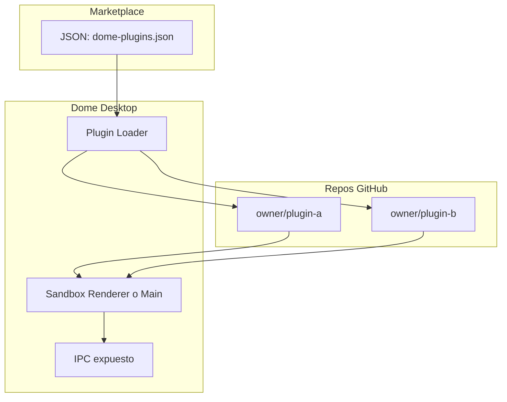

# Plan: Actualizaciones, Plugins y Sincronización Cloud para Dome

## Resumen de Investigación

### Estado actual de Dome

- **Build**: electron-builder v25, targets NSIS (Windows) y DMG+ZIP (macOS)
- **Releases**: GitHub Actions ya crea releases en tags `v*` con artifacts para macOS y Windows
- **Datos**: `app.getPath('userData')` contiene:
  - `dome.db` (SQLite con projects, resources, sources, tags, settings)
  - `dome-files/` (PDFs, imágenes, videos, audio, documentos)
  - `lancedb/` (vectores para búsqueda semántica)
  - `avatars/`, `martin/`, `whatsapp-auth/`, etc.
- **Arquitectura**: Main process (Node.js) + Renderer (Next.js/React) vía IPC estricto

---

## 1. Actualizaciones a Distancia (Auto-Update)

### Enfoque recomendado: electron-updater + GitHub Releases

Dome ya publica en GitHub Releases. Solo falta integrar `electron-updater` para que la app revise y descargue nuevas versiones automáticamente.

**Referencias**:

- [electron.build/auto-update](https://electron.build/auto-update.html)
- Skill `moai-framework-electron` (UpdateService pattern)
- [electron-updater](https://www.electron.build/electron-updater)

### Pasos

1. **Instalar dependencia**: `electron-updater` (runtime, no dev).
2. **Configurar publish en [package.json**](package.json): Añadir `publish` en `build`:
  ```json
   "build": {
     "publish": {
       "provider": "github",
       "owner": "TU_ORG",
       "repo": "dome",
       "private": false
     }
   }
  ```
3. **Crear `electron/update-service.cjs**`: Servicio que:
  - Importa `autoUpdater` desde `electron-updater`
  - Configura `autoDownload: false` (opcional: dejar que el usuario decida cuándo descargar)
  - Escucha eventos: `update-available`, `update-downloaded`, `error`
  - Notifica al renderer vía IPC para mostrar UI de actualización
  - Llama a `autoUpdater.checkForUpdatesAndNotify()` tras `app.ready` (con delay para no interferir con startup)
4. **Workflow de release**: El workflow actual ya sube DMG/ZIP/EXE a GitHub Release. electron-updater usa el archivo `latest.yml` / `latest-mac.yml` que electron-builder genera si el `publish` está configurado. Ajustar el workflow para que electron-builder publique directamente:
  - Configurar `GH_TOKEN` en el job de build
  - Añadir paso de upload de releases con `electron-builder --publish always` (o similar) cuando haya tag
5. **UI en renderer**: Panel en Settings o notificación modal con:
  - "Hay una nueva versión X. ¿Descargar?"
  - Barra de progreso durante la descarga
  - Botón "Reiniciar para instalar"
6. **Preload/IPC**: Nuevos canales: `updater:check`, `updater:download`, `updater:install`, `updater:on-status` (evento).

**Importante**: macOS requiere code signing para que auto-update funcione; Windows NSIS ya es compatible.

---

## 2. Sistema de Plugins con Marketplace y GitHub

### Enfoque: Patrón Obsidian

Obsidian usa:

- Un JSON central (`community-plugins.json`) que lista todos los plugins oficiales
- Cada plugin: `manifest.json`, `main.js`, `styles.css` en su repo
- Descarga desde GitHub Releases (archivo .zip del plugin)

### Arquitectura para Dome




### Opciones de diseño de plugins


| Opción                    | Descripción                                         | Complejidad | Seguridad          |
| ------------------------- | --------------------------------------------------- | ----------- | ------------------ |
| A. UI-only (Tiptap/React) | Plugins solo extienden editor/UI, sin acceso a Node | Baja        | Alta               |
| B. IPC whitelist          | Plugins pueden llamar a canales IPC permitidos      | Media       | Media (validación) |
| C. Main process (worker)  | Plugins corren en proceso separado/main             | Alta        | Requiere sandbox   |


**Recomendación inicial**: Opción A o B. Para un marketplace tipo Obsidian, B permite más funcionalidad (acceso a recursos, DB vía IPC) sin exponer Node directamente.

### Pasos

1. **Definir API de plugins Dome**:
  - `dome-plugin-api` (paquete npm o tipos en repo): interfaz `DomePlugin` con `onLoad()`, `onUnload()`, acceso a `window.dome` (API limitada vía contextBridge).
  - `manifest.json`: `id`, `name`, `author`, `description`, `version`, `minDomeVersion`, `repo` (owner/repo).
2. **Marketplace JSON**:
  - Repo `dome-project/dome-plugins` (o similar) con `plugins.json`:
  - Los desarrolladores envían PR para añadir su plugin (proceso manual o semiautomático).
3. **Descubrimiento vía GitHub** (alternativa o complemento):
  - Buscar repos con topic `dome-plugin` usando GitHub API: `search/repositories?q=topic:dome-plugin`
  - Validar que tengan `manifest.json` y estructura esperada.
4. **Carga de plugins**:
  - Directorio: `userData/plugins/{plugin-id}/`
  - Al "instalar": descargar release desde `https://github.com/{owner}/{repo}/releases/latest` (asset `.zip` del plugin).
  - Cargar `main.js` en un contexto aislado (iframe, webview, o Worker) que tenga acceso solo a `window.dome` (API expuesta).
  - Para acceso a DB/archivos: exponer canales IPC específicos para plugins, por ejemplo `plugin:resources:search`, `plugin:files:read`, etc., con validación de plugin-id.
5. **UI Marketplace**:
  - Pantalla "Plugins" en Settings o ruta dedicada
  - Lista de plugins desde `plugins.json` o GitHub API
  - Botones: Instalar, Desinstalar, Actualizar
  - Indicadores de versión y compatibilidad
6. **Seguridad**:
  - Validar `manifest` antes de cargar
  - No dar a plugins acceso a `require`, `process`, ni Node
  - Sanitizar inputs en handlers IPC usados por plugins

---

## 3. Sincronización en la Nube

### Datos a sincronizar


| Componente       | Ubicación     | Tamaño típico         | Estrategia                   |
| ---------------- | ------------- | --------------------- | ---------------------------- |
| SQLite           | `dome.db`     | KB–MB                 | Sync primario                |
| Archivos         | `dome-files/` | Variable (GB posible) | Sync por demanda o selección |
| LanceDB          | `lancedb/`    | Variable              | Regenerar o sync opcional    |
| Settings/Avatars | Varios        | Pequeño               | Incluir en sync              |


### Opciones evaluadas


| Solución                        | Modelo                                   | Pros                                        | Contras                                                 |
| ------------------------------- | ---------------------------------------- | ------------------------------------------- | ------------------------------------------------------- |
| **Turso Embedded**              | Local-first SQLite con sync              | Bajo latency, offline, Turso gestiona infra | Migrar a libsql, esquema puede requerir ajustes         |
| **Litestream**                  | Replicación WAL a S3/GCS                 | Sin cambios en app, backup continuo         | No es sync bidireccional en tiempo real; restore manual |
| **Sync manual (export/import)** | Usuario exporta e importa en otro equipo | Muy simple, sin backend                     | UX pobre, no automatizado                               |
| **Backend propio (REST)**       | API + almacenamiento (S3, etc.)          | Control total, sync a medida                | Requiere servidor, auth, costes                         |


### Recomendación por fases

**Fase 1 (rápida)**: Export/Import manual

- Añadir "Exportar todo" (SQLite + estructura de dome-files como ZIP o formato propietario) y "Importar" en otro equipo
- Sirve para migraciones puntuales

**Fase 2 (media)**: Turso o similar para SQLite

- Si Dome puede usar [Turso/libsql](https://docs.turso.tech/) con embedded replica, el SQLite se sincroniza automáticamente
- Requiere: migrar de better-sqlite3 a libsql (compatible con SQLite), cuenta Turso
- Los archivos (`dome-files`) se pueden sincronizar por separado (p. ej. con RClone, o un sistema simple de upload a cloud storage)

**Fase 3 (avanzada)**: Backend propio

- Servidor con auth (OAuth/email), almacenamiento de SQLite + archivos
- Sync bidireccional con conflict resolution (CRDTs o last-write-wins según caso)

### Pasos para Fase 1 (Export/Import)

1. **IPC**: `sync:export` y `sync:import`
2. **Export**: Crear ZIP con:
  - `dome.db`
  - `dome-files/` (o una estructura que preserve rutas relativas)
  - `manifest.json` con versión de Dome, checksums opcionales
3. **Import**: Descomprimir en `userData`, verificar integridad, opcionalmente hacer backup previo
4. **UI**: En Settings, sección "Sincronización" con "Exportar datos" e "Importar datos"

---

## Resumen de Skills y Recursos

- **electron-updater**: Documentación en electron.build y skill `moai-framework-electron`
- **Plugins**: Patrón Obsidian ([docs.obsidian.md](https://docs.obsidian.md/Plugins/Getting+started/Anatomy+of+a+plugin)), [obsidian-releases/community-plugins.json](https://github.com/obsidianmd/obsidian-releases/blob/master/community-plugins.json)
- **Cloud sync**: Turso ([docs.turso.tech](https://docs.turso.tech/)), Litestream ([litestream.io](https://litestream.io/))

---

## Orden de Implementación Sugerido

1. **Auto-updates** – Alto impacto, esfuerzo bajo, aprovecha el workflow actual
2. **Export/Import** – Sincronización básica sin backend
3. **Plugins (Fase 1)** – API + manifest + carga simple, sin marketplace público todavía
4. **Marketplace** – Listado `plugins.json` + UI de discovery/install
5. **Cloud sync avanzado** – Turso o backend propio según prioridades

