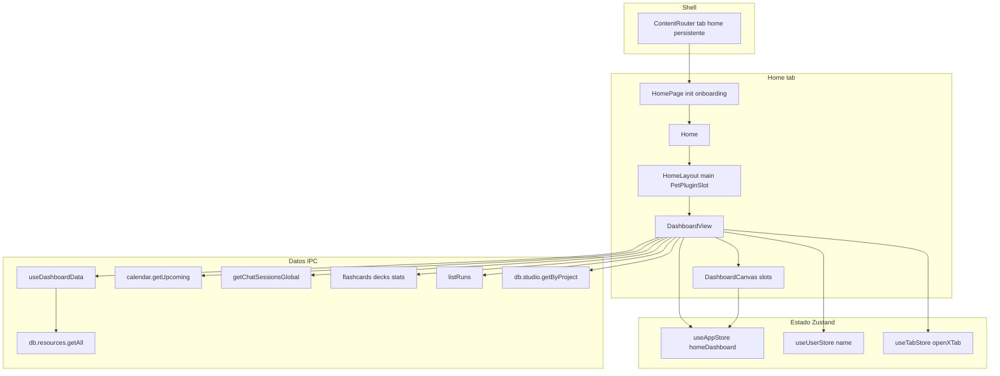

# Diseño detallado — Home Dashboard (pestaña Inicio)

Documento de referencia para **rediseñar** la pestaña **Home** de Dome: el dashboard gamificado del proyecto activo (`type: 'home'` en [`useTabStore`](app/lib/store/useTabStore.ts)). Está alineado en estilo con [`NOTES-SYSTEM-DESIGN.md`](NOTES-SYSTEM-DESIGN.md).

**Última revisión orientada al código:** [`HomePage.tsx`](app/pages/HomePage.tsx), [`DashboardView.tsx`](app/components/home/DashboardView.tsx), [`DashboardCanvas.tsx`](app/components/home/dashboard/DashboardCanvas.tsx), [`useDashboardData.ts`](app/lib/hooks/useDashboardData.ts).

**Alcance explícito:** solo el contenido del tab Home (dashboard + búsqueda inline). No incluye `UnifiedSidebar`, `FolderTabView`, ni componentes legacy no montados (`HomeSidebar`, `FilterBar`, `ResourceCard`, `DocumentToolbar`).

---

## Tabla de contenidos

1. [Resumen ejecutivo](#1-resumen-ejecutivo)
2. [Arquitectura y capas](#2-arquitectura-y-capas)
3. [Modelo de datos y persistencia](#3-modelo-de-datos-y-persistencia)
4. [UI/UX — Contenedor y layout global](#4-uiux--contenedor-y-layout-global)
5. [UI/UX — Apartados del dashboard](#5-uiux--apartados-del-dashboard)
6. [Flujos de usuario](#6-flujos-de-usuario)
7. [Dependencias npm](#7-dependencias-npm)
8. [Internacionalización (i18n)](#8-internacionalización-i18n)
9. [Mapa de archivos](#9-mapa-de-archivos)
10. [Integración con el shell](#10-integración-con-el-shell)
11. [Gaps, deuda y riesgos de rediseño](#11-gaps-deuda-y-riesgos-de-rediseño)
12. [Decisiones de diseño y compensaciones](#12-decisiones-de-diseño-y-compensaciones)
13. [Referencias](#13-referencias)

---

## 1. Resumen ejecutivo

La **Home** en Dome es la pestaña fija **`home`** del shell que muestra un **dashboard configurable**: saludo, meta diaria (hasta 3 “objetivos” gamificados), racha en días, búsqueda unificada opcional, acciones rápidas reordenables, bloques de momentum/heatmap pendientes y “continuar actividad”.

- **Orquestación:** [`DashboardView.tsx`](app/components/home/DashboardView.tsx) concatena datos de proyecto (`currentProject`), preferencias persistentes (`homeDashboard`), y estado local del modo personalización (`isEditing`).
- **Personalización:** el usuario muestra/oculta secciones (excepto el hero), reordena con controles ↑/↓ y gestiona las quick actions — todo persistido como JSON en SQLite bajo la clave `home_dashboard_v1` ([`saveAppPreferences`](app/lib/settings/index.ts)).
- **Datos runtime:** [`useDashboardData`](app/lib/hooks/useDashboardData.ts) agrupa llamadas IPC (recursos, calendario, chats, mazos, runs, studio counts) y se **re-invalida** con eventos `resource:*` y `onRunUpdated`.
- **Tokens:** preferir variables `var(--dome-*)` con fallback a `--primary-text`, `--border`, etc. (coherencia con [`UI-REDESIGN-SPEC.md`](UI-REDESIGN-SPEC.md) y [`docs/features/dome-design-guide.md`](docs/features/dome-design-guide.md)).

---

## 2. Arquitectura y capas

### 2.1 Diagrama



### 2.2 Responsabilidades por capa

| Capa | Archivo(s) | Rol |
|------|-------------|-----|
| Página entrada | [`HomePage.tsx`](app/pages/HomePage.tsx) | Espera preload Electron, `initializeApp`, carga perfil/preferencias, overlay [`Onboarding`](app/components/onboarding/Onboarding.tsx), banner fallback |
| Layout del tab | [`Home.tsx`](app/components/home/Home.tsx), [`HomeLayout.tsx`](app/components/home/HomeLayout.tsx) | Contenedor principal + opcional mascota plugins (`PetPluginSlot`) |
| Orquestador dashboard | [`DashboardView.tsx`](app/components/home/DashboardView.tsx) | `visibleIds`, slots, handlers de navegación/creación, `DashboardCanvas` |
| Canvas personalizable | [`DashboardCanvas.tsx`](app/components/home/dashboard/DashboardCanvas.tsx) | Orden vertical por `layout.y`, modo edición, merge de layout |
| Widgets UI | [`app/components/home/dashboard/*.tsx`](app/components/home/dashboard/) | Hero, momentum, heatmap, pending, continue, labels |
| Hook datos | [`useDashboardData.ts`](app/lib/hooks/useDashboardData.ts) | Agregación, gamificación, `activityDayCounts`, `pendingToday`, `refresh` |
| Preferencias tipadas | [`app/types/index.ts`](app/types/index.ts) (`HomeDashboardPreferences`), [`home-dashboard.ts`](app/lib/settings/home-dashboard.ts) | Normalización, merge layout, serialización |

---

## 3. Modelo de datos y persistencia

### 3.1 Preferencias del dashboard (`home_dashboard_v1`)

Definición TypeScript:

| Campo | Tipo | Uso |
|-------|------|-----|
| `quickActions` | `HomeQuickActionId[]` | Orden visible; valores: `newNote`, `upload`, `newChat`, `learn`, `calendar` |
| `widgets` | `HomeDashboardWidgets` | Booleans por bloque opcional (`momentum`, `weeklyActivity`, `pendingToday`, `search`, `continueActivity`) |
| `layout` | `DashboardLayoutItem[]` | Grid **persistido histórico**; en runtime solo **`y`** y presencia ordenan el stack |

Layout por defecto: [`DEFAULT_DASHBOARD_LAYOUT`](app/types/index.ts) — comentarios en código sugieren grid 12 columnas, pero **`DashboardCanvas` solo usa stack vertical ordenado por `y`**.

[`normalizeHomeDashboardPreferences`](app/lib/settings/home-dashboard.ts): valida IDs, fuerza hero `static`, `hero.y = 0`, deduplica quick actions.

### 3.2 Datos derivados (`useDashboardData`)

| Salida del hook | Origen principal | Notas |
|-----------------|-----------------|-------|
| `stats.resourceCount` | Recursos del `project_id` activo desde `resources.getAll(2000)` | Filtra por proyecto |
| `stats.studioCount` | `db.studio.getByProject(scopedPid)` | **Calculado pero no mostrado** en ningún widget del Home |
| `stats.dueFlashcards` | Suma `due_cards` por mazo del proyecto |
| `stats.upcomingEvents` | `calendar.getUpcoming` ventana 7 días (count lista) |
| `stats.recentChats` | Longitud lista `getChatSessionsGlobal` (`limit`: 80) |
| `activity` | Hasta ~12 ítems: recursos tocados últimos 7 días (`updated_at`) + chats, orden merge |
| `activityDayCounts` | Map `yyyy-mm-dd` → cuenta de “eventos actividad” (creaciones/updates recursos/chats/fechas runs) para heatmap |
| `gamification.streakDays` | `computeStreak` permite **un día hueco inicial** antes de cortar serie |
| `gamification.dailyGoalProgress` | Máximo 3: (creado hoy XOR editado notable) ⊕ chat activo hoy ⊕ run **completed** hoy — ver lógica en hook |
| `gamification.momentumPercent` | Fórmula ponderada sobre creados/touches/chats/completed runs última semana, cap 100 |
| `pendingToday` | Flashcards due (>0 agrupadas), eventos **hoy** en `eventsRaw`, runs `running` / `waiting_approval` / `queued` |

**Suscripciones:** `resource:created`, `resource:updated`, `resource:deleted`, `onRunUpdated` disparan recarga completa del hook.

---

## 4. UI/UX — Contenedor y layout global

### 4.1 Jerarquía visual

```
HomePage (loading / banner error / onboarding)
└── Home
    └── HomeLayout  [flex column, fondo --dome-bg]
        └── main  [flex-1 overflow-y-auto overscroll-contain relative]
            ├── DashboardView
            └── PetPluginSlot  [superposición dentro del mismo main]
```

`DashboardView` internamente:

```
div h-full overflow-y-auto  [bg --dome-bg]
└── mx-auto max-w-5xl px-4 py-8 sm:px-6 sm:py-10
    └── DashboardCanvas
        └── flex flex-col gap-3 → secciones visibles ordenadas
```

### 4.2 Medidas y restricciones

| Aspecto | Valor actual |
|---------|---------------|
| Ancho contenido | `max-w-5xl` (~64rem) centrado |
| Espaciado vertical entre bloques canvas | `gap-3` |
| Hero | `rounded-2xl`, `sm:p-8` dentro de `DomeCard` |
| Secciones típicas | `mb-8` en wrappers `<section>` de widgets hijos |
| Scroll | El viewport scrollea el `<main>` de `HomeLayout` |

### 4.3 Contexto `HomePage` (no widgets)

Spinner de inicialización usa `app.loading` / `app.initializing` y línea debug `debugInfo`; overlay onboarding bloqueante si `needsOnboarding`. Rediseño del core del dashboard puede ignorar estos estados pero conviene conocer stacking con `PetPluginSlot` y errores (`initError` banner fijo superior).

---

## 5. UI/UX — Apartados del dashboard

Plantilla repetida por bloque:

| Campo |
|-------|
| **Componente:** path |
| **Estructura UI:** árbol |
| **Datos:** fuente |
| **Interacciones** |
| **Estados:** loading / vacío |
| **i18n** |
| **Tokens** |
| **Notas rediseño** |

### 5.1 Hero (`DashboardHero.tsx`)

**Componente:** [`app/components/home/dashboard/DashboardHero.tsx`](app/components/home/dashboard/DashboardHero.tsx)

**Estructura UI:**

```
DomeCard
├── Fila: h1 saludo [, nombre]; p fecha; DomeButton personalize/done
└── Meta: label goal_today
    └── Fila: columna izq texto + DomeProgressBar; derecha badge racha (Flame + número + streak_label)
```

**Datos:**

- `nameFirst`: primer token del nombre en perfil usuario.
- `gamification.{dailyGoalProgress,dailyGoalTarget,streakDays}` de `useDashboardData`.
- `loading`: skeleton rectangular sobre texto de meta + barra; oculta badge racha.

**Interacciones:** botón cambia modo edición del padre (`onStartCustomize` / `onDoneEditing`) — único punto de entrada/salida visible en pantalla principal.

**i18n:** `dashboard.greeting_morning|afternoon|evening`, `dashboard.customize_home`, `dashboard.edit_mode_done`, `dashboard.goal_today`, `dashboard.goal_progress` (`{{current}}`, `{{target}}`), `dashboard.streak_label`.

**Tokens:** `--dome-border/surface/text/text-secondary/text-muted/accent/bg` con fallbacks estándar.

**Notas rediseño:**

- La **fecha larga** usa `toLocaleDateString(undefined, …)` → idioma/siglas dependen del **sistema**, no de `i18n` (`react-i18next`).
- Hero **no tiene flag** `widgets.*`; siempre existe en `slots.hero`.

---

### 5.2 Búsqueda inline (`InlineSearch` en slot `search`)

**Componente:** [`app/components/Search/SimpleSearch.tsx`](app/components/Search/SimpleSearch.tsx) — export `InlineSearch`.

**Estructura UI:**

```
div.relative
├── Barra input (icono Search, input, ⌘K hint desktop, spinner o clear)
└── Dropdown absoluto cuando focused && query no vacío
    └── grupos resource | interaction | studio | graph (solo si tienen datos)
```

**Datos:**

- Llamadas `window.electron.db.search.unified(query)` (+ orden híbrido `orderUnifiedResourcesByHybrid` sobre recursos).
- Categoría `graph` prevista en iteración pero la población efectiva viene del payload unificado (**puede estar vacío** habitualmente si el backend no la rellena).
- Telemetría `recordSearchResultSelected` con `surface: 'inline_home'`.

**Interacciones:**

- Selección → `onResourceSelect({ id,type,title })` en `DashboardView` abre recurso/carpeta.
- ⌘K: evento window `dome:focus-inline-search` (documentado en comentarios del archivo; debe alinearse con `AppShell`).
- Escape cierra dropdown y borra estado.

**Estados:**

- Spinner mientras hay query y petición pendiente (`debounce` 250ms).
- Dropdown “sin resultados” / “Buscando…” con **texto en español literal** dentro del JSX (gap i18n severo fuera del es).

**i18n:**

- Principal: `dashboard.search_placeholder` (+ fallback español `'Buscar recursos…'` en el JSX).
- `dashboard.untitled_note` aparece también en otros caminos dentro de SimpleSearch para títulos.

**Tokens:** superficie/busca foco `--dome-surface`, borde/accent `--dome-accent`, `--dome-border`, texto `--dome-text*`.

**Notas rediseño:**

- Impacto lateral: mismo componente/recurrencia pueden usarse en otras vistas; cualquier redesign visual debe decidir alcance (`surface` discriminador).
- Búsqueda de chats está **comentada** hasta exista IPC (`db.search.chats`).

---

### 5.3 Acciones rápidas (`DashboardQuickActions.tsx`)

**Componente:** [`app/components/home/dashboard/DashboardQuickActions.tsx`](app/components/home/dashboard/DashboardQuickActions.tsx)

**Estructura UI:**

```
<section>
  DashboardSectionLabel → quick_actions
  grid 1→2→3 DomeButton[h-auto] por id
```

**Datos:** `orderedIds` desde `preferences.quickActions`. Si array vacío, `DashboardView` no pasa slot → no se renderiza junto canvas.

**Interacciones mapping en `DashboardView`:**

| id | Acción técnica |
|----|----------------|
| `newNote` | `db.resources.create` nota vacía + `openResourceTab` |
| `upload` | `selectFiles` + `resource.importMultiple` + toasts dupes |
| `newChat` | `session_${Date.now()}` + `openChatTab` |
| `learn` | `openLearnTab` |
| `calendar` | `openCalendarTab` |

**i18n:**

- Etiquetas: `dashboard.action_new_note`, `…_upload`, `…_new_chat`, `…_learn`, `…_calendar`.
- Subtítulos: `dashboard.action_*_desc`.

**Tokens:** primera acción primaria usa texto blanco/80 sobre botón `--accent`; resto `--tertiary-text` para descripción.

---

### 5.4 Momentum (`DashboardMomentum.tsx`)

**Componente:** [`app/components/home/dashboard/DashboardMomentum.tsx`](app/components/home/dashboard/DashboardMomentum.tsx)

**Estructura UI:** etiqueta `section_momentum` + grid `2cols→4cols` de `MiniStat` (`DomeCard` + ícono + número + label).

**Datos:**

1. `%` momentum desde `gamification.momentumPercent`
2. `stats.resourceCount`, `recentChats`, `dueFlashcards`

**Estados:** `loading` pone pulsos sólo sobre el valor grande (primer stat usa loading tambien).

**i18n:** `dashboard.section_momentum`, `dashboard.momentum_label`, `dashboard.stat_resources`, `dashboard.stat_chats`, `dashboard.stat_flashcards`.

**Notas:** `stat_studio` / `stat_events` existen en `i18n` pero este widget **no** los usa (ver §11).

---

### 5.5 Actividad semanal (`DashboardWeeklyActivity.tsx`)

**Componente:** [`app/components/home/dashboard/DashboardWeeklyActivity.tsx`](app/components/home/dashboard/DashboardWeeklyActivity.tsx)

**Estructura UI:**

- Etiquetas de mes sobre **18 semanas** (columnas flex), filas Lun–Dom con labels solo Lun/Mié/Vie.
- Celdas `div` dentro de `Tooltip` de `@mantine/core` con `heatmap_tooltip`.
- Leyenda nivel 0–4 “Menos / Más”.
- Skeleton 140px en loading.

**Datos:**

- Umbral nivel: `{0},{1-2},{3-5},{6-9},{10+}` via `levelForCount`.
- Rango: últimas 18 semanas completas relativas al lunes local; “futuras” aparecen lavadas/opacidad 0.38.

**i18n:** `dashboard.section_activity_grid`, `heatmap_aria`, `heatmap_tooltip`, `heatmap_less/more`, `weekday_*_short`.

---

### 5.6 Para hoy (`DashboardPending.tsx`)

**Componente:** [`app/components/home/dashboard/DashboardPending.tsx`](app/components/home/dashboard/DashboardPending.tsx)

**Estructura UI:**

- Lista `ul` grid responsive de botones con iconografía por `kind` (`flashcards`|`calendar`|`run`), chevron, subtítulo sólo si run con estado `subtitle`.

**Datos:** `pendingToday[]` ordenados por tiempo ascendente antes de cortar (`slice(0,8)` fuera pero preparación orden en hook).

**Interacciones (padre):**

| kind | Navega a |
|------|----------|
| `flashcards` | `openLearnTab` |
| `calendar` | `openCalendarTab` |
| `run` | `openAgentsTab` (**no navega por `refId`** en handler actual — ver gap) |

**Estados:**

- Lista vacía: card con `dashboard.pending_empty`.
- Loading: skeleton 4 tiles + `common.loading` sr-only.

**i18n:** `dashboard.section_pending`, `pending_flashcards` (`{{count}}`), `pending_event`, `pending_run`, `pending_empty`.

---

### 5.7 Continuar actividad (`DashboardActivityContinue.tsx`)

**Componente:** [`app/components/home/dashboard/DashboardActivityContinue.tsx`](app/components/home/dashboard/DashboardActivityContinue.tsx)

**UI:** lista hasta **8** actividades combinadas orden global (padre corta después de fusionar hasta 12, widget sólo muestra primeros 8 en render actual — verificar slicing en hook: fusion a 12, widget slice 0..8).

**Datos:**

- Chips `ActivityItem.kind` `'resource'` o `'chat'`.
- Timestamp mostrado vía [`formatDistanceToNow`](app/lib/utils/formatting.ts) (wrapper interno sobre fechas relativas).

**Interacciones:** `disabled` cuando falta id clave (`resourceId`/`sessionId`). Click abre pestaña recurso/carpeta o chat.

**i18n:** `dashboard.section_continue`, `dashboard.no_activity`, `dashboard.no_recent_hint`, `common.loading`.

---

### 5.8 Modo personalización (`DashboardCanvas.tsx`)

**Componente:** [`app/components/home/dashboard/DashboardCanvas.tsx`](app/components/home/dashboard/DashboardCanvas.tsx)

**Comportamiento:**

- Construye `orderedSectionIds` = `hero` + resto ordenado por map `layout[y]`.
- `visibleSections`: intersección con `visibleIds` y slot no `undefined`.

**Panel edición:**

- Dos columnas: widgets (lista con GripVertical ornament), quick actions (↑/↓, quitar, añadir dashed).
- Cada bloque visible en modo edición tiene barra dashed superior con mismos mover/ocultar (excepto hero).

**Ocultamiento:**

| id sección | Puede ocultarse vía `widgets` |
|------------|-------------------------------|
| `hero` | No |
| `search` | Sí (`widgets.search`) → `DashboardView` también excluye slot |
| `quickActions` | Indirecto (`quickActions.length === 0` en padre — no booleans en `widgets`) |
| otros map keys | mediante `widgets.*` cuando `widgetKeyForId(id)` no null |

**Merge layout:** [mergeLayoutAfterGridChange](app/lib/settings/home-dashboard.ts) reescribe todas las IDs conocidas usando pseudo grid al reordenar secciones (ancho alto fijos sintéticos `w=12,h=5`).

**Notas rediseño críticas:**

- Copy `edit_mode_hint` y `drag_hint` mencionan **drag/resize**, pero UX real = **solo botones**.
- Íconos `GripVertical` son ornamentales (**no draggable**).

---

### 5.9 Etiqueta de sección (`DashboardSectionLabel.tsx`)

**Componente:** [`app/components/home/dashboard/DashboardSectionLabel.tsx`](app/components/home/dashboard/DashboardSectionLabel.tsx)

Wrap [`DomeSectionLabel`](app/components/ui/DomeSectionLabel.tsx) compacto con clase `tracking-widest text-[var(--dome-text-muted…)]`.

---

## 6. Flujos de usuario

### 6.1 Primera apertura

1. Splash init `HomePage` hasta `initializeApp` resuelva.
2. `loadPreferences` hidrata `homeDashboard`; si tabla vacía ⇒ defaults desde tipos/normalizer.
3. `useDashboardData` ejecuta primera carga paralela IPC.
4. Se pinta Hero + widgets según prefs.

### 6.2 Personalizar inicio

1. Usuario pulsa “Customize home” (`DashboardHero`).
2. `DashboardView` → `isEditing=true`.
3. Aparecen panel superior + bordes dashed en secciones.
4. Cambios llaman `updateHomeDashboard`:
   ```
   normalize → saveAppPreferences({ homeDashboard }) → set estado local store
   ```
5. Pulsa Done → ocultar UI edición pero preferencias persisten.

### 6.3 Acciones rápidas

Ver tabla §5.3.

### 6.4 Continuar / Pendiente → destino

- Continuar recurso/clic chat abre nuevo tab mediante `openResourceTab`/`openFolderTab`/`openChatTab`.
- Pendiente hoy navega vistas macro (learn/calendar/agents) pero **sin deep link granular** garantizado para runs/events.

### 6.5 Búsqueda

Debounced unified search → clic resultado → cerrar dropdown + navegar recurso/nota/pdf según tipo.

---

## 7. Dependencias npm

| Dependencia | Uso en Home dashboard |
|-------------|-----------------------|
| `lucide-react` | Íconografía en todos los widgets + canvas edit |
| `@mantine/core` | `Tooltip` heatmap |
| `@/components/ui/Dome*` | Card, Button, ProgressBar, SectionLabel |
| utilidades proyecto | [`formatDistanceToNow`](app/lib/utils/formatting.ts) vía `@/lib/utils` (strings relativos **fijos en español** dentro del helper) |

(No introduce HTTP lib propia — todo IPC.)

---

## 8. Internacionalización (i18n)

Textos definidos en [`app/lib/i18n.ts`](app/lib/i18n.ts) dentro del objeto **`dashboard`** para **en / es / fr / pt**.

### 8.1 Claves usadas efectivamente por el dashboard actual + InlineSearch Home

Lista (prefijo omitido):

- `greeting_morning`, `greeting_afternoon`, `greeting_evening`
- `customize_home`, `edit_mode_done`
- `goal_today`, `goal_progress`, `streak_label`
- `quick_actions`
- `action_new_note`, `action_upload`, `action_new_chat`, `action_learn`, `action_calendar` + todas `action_*_desc`
- `action_label_newNote`, `_upload`, `_newChat`, `_learn`, `_calendar` (canvas)
- `section_momentum`, `momentum_label`, `stat_resources`, `stat_chats`, `stat_flashcards`
- `section_activity_grid`, `heatmap_*`, `weekday_*_short`
- `section_pending`, `pending_*`, `pending_flashcards`
- `section_continue`, `no_activity`, `no_recent_hint`
- `edit_mode_hint`, `customize_widgets`, `customize_quick_actions`, `layout_label_*`
- `move_up`, `move_down`, `hide_widget`, `show_widget`, `drag_hint`
- `untitled_note` (DashboardView creación + SimpleSearch fallback títulos)
- `search_placeholder` (InlineSearch)
- Fallback inline `action_new_chat` en `DashboardView` al abrir chat legacy label

Otros objetos fuera (`common.loading`) para skeletons.

### 8.2 Claves `dashboard.*` presentes en JSON pero sin uso evidente en `app/components/home/**`

Útiles para backlog de contenido/UI u obsolescencia candidata (`activity`, `stat_studio`, `stat_events`, acciones/agents/settings antiguos, ayudas `customize_widgets_help`, `widget_*`, `section_weekly`, series `weekly_*`, etc.). Un rediseño puede **eliminar**, **reasignar** o **pulir** estos textos.

### 8.3 Gaps conocidos fuera del namespace dashboard

Dropdown `InlineSearch` contiene español literal ("Sin resultados…", “Buscando…”, prefijo `"En:`").

---

## 9. Mapa de archivos

| Ruta | Rol |
|------|-----|
| [`app/pages/HomePage.tsx`](app/pages/HomePage.tsx) | Init + onboarding overlay |
| [`app/components/home/Home.tsx`](app/components/home/Home.tsx) | Puente dashboard |
| [`app/components/home/HomeLayout.tsx`](app/components/home/HomeLayout.tsx) | Main + mascot |
| [`app/components/home/DashboardView.tsx`](app/components/home/DashboardView.tsx) | Ensambla datos + navegación |
| [`app/components/home/dashboard/DashboardCanvas.tsx`](app/components/home/dashboard/DashboardCanvas.tsx) | Edición/stack |
| [`app/components/home/dashboard/DashboardHero.tsx`](app/components/home/dashboard/DashboardHero.tsx) | Cabecera |
| [`…/DashboardQuickActions.tsx`](app/components/home/dashboard/DashboardQuickActions.tsx) | Atajos |
| [`…/DashboardMomentum.tsx`](app/components/home/dashboard/DashboardMomentum.tsx) | KPIs compactos |
| [`…/DashboardWeeklyActivity.tsx`](app/components/home/dashboard/DashboardWeeklyActivity.tsx) | Heatmap |
| [`…/DashboardPending.tsx`](app/components/home/dashboard/DashboardPending.tsx) | Lista urgencias |
| [`…/DashboardActivityContinue.tsx`](app/components/home/dashboard/DashboardActivityContinue.tsx) | Recientes |
| [`…/DashboardSectionLabel.tsx`](app/components/home/dashboard/DashboardSectionLabel.tsx) | Títulos sección |
| [`app/components/Search/SimpleSearch.tsx`](app/components/Search/SimpleSearch.tsx) | InlineSearch integrado Home |
| [`app/lib/hooks/useDashboardData.ts`](app/lib/hooks/useDashboardData.ts) | Agregaciones |
| [`app/lib/settings/home-dashboard.ts`](app/lib/settings/home-dashboard.ts) | Normalización layout/preferences |
| [`app/lib/store/useAppStore.ts`](app/lib/store/useAppStore.ts) | Persistencia estado app |
| [`app/globals.css`](app/globals.css) | Clusters `.dashboard-*` legacy (+ `.filter-bar` relacionados vistas antiguas) |

---

## 10. Integración con el shell

| Concepto | Detalle |
|---------|---------|
| Tab id | `'home'` constante `HOME_TAB_ID` |
| Persistencia montaje | `PERSISTENT_TAB_TYPES` incluye `'home'` — no se desmonta al cambiar pestaña (mantener scroll/inputs) ([`ContentRouter`](app/components/shell/ContentRouter.tsx)) |
| Proyecto activo | Datos dashboard filtran `currentProject.id` fallback `'default'` |
| Atajo foco buscador | CustomEvent `dome:focus-inline-search` (comentarios en InlineSearch deben estar alineados con implementación [`AppShell`](app/components/shell/AppShell.tsx)) |

---

## 11. Gaps, deuda y riesgos de rediseño

1. **Copy vs realidad UX edición**: arrastrar/redimensionar anunciados en texto, implementación sólo ↑/↓.
2. **Layout grid zombie**: persisten `x,w,h,minW,...` pero el render sólo ordena verticalmente usando `y` e IDs.
3. **Métrica Studio oculta:** `studioCount` nunca llega UI Home.
4. **Fecha hero no localizada por i18n** (depende navegador / locale sistema).
5. **Mezcla tokens** `--dome-*` vs fallbacks puede crear inconsistencias sutiles modo claro/oscuro al rediseñar.
6. **CSS clase `.dashboard-empty-state`** en [`globals`](app/globals.css) — **grep no encontró JSX que la use actualmente**: candidata a cleanup o nuevo empty state reusable.
7. **InlineSearch i18n mezcla idiomas**.
8. **`PendingToday` clic run** no diferencia automatización puntual mediante `refId` (solo abre vista agentes macro).
9. **Tiempos relativos en “Continuar”:** `formatDistanceToNow` en [`formatting.ts`](app/lib/utils/formatting.ts) devuelve frases tipo “hace 2 días” **siempre en español**, independiente de `i18n` → prioridad alta en un rediseño multidioma del Home.
10. **`recordSearchResultSelected`** asume formato analytics — cualquier nueva superficie debe mantener `surface`.

---

## 12. Decisiones de diseño y compensaciones

| Decisión | Motivo código / producto |
|----------|---------------------------|
| Stack vertical liviano sin react-grid-layout | Comentarios en `DashboardCanvas` — menor complejidad, siempre usable en pantallas estrechas |
| Gamificación capada a 3 metas binarias día | Ligereza UX; usuarios heavy pueden percibir falsos positivos (“edité recurso grande” igual peso que micro cambio tras umbral tiempo) |
| Hero inamovible/nuclear | Marca bienvenida + acceso garantizado al modo personalize |
| Recarga completa hook tras eventos | Simplicidad; posible jitter performance en grandes bibliotecas (riesgo conocido futuro perf) |

---

## 13. Referencias

- [`NOTES-SYSTEM-DESIGN.md`](NOTES-SYSTEM-DESIGN.md)
- [`UI-REDESIGN-SPEC.md`](UI-REDESIGN-SPEC.md)
- [`docs/features/dome-design-guide.md`](docs/features/dome-design-guide.md)
- [`AGENTS.md`](AGENTS.md) / [`CLAUDE.md`](CLAUDE.md) — proceso IPC/renderer

---

*Fin del documento de diseño del Home Dashboard.*
