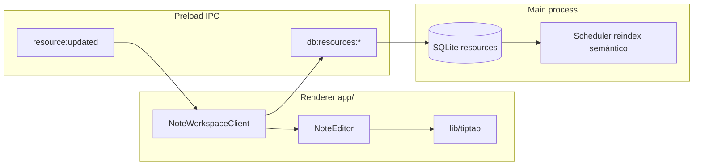
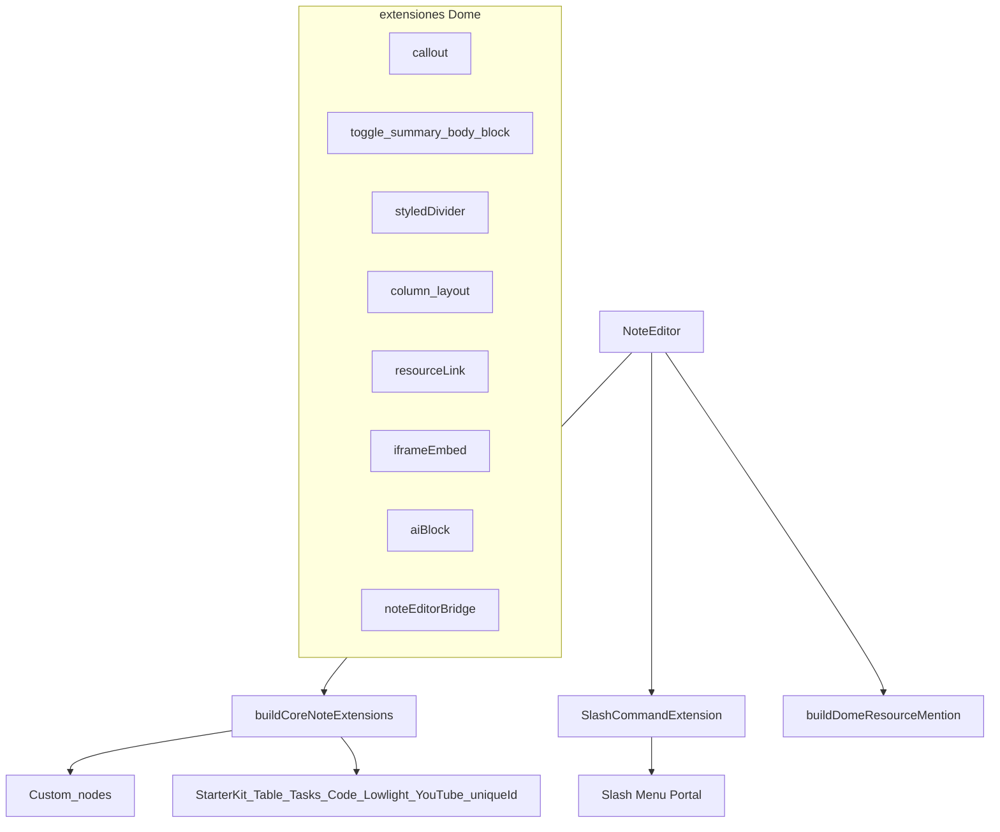

# Diseño detallado — Sistema de notas (TipTap)

Documento de referencia para el subsistema de **notas rich-text** de Dome (`resources.type === 'note'`). Actualiza conceptualmente contenido que quedó obsoleto en [`docs/features/editor.md`](docs/features/editor.md).

**Última revisión orientada al código:** `NoteEditor`, `NoteWorkspaceClient`, `app/lib/tiptap/*`.

---

## Tabla de contenidos

1. [Resumen ejecutivo](#1-resumen-ejecutivo)
2. [Arquitectura y capas](#2-arquitectura-y-capas)
3. [Modelo de datos y persistencia](#3-modelo-de-datos-y-persistencia)
4. [UI/UX — Workspace y modos](#4-uiux--workspace-y-modos)
5. [UI/UX — Interacciones del editor](#5-uiux--interacciones-del-editor)
6. [Catálogo de comandos slash (`/`)](#6-catálogo-de-comandos-slash)
7. [Catálogo de bloques TipTap](#7-catálogo-de-bloques-tiptap)
8. [Flujos de usuario](#8-flujos-de-usuario)
9. [Dependencias npm](#9-dependencias-npm)
10. [Internacionalización (i18n)](#10-internacionalización-i18n)
11. [Mapa de archivos](#11-mapa-de-archivos)
12. [Integración con agentes IA](#12-integración-con-agentes-ia)
13. [Fuera de alcance](#13-fuera-de-alcance)
14. [Decisiones de diseño y compensaciones](#14-decisiones-de-diseño-y-compensaciones)
15. [Referencias](#15-referencias)

---

## 1. Resumen ejecutivo

Una **nota** en Dome es un recurso SQLite (`resources`) cuyo campo `content` almacena, de forma **canónica**, un documento TipTap como **cadena JSON** (`{"type":"doc", ...}`).

- **Experiencia:** inspiración tipo Notion/Docmost: columna centrada en modo `.focused`, comandos slash (`/`), menciones `@`, manijas de bloque, toolbar flotante y menú contextual (bubble) sobre la selección.
- **Persistencia:** no hay autosave por teclado; el usuario guarda explícitamente con **Cmd/Ctrl+S** o el botón de guardado en [`WorkspaceHeader`](app/components/workspace/WorkspaceHeader.tsx). El **título** se persiste al **blur** del campo editable.
- **Shell:** las notas viven como pestañas en el mismo shell que el resto del workspace (`SourcesPanel`, `StudioPanel`, [`SidePanel`](app/components/workspace/SidePanel.tsx), split para referencias).
- **Tokens y marca:** usar variables Dome (`var(--dome-text)`, `var(--dome-accent)`, etc.) descritas en [`docs/features/dome-design-guide.md`](docs/features/dome-design-guide.md).

---

## 2. Arquitectura y capas

### 2.1 Diagrama de datos y eventos



### 2.2 Responsabilidades por capa

| Capa | Artefactos | Rol |
|------|------------|-----|
| Workspace | [`NoteWorkspaceClient.tsx`](app/components/notes/NoteWorkspaceClient.tsx) | Carga/guardado, estado dirty/saving, shortcuts, paneles laterales, registro como fuente activa IA |
| Editor | [`NoteEditor.tsx`](app/components/editor/NoteEditor.tsx), [`NoteToolbar.tsx`](app/components/editor/NoteToolbar.tsx) | TipTap, menús, modales pickers/embed, menciones |
| TipTap core | [`extensions.ts`](app/lib/tiptap/extensions.ts), [`slash-commands.ts`](app/lib/tiptap/slash-commands.ts), `extensions/*.ts` | Lista de extensiones, comandos slash, nodos Dome |
| Serialización | [`utils.ts`](app/lib/tiptap/utils.ts) | `serializeNoteContent` (JSON), `loadNoteContent` (upgrade legacy/markdown → HTML TipTap inicial) |
| Estado global relacionado | [`useTabStore.ts`](app/lib/store/useTabStore.ts), [`useAppStore.ts`](app/lib/store/useAppStore.ts) | Tabs/split (`openResourceInSplit`), paneles Sources/Studio, IDs de fuentes seleccionadas |
| IPC | Dominio **`db`** (no existe `notes:`) | `window.electron.db.resources.getById` / `.update`; evento `window.electron.on('resource:updated', …)` |
| Persistencia física | `electron/ipc/database.cjs` + SQLite | Una fila en `resources` por nota |

**No existe** un store dedicado `useNoteStore`: el ciclo de vida del contenido vivo sigue siendo refs + estado local del workspace.

---

## 3. Modelo de datos y persistencia

### 3.1 Recurso `note`

Las notas **no tienen tabla propia**. Son filas en `resources` con `type = 'note'` (consultar también [`docs/features/resources.md`](docs/features/resources.md) para el modelo general de ficheros/uso de `userData`).

Campos más relevantes:

| Campo | Uso |
|-------|-----|
| `id` | Identificador estable |
| `project_id` | Proyecto activo; filtra pickers y menciones |
| `title` | Título de la nota; guardado on blur |
| `content` | **String JSON** del documento TipTap |
| `folder_id` | Jerarquía en biblioteca |
| `metadata` | JSON adicional (enlaces, tags, etc. según producto) |

### 3.2 Formato de `content`

- **Canónico:** JSON TipTap (`type: "doc"` en raíz). Tras el primer guardado desde un documento migrado, el almacenamiento queda normalizado a este formato (ver comentarios en `loadNoteContent`).
- **Legacy / agente:** `loadNoteContent` admite:
  1. JSON TipTap válido (se usa tal cual, salvo heurística de “markdown crudo dentro de párrafos”).
  2. Parrafos con tablas markdown “planas” → se recompone vía `markdownToHtml`.
  3. Markdown o texto plano → `markdownToHtml` para la primera carga.

`serializeNoteContent` hace `JSON.stringify(editor.getJSON())` — no se persiste HTML como formato principal.

### 3.3 Relaciones y búsqueda

- **Backlinks / grafo:** según features del producto vía DB (`getBacklinks`, etc.); el panel lateral (`SidePanel`) consume el recurso actual.
- **Menciones:** búsqueda de recursos para `@` (IPC de menciones en dominio `db` — `searchForMention` en la capa de base de datos).
- **Reindex semántico:** al actualizar un recurso, el proceso principal puede programar reindexación; el texto plano para embeddings se deriva del JSON ProseMirror en servicios de main (no en renderer).

---

## 4. UI/UX — Workspace y modos

### 4.1 Jerarquía visual

```
NoteWorkspaceClient
├── WorkspaceHeader (título, guardar, split, popout, metadatos)  [oculto si compact]
├── NoteToolbar (variante focused; solo si editor listo y !readOnly)
├── NoteEditor
├── SourcesPanel / StudioPanel / StudioOutputViewer (según flags en useAppStore)
└── SidePanel + MetadataModal
```

### 4.2 Modos de presentación

| Modo | Cómo se activa | Comportamiento |
|------|----------------|----------------|
| Pestaña normal | `ContentRouter` → `case 'note'` | Header completo, edición si no es referencia |
| Referencia en split | `referenceMode` en [`ContentRouter.tsx`](app/components/shell/ContentRouter.tsx) → `readOnly={true}`, `compact={true}` | Sin header compact ni toolbar (`!compact`): header oculto; nota solo lectura en panel de referencia |
| Ventana popout | Ruta `/focus/note/:id` → [`NoteFocusPage.tsx`](app/pages/NoteFocusPage.tsx) | Sin `AppShell` (sin tabs/sidebar principal); mismo `NoteWorkspaceClient`; `document.title` sincronizado con título |

En **todas** las instancias actuales de `NoteWorkspaceClient` el editor recibe **`focused`** (valor booleano verdadero implícito en JSX): la clase `.note-editor-wrapper.focused` aplica tipografía centrada (~720 px max-width) definida en [`note-editor.css`](app/components/editor/note-editor.css).

### 4.3 Tokens tipográficos y layout (`note-editor.css`)

| Aspecto | Modo normal (`.note-editor-content .tiptap`) | Modo `.focused .tiptap` |
|---------|---------------------------------------------|---------------------------|
| Padding contenido | `24px 32px 80px` | `56px 40px 120px` |
| Anchura máxima | (fluido panel) | `720px`, centrado `margin: 0 auto` |
| Tamaño base | `16px`, interlineado `1.6` | `17px`, interlineado `1.75` |
| Fondo | — | Gradiente radial sutil con `--dome-accent` + `--dome-bg` |
| Títulos H1/H2/H3 | Escala tipo Notion (`1.875rem` / `1.5rem` / …) | Misma escala dentro del contenedor |
| Placeholder | Primer párrafo vacío `::before`; bloques vacíos en foco (comportamiento Notion-like) | Idem |

Colores del texto siguen **`var(--dome-text)`, `var(--dome-text-muted)`** (coherencia con tema claro/oscuro de la app).

---

## 5. UI/UX — Interacciones del editor

| Interacción | Gatillo | Implementación principal |
|-------------|---------|---------------------------|
| Slash palette | Teclear `/` | [`SlashCommandExtension`](app/lib/tiptap/slash-commands.ts) + [`SlashCommandMenu.tsx`](app/components/editor/SlashCommandMenu.tsx); filtro por título/descripción/categoría |
| Mencionar recurso | Teclear `@` + sugerencias | [`resource-mention.ts`](app/lib/tiptap/extensions/resource-mention.ts) + [`MentionSuggestionMenu.tsx`](app/components/editor/MentionSuggestionMenu.tsx); inserción también vía comando slash “Mención @…” |
| Manijas de bloque | Hover lateral cuando `focused`/editable | [`BlockHandles.tsx`](app/components/editor/BlockHandles.tsx) |
| Bubble menú | Selección de texto | `SelectionBubbleMenu` en `NoteEditor.tsx` — formato (`MarkButton` de primitivas TipTap UI) + acciones IA |
| Toolbar flotante | Siempre tras `onEditorReady` en workspace principal | [`NoteToolbar.tsx`](app/components/editor/NoteToolbar.tsx) (`focused`): encadena con `Ask AI`, insertar AI block (`dome:focused-editor-ai`), etc. |
| Enlaces recurso incrustados | Slash “Referencia”; picker | [`ResourcePickerModal.tsx`](app/components/editor/ResourcePickerModal.tsx) + extensión `resource-link` |
| Imagen desde librería / portapapeles | Slash; bridge | Clipboard → `pasteImageFromClipboard`; librería → `noteEditorBridge.openImagePicker()` → modal |
| YouTube / iframe | Slash | `EmbedModal` + `@tiptap/extension-youtube` / nodo iframe |
| Clic en enlace recurso | Clic sobre nodo recurso | Si `focused`, abre recurso **en split** vía [`useTabStore.openResourceInSplit`](app/lib/store/useTabStore.ts); si no focused, nueva pestaña |
| Guardado | Cmd/Ctrl+S o botón header | [`handleSave`](app/components/notes/NoteWorkspaceClient.tsx) → `db.resources.update` con `serializeNoteContent` |
| Sync multi-ventana | Evento IPC | Listener `resource:updated`: refresca contenido solo si **`!isDirty`** para no pisar escritura local |

**Bridge TipTap ↔ React:** [`NoteEditorBridge`](app/lib/tiptap/extensions/note-editor-bridge.ts) guarda callbacks en `editor.storage.noteEditorBridge` (`openResourcePicker`, `openImagePicker`, `openEmbedModal`, `aiActions`).

---

## 6. Catálogo de comandos slash (`/`)

Todos definidos en `SLASH_COMMANDS` dentro de [`slash-commands.ts`](app/lib/tiptap/slash-commands.ts). Búsqueda del menú usa `title`, `description`, `category`, `group` (todas categorías igual a `category`).

### Texto

| Ícono (UI menú) | Título | Efecto |
|-----------------|--------|--------|
| ¶ | Texto | `setParagraph` |
| H1/H2/H3 | Título 1/2/3 | `toggleHeading` nivel 1–3 |
| ℹ ⚠ ✕ ✓ | Callout información / aviso / error / éxito | `setCallout` con `variant` |
| ▸ | Toggle | `setToggle({ collapsed: false })` |
| " | Cita | `toggleBlockquote` |
| </> | Código | `toggleCodeBlock` |

### Multimedia

| Ícono | Título | Efecto |
|-------|--------|--------|
| 📋 | Imagen (portapapeles) | Lee clipboard y `setImage` (data URL) |
| 🖼 | Imagen (Dome) | Abre `openImagePicker` |
| ▶ | YouTube | Abre modal embed modo `youtube` |
| ▢ | Iframe / embed | Abre modal embed modo `iframe` |

### Estructura

| Ícono | Título | Efecto |
|-------|--------|--------|
| • | Lista | `toggleBulletList` |
| 1. | Lista numerada | `toggleOrderedList` |
| ☐ | Lista de tareas | `toggleTaskList` |
| — | Separador | Regla horizontal (`setHorizontalRule`) |
| ··· | Separador ··· | `setDivider({ variant: 'dots' })` |
| ⎵ | Separador espacio | `setDivider({ variant: 'space' })` |
| ⫯ / ▥ | 2 columnas / 3 columnas | `insertTwoColumns` / `insertThreeColumns` |
| ⊞ | Tabla | `insertTable({ rows: 3, cols: 3, withHeaderRow: true })` |

### Dome

| Ícono | Título | Efecto |
|-------|--------|--------|
| ⌘ | Referencia a recurso | `openResourcePicker('link')` → insert `resourceLink` |
| @ | Mención @… | Abre picker en modo `mention` |

---

## 7. Catálogo de bloques TipTap

### 7.1 Composición



### 7.2 Núcleo (`buildCoreNoteExtensions`)

Construido en [`extensions.ts`](app/lib/tiptap/extensions.ts):

- **StarterKit** con `codeBlock` desactivado (sustituido por CodeBlockLowlight).
- Marcado estándar: `Underline`, `TextStyle`, `Color`, `Highlight` (multicolor), `Link` (Sin abrir clic; `target="_blank"`), `Image` (permite Base64).
- Tipografía/alineación: `Typography`, `TextAlign` (heading/párrafo).
- Listas: `TaskList`, `TaskItem` anidable.
- Tablas resizables: `Table`, `TableRow`, `TableHeader`, `TableCell`.
- Código resaltado: `CodeBlockLowlight` + `lowlight(common)`.
- `Placeholder`, `@tiptap/extension-youtube` (nocookie), `UniqueID` en tipos de bloque Dome y estándares listados en el mismo archivo.

### 7.3 Nodos/extensiones Dome (archivo → propósito)

| Nodo / pieza | Archivo | Notas |
|--------------|---------|--------|
| Callout | `callout.ts` | `variant`: `info` \| `warning` \| `error` \| `success` (+ opcionales icon/color attrs) |
| Toggle | `toggle-block.ts` | `toggleSummary`, `toggleBody`, `toggleBlock`; comando `setToggle` |
| Separador decorado | `styled-divider.ts` | Nombre nodo `styledDivider`; comando `setDivider`; `variant` `line` \| `dots` \| `space` |
| Layout columnas | `column-layout.ts` | `twoColumnLayout`, `threeColumnLayout`, `column`; comandos insert |
| Enlace recurso | `resource-link.ts` | `resourceLink` → abre recurso desde editor |
| Iframe embed | `iframe-embed.ts` | Páginas incrustadas (además del nodo oficial YouTube) |
| AI block | `ai-block.ts` | Nodo editable + UI en [`AIBlockNodeView.tsx`](app/components/editor/AIBlockNodeView.tsx) (`prompt`, `response`, `status`) |
| Bridge | `note-editor-bridge.ts` | Almacén de callbacks/UI para slash y comandos externos |

Las **menciones** `@` son una extensión aparte registrada desde `NoteEditor` (`buildDomeResourceMention`), no están en la lista anterior de nodos pero comparten proyecto y búsqueda de recursos.

---

## 8. Flujos de usuario

1. **Crear nota** — Desde home/sidebar/workspace (acciones tipo `workspace.new_note`), vistas de carpeta (`FolderTabView`), agente/tooling que llama `resource_create` con tipo `note`, u otros puntos producto equivalentes.

2. **Abrir desde biblioteca** — Clic/busca/`openNoteTab` o `openResourceTab(id, 'note', title)` desde tarjetas, árbol, grafo ([`UnifiedSidebar.tsx`](app/components/workspace/UnifiedSidebar.tsx), [`SimpleSearch.tsx`](app/components/search/SimpleSearch.tsx), etc.).

3. **Editar y guardar** — Contenido dispara `onUpdate` → `isDirty`; usuario guarda vía shortcut o botón; feedback “Saved” ~2 s tras éxito.

4. **Cambiar título** — Edición inline en header; al perder foco se envía update conservando `content` del último recurso cargado (no re-serializa el editor ahí si no hubo cambio de snapshot remoto coincidente — ver código para detalle de igualdad).

5. **Modo popout** — Desde workspace (opción típica via `WorkspaceHeader`/window manager invocando `window:create` con ruta `/focus/note/:id`): ventana mínima; sync vía broadcast.

6. **Split de referencia** — Atajo o UI abre recurso relacionado como segunda columna (`referenceMode`): la nota de referencia aparece solo lectura y compact sin header grande.

7. **Transcripción → nota** — Flujo sistema (main/renderer) puede materializar contenido Markdown convertido después a TipTap; ver [`electron/transcription-note-helper.cjs`](electron/transcription-note-helper.cjs) y UI `transcriptions.*` si se documenta UX de producto más allá del editor mismo.

---

## 9. Dependencias npm

Versiones snapshot desde [`package.json`](package.json) del paquete `dome` (ajustar si los rangos semver resuelven a parches nuevos).

### 9.1 TipTap / ProseMirror — núcleo

| Dependencia | Versión declarada | Uso en notas |
|-------------|-------------------|---------------|
| `@tiptap/core` | ^3.22.4 | Modelo comandos/extensiones |
| `@tiptap/react` | ^3.22.4 | `useEditor`, `EditorContent` |
| `@tiptap/starter-kit` | ^3.22.4 | Bloques estándar (headings listas blockquote etc.) |
| `@tiptap/pm` | ^3.22.4 | ProseMirror detrás de TipTap |
| `@tiptap/extension-*` | ^3.22.3–3.22.4 | Ver siguiente tabla |
| `@tiptap/suggestion` | ^3.22.3 | Motor sugerencias para `/` slash |

Extensiones instaladas específicas (todas dentro del patrón `^3.22.x` salvo donde se liste):

| Paquete extension | Rol en editor de notas |
|-------------------|------------------------|
| `code-block-lowlight` | Bloques código + resaltado |
| `color`, `highlight`, `text-style`, `underline` | Estilos marcado |
| `link` | Hiperenlaces externos |
| `image` | Imágenes (data URL/Base64 desde clipboard o picker) |
| `text-align` | Alinear heading/párrafo |
| `typography` | Smart punctuation |
| `task-list`, `task-item` | Todo lists |
| `table`, `table-row`, `table-header`, `table-cell` | Tablas editables/resizables |
| `horizontal-rule` | Separador línea desde slash (“Separador”) |
| `placeholder` | UX placeholder bloques vacíos |
| `unique-id` | IDs deterministas en nodos (útil tooling/merge futuro) |
| `youtube` | Embeds vídeo normados |
| `floating-menu` | Declarada en [`package.json`](package.json); el menú flotante de la nota hoy usa **portales React** (`SelectionBubbleMenu` en `NoteEditor`), no necesariamente esta extensión en runtime |
| `mention` | Soporte Mention base (conjunto custom Dome en `resource-mention`) |

### 9.2 Resaltado de sintaxis

| Paquete | Versión | Uso |
|---------|---------|-----|
| `lowlight` | ^3.1.0 | `createLowlight(common)` para `CodeBlockLowlight` |

### 9.3 Markdown ↔ HTML (migraciones y utilidades renderer)

| Paquete | Versión | Uso |
|---------|---------|-----|
| `marked` | ^17.0.6 | Parsing markdown en utilidades tipo `markdownToHtml` |
| `remark-gfm` | ^4.0.1 | Pipelines Markdown/GFM relacionados donde aplique imports |
| `turndown` | ^7.2.4 | Conversiones Markdown/HTML en flujos de salida/auxiliares IA |

Estas rutas sirven especialmente cuando `loadNoteContent` produce **HTML inicial** antes de serializar TipTap JSON al guardar.

### 9.4 UI cercana al editor (renderer React)

| Paquete / carpeta | Uso |
|-------------------|-----|
| `lucide-react` | Íconos en bubble menu/toolbar/notas UX |
| `app/components/tiptap-ui-primitive/*` | `Button`, `Toolbar`, `MarkButton`, `Separator`, dropdowns/popovers alineadas con diseño Dome |
| `react-dom` (`createPortal`) | Portales Slash/Mention overlays |

Paquete **`pyodide`** también está en `package.json`, pero pertenece al subsistema **notebook** Jupyter; **no** forma parte del stack de TipTap-notes.

---

## 10. Internacionalización (i18n)

Textos siguen **`react-i18next`** definidos en [`app/lib/i18n.ts`](app/lib/i18n.ts):

- Idiomas: **`en`, `es`, `fr`, `pt`**. Fallback resolver: por defecto `es` cuando no hay clave usuario (véase `getInitialLanguage`).
- **`common.*`** — compartidos: `save`, `saving`, `saved`, `loading`, etc. (consumidos desde `NoteWorkspaceClient` durante load/save).
- **`focused_editor.*`** — toolbar popout/reference/IA: ej. `toolbar`, `ask_ai`, `ai_block`, `mention_no_matches`, etiquetas tipo `ref_type_note`, placeholders del bloque AI (`ai_block_prompt_placeholder`), `popout_title`, …
- **`workspace.*`** — creación y tipos recurso UI: `new_note`, `note`, `notebook` (solo etiqueta recurso cercana si la UI muestra tipo), `untitled_note`, `untitled_notebook`, búsquedas/linking (`search_resources`, `type_to_search`, … cuando el panel muestra estos strings).

La UI de comandos slash hoy muestra strings **literales en español** en `slash-commands.ts`; es un posible trabajo futuro de i18n.

---

## 11. Mapa de archivos

### 11.1 Núcleo nota/editor

| Ruta |
|------|
| [`app/components/notes/NoteWorkspaceClient.tsx`](app/components/notes/NoteWorkspaceClient.tsx) |
| [`app/components/editor/NoteEditor.tsx`](app/components/editor/NoteEditor.tsx) |
| [`app/components/editor/NoteToolbar.tsx`](app/components/editor/NoteToolbar.tsx) |
| [`app/components/editor/note-editor.css`](app/components/editor/note-editor.css) |
| [`app/components/editor/SlashCommandMenu.tsx`](app/components/editor/SlashCommandMenu.tsx) |
| [`app/components/editor/MentionSuggestionMenu.tsx`](app/components/editor/MentionSuggestionMenu.tsx) |
| [`app/components/editor/ResourcePickerModal.tsx`](app/components/editor/ResourcePickerModal.tsx) |
| [`app/components/editor/ImagePickerModal.tsx`](app/components/editor/ImagePickerModal.tsx) |
| [`app/components/editor/EmbedModal.tsx`](app/components/editor/EmbedModal.tsx) |
| [`app/components/editor/BlockHandles.tsx`](app/components/editor/BlockHandles.tsx) |
| [`app/components/editor/AIBlockNodeView.tsx`](app/components/editor/AIBlockNodeView.tsx) |
| [`app/components/editor/index.ts`](app/components/editor/index.ts) |

### 11.2 TipTap y utilidades IA editor

| Ruta |
|------|
| [`app/lib/tiptap/extensions.ts`](app/lib/tiptap/extensions.ts) |
| [`app/lib/tiptap/slash-commands.ts`](app/lib/tiptap/slash-commands.ts) |
| [`app/lib/tiptap/utils.ts`](app/lib/tiptap/utils.ts) |
| [`app/lib/tiptap/ai-actions.ts`](app/lib/tiptap/ai-actions.ts) |
| [`app/lib/tiptap/types.ts`](app/lib/tiptap/types.ts) |
| [`app/lib/tiptap/extensions/*.ts`](app/lib/tiptap/extensions/) |

### 11.3 Rutas, shell y entrada UX

| Ruta |
|------|
| [`app/pages/NoteFocusPage.tsx`](app/pages/NoteFocusPage.tsx) |
| [`app/workspace/note/[[...params]]/client.tsx`](app/workspace/note/[[...params]]/client.tsx) |
| [`app/App.tsx`](app/App.tsx) — prefijo rutas `/focus/note/` |
| [`app/components/shell/ContentRouter.tsx`](app/components/shell/ContentRouter.tsx) — `case 'note'`, split `referenceMode` |
| [`app/lib/store/useTabStore.ts`](app/lib/store/useTabStore.ts) |
| Sidebar/búsqueda/tarjetas: [`UnifiedSidebar.tsx`](app/components/workspace/UnifiedSidebar.tsx), [`SimpleSearch.tsx`](app/components/search/SimpleSearch.tsx), [`ResourceCard.tsx`](app/components/home/ResourceCard.tsx), [`resourceVisual.tsx`](app/lib/resources/resourceVisual.tsx), [`FileManagerTree.tsx`](app/components/workspace/file-manager/FileManagerTree.tsx), … |

---

## 12. Integración con agentes IA

- **Tools renderer** típicamente [`resource-actions.ts`](app/lib/ai/tools/resource-actions.ts) (`resource_create` / `resource_update` ...) que invocan el handler IPC de tools en proceso principal.

- **Procesamiento main** [`electron/ai-tools-handler.cjs`](electron/ai-tools-handler.cjs): convierte Markdown de agente → JSON TipTap vía rutas tipo `markdownToTipTapJSON` / normalización de contenido mencionadas en ese archivo (consultar función exacta cuando se implementen extensiones nuevas compatibles modelo).

- **Contexto contextual panel:** [`NoteWorkspaceClient`](app/components/notes/NoteWorkspaceClient.tsx) ejecuta `setSelectedSourceIds([resourceId])` al montar, de modo que Many/Sources pueden sugerir el recurso abierto como contexto principal.

**Evento UX:** La toolbar dispara el CustomEvent `'dome:focused-editor-ai'`; en `NoteEditor` (cuando `focused`) el listener actual ejecuta **`improve`** sobre la selección mediante `executeEditorAIAction` (el `detail.action` enviado hoy **no cambia la ruta** del handler).

---

## 13. Fuera de alcance

Concisamente (no forman parte de **este** documento pero comparten nomenclatura “notas”):

1. **`resources.type === 'notebook'`** — Jupyter local; ejecuta código con IPC `notebook:*` y Pyodide; autosave típico de celdas (comportamiento diferente).

2. **Anotaciones / “notes” dentro de viewers PDF** — Tabla `resource_interactions` tipo `annotation`/`note` del viewer; persistencia diferente que TipTap-notes.

3. **Documentación vieja [`docs/features/editor.md`](docs/features/editor.md)** — Referencia rutas/componentes deprecados (`NotionEditor.tsx` etc.); usar **este archivo** más el código vivo para ingeniería.

---

## 14. Decisiones de diseño y compensaciones

| Decisión | Motivo | Coste conocido |
|----------|--------|----------------|
| Guardado manual (sin autosave texto) | Control explícito usuario; menor ruido de escrituras disco/reindex durante tipeo rápido | Riesgo de pérdida si app cierra antes de Cmd+S |
| Contenido en `ref`, no estado React para snapshot completo tipado editor | Evita remount TipTap ante cada keypress grande | Debugging “two sources of truth”: ref + modelo editor |
| `resource:updated` solo aplica nuevo doc si **no** hay `isDirty` | Previene colisiones escritura paralela pero adopta filosofía último escritor válido sólo después de usuario guardando | Si ventana principal olvida guardar pero popout sí, versiones pueden divergir perceptiblemente hasta próximo sync manual |
| JSON TipTap canónico (no HTML) | Mejor fidelity round-trip nodos Dome y futuras migraciones schema | Migraciones necesitan capa como `loadNoteContent` cuando histórico trae Markdown |
| Slash UI sin i18n todavía | Simplicidad de mantenimiento de íconos/strings estáticas | Strings mixtos ES/keys i18n en otras zonas |

---

## 15. Referencias

- [`CLAUDE.md`](CLAUDE.md) — Arquitectura Electron / IPC (“no SQLite en renderer”).
- [`docs/features/dome-design-guide.md`](docs/features/dome-design-guide.md) — Paleta, tipografía, principios marca.
- [`docs/architecture/`](docs/architecture/) — Lista canales IPC (dominio `db`, eventos recurso).

---

Si ampliamos el editor (bloques nuevos, autosave opcional o i18n de slash commands), mantener esta página alineada con `extensions.ts`, `slash-commands.ts`, y cualquier cambio schema en SQLite `resources`.
