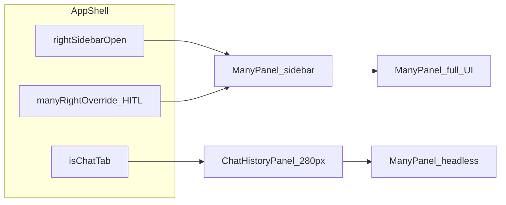
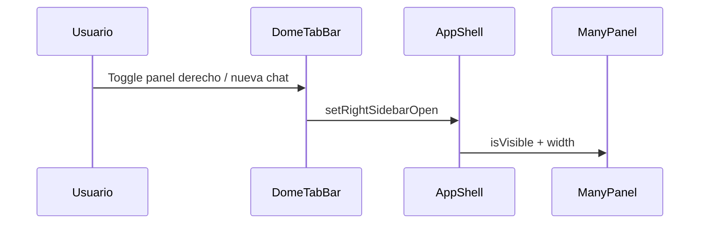
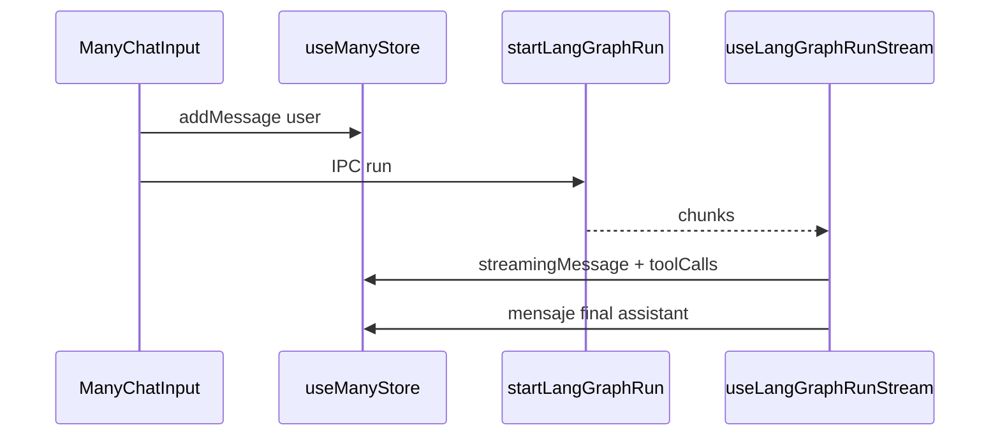

# Especificación de diseño UI — Many y chat compartido

Documento de referencia para **rediseñar** el asistente Many y el sistema de mensajería compartido (`app/components/chat/`). Los valores de color y forma reflejan la implementación actual en [`app/globals.css`](app/globals.css), no documentación heredada (p. ej. [.claude/rules/ui-style-guidelines.md](.claude/rules/ui-style-guidelines.md) con azules genéricos).

**Alcance:** Many (panel, pestaña Chat, modo headless) + componentes de chat compartidos. No incluye Home, Settings, viewers ni shell completo.

---

## Índice

1. [Principios y tokens](#1-principios-y-tokens-del-sistema)
2. [Superficie Many](#2-superficie-many-componentes-y-medidas)
3. [Núcleo de chat compartido](#3-núcleo-de-chat-compartido)
4. [Flujos de usuario](#4-flujos-de-usuario)
5. [Gaps, deuda y riesgos de rediseño](#5-gaps-deuda-y-riesgos-de-rediseño)
6. [Apéndice](#6-apéndice)

---

## 1. Principios y tokens del sistema

### 1.1 Principios (alineados al producto)

| Principio | Implicación para rediseño |
|-----------|---------------------------|
| Claridad antes que adorno | Poca decoración; jerarquía por tipografía y espacio |
| Identidad Many | Acento **verde oliva** (`#596037`) + highlight pálido `#E0EAB4` |
| Accesibilidad | Contraste orientado a WCAG AA en tema claro; `prefers-reduced-motion` en animaciones Many |
| Tokens, no hex sueltos | Preferir `var(--accent)` etc. en componentes nuevos |

### 1.2 Paleta oficial (tema claro / oscuro)

Fuente: `:root[data-theme="light"]` y `:root[data-theme="dark"]` en [`app/globals.css`](app/globals.css).

| Rol | Variable | Light | Dark |
|-----|----------|-------|------|
| Marca (outline) / acento | `--accent`, `--primary` | `#596037` | `#A4AD7A` |
| Many Green (highlight) | `--secondary` | `#E0EAB4` | `#3A4020` |
| Texto principal | `--primary-text` | `#1A1A1A` | `#E8E8E8` |
| Texto secundario | `--secondary-text` | `#5C5C5C` | `#A0A0A0` |
| Texto terciario | `--tertiary-text` | `#6B6B6B` | `#787878` |
| Fondo app | `--bg` | `#FAFAFA` | `#121212` |
| Superficie / card | `--bg-secondary` | `#FFFFFF` | `#1E1E1E` |
| Inputs / sutil | `--bg-tertiary` | `#F5F5F5` | `#2A2A2A` |
| Hover | `--bg-hover` | `#E5E5E5` | `#333333` |
| Borde | `--border` | `#E5E5E5` | `#333333` |
| Éxito (semántico) | `--success` | `#596037` | `#A4AD7A` |
| Advertencia | `--warning` | `#E6C47A` | `#E6C47A` |
| Error | `--error` | `#E88585` | `#E88585` |
| Info | `--info` | `#7B9DD0` | `#7B9DD0` |
| Anillo foco | `--focus-ring` | `0 0 0 3px` + `--translucent` | igual patrón |

**Sidebar shell (Home):** `--dome-sidebar-bg` — light `#f0f0ed`, dark `#181818`.

**Alias `--dome-*`:** mapean a los anteriores (`--dome-accent`, `--dome-surface`, etc.) para componentes del shell y overlays.

### 1.3 Tipografía

| Uso | Definición |
|-----|------------|
| UI | `Inter` vía `--font-sans` |
| Código / JSON en HITL | `JetBrains Mono` vía `--font-mono` |
| Welcome fullscreen Many | **Georgia** (solo titular welcome): `Georgia, 'Times New Roman', serif`, `clamp(28px, 4vw, 42px)`, peso 600 |

### 1.4 Forma, espacio, elevación, z-index

| Categoría | Valores clave |
|-----------|---------------|
| Radios | `--radius-sm` 4px … `--radius-2xl` 16px; `--radius-full` pills |
| Espaciado | Base 4px (`--space-1` … `--space-12`) |
| Sombras | `--shadow-sm` … `--shadow-xl` (muy sutiles en light; más profundas en dark) |
| Transiciones | `--transition-fast` 120ms, `--transition-base` 220ms, `--transition-slow` 300ms |
| Z-index | `--z-dropdown` 100 … `--z-max` 9999 (dropdowns/popovers usan `--z-popover` 600) |

### 1.5 Clases utilitarias globales (chat / AI)

Definidas en `@layer utilities` en [`app/globals.css`](app/globals.css):

| Clase | Comportamiento visual |
|-------|------------------------|
| `.ai-surface-card` | `bg-secondary`, borde, `radius-2xl`, `shadow-sm` |
| `.ai-composer-frame` | Fondo `bg-secondary`, **border-radius 20px** |
| `.ai-composer-frame-dragging` | `color-mix(accent 6%, bg-secondary)` |
| `.ai-composer-frame-welcome` | Border-radius **24px** |
| `.ai-context-chip` | Chip de recurso pineado: borde `color-mix(accent 30%, border)`, fondo `color-mix(accent 8%)`, texto 11px |
| `.ai-message-item` | `content-visibility: auto` (rendimiento) |

### 1.6 Skin Many (`data-surface="many"`)

Selector: `.many-panel-messages[data-surface="many"]` en [`app/globals.css`](app/globals.css) (~L1123–1184).

| Elemento | Regla |
|----------|--------|
| `.many-minimal-status-dots` | Color `--secondary-text` |
| `.many-minimal-status-dot` | 5×5px, `border-radius` full, animación `manyMinimalDotPulse` 1.05s, delays 0 / 140 / 280 ms |
| `prefers-reduced-motion` | Sin animación; opacidad fija 0.55 |
| `.many-chat-tool-root` | `box-shadow: none` |
| `.many-chat-timeline-root` | Fondo `color-mix(bg-secondary 72%, transparent)`, borde `--border`, radius md, sin shadow |
| `.many-message-group` | `content-visibility: auto` |

### 1.7 Responsive panel derecho

`@media (max-width: 980px)`: `.dome-right-panel` pasa a posición absoluta derecha, ancho `min(380px, 86vw)`, `z-index: var(--z-fixed)`, sombra `--shadow-xl`, fondo `--dome-surface`.

---

## 2. Superficie Many: componentes y medidas

### 2.1 Modos de presentación



| Modo | Condición | UI |
|------|-----------|-----|
| **Sidebar derecho** | `rightSidebarOpen && !(isChatTab && !manyRightOverride)` | [`ManyPanel`](app/components/many/ManyPanel.tsx) `isFullscreen=false` |
| **Historial en sidebar** | Pestaña tipo `chat` activa y **sin** override HITL | Ancho fijo **280px**, [`ChatHistoryPanel`](app/components/chat/ChatHistoryPanel.tsx) en lugar de Many |
| **Headless** | Many no visible en sidebar (historial o panel cerrado) | `ManyPanel` `mode="headless"` — [`return null`](app/components/many/ManyPanel.tsx) pero **lógica y streaming activos** |
| **Pestaña Chat fullscreen** | [`ContentRouter`](app/components/shell/ContentRouter.tsx) → `ChatTabView` | `ManyPanel` `isFullscreen`, `width={0}` |

**Ancho panel Many (sidebar):** constantes en [`AppShell.tsx`](app/components/shell/AppShell.tsx): `MANY_DEFAULT=380`, `MANY_MIN=280`, `MANY_MAX=600`, persistencia `localStorage` **`dome:many-panel-width-v1`**. Resize vía [`ResizeHandle`](app/components/workspace/ResizeHandle.tsx) (horizontal).

**Transiciones:** contenedor Many en sidebar ([`AppShell`](app/components/shell/AppShell.tsx)): `width 200ms ease`. [`ManyPanel`](app/components/many/ManyPanel.tsx) interno: `width 180ms ease, opacity 140ms ease` cuando `isVisible` alterna.

### 2.2 Árbol de componentes Many (resumen)

```
ManyPanel (full | headless)
├── UICursorOverlay (portal, z-index 99999)
├── ManyChatHeader → UnifiedChatHeader(ManyIcon, acciones)
├── [Fullscreen empty] Welcome + UnifiedChatInput + quick pills
├── UnifiedChatMessageArea data-surface="many"
│   └── ChatMessageGroup × N (surfaceVariant="many")
├── PdfRegionBanner (condicional)
├── HITLReviewPanel (sticky, pendingApproval)
├── TokenBudgetBadge + fila controles
└── UnifiedChatInput mode="many" → ManyChatInput → AIComposer*
```

### 2.3 Inventario por archivo

| Archivo | Especificación visual |
|---------|----------------------|
| [`ManyPanel.tsx`](app/components/many/ManyPanel.tsx) | Contenedor `flex flex-col h-full border-l`; fullscreen: `width 100%`, sin borde izquierdo, `background: var(--bg)`. No fullscreen: `width` en px, `minWidth 320`, `maxWidth 600`, transición width/opacity. Welcome: Georgia + input centrado `max-w-2xl`, quick actions `rounded-xl border px-4 py-2.5 text-[13px]`. Área mensajes: padding horizontal **`10%`** si fullscreen, else `16px`. Error: fondo `color-mix(error 10%, transparent)`. |
| [`ManyChatHeader.tsx`](app/components/many/ManyChatHeader.tsx) | Delega a `UnifiedChatHeader`; subtítulo según `status`: `thinking` / `speaking` (i18n) o `loadingHint` / proveedor / contexto. Acciones: botones **`size-8 rounded-lg`**, texto `--tertiary-text`, hover `--bg-hover` + `--primary-text`. Separador vertical `h-4 w-px` `--border`. |
| [`ManyIcon.tsx`](app/components/many/ManyIcon.tsx) | Asset estático **`/many.png`**. |
| [`ManyAvatar.tsx`](app/components/many/ManyAvatar.tsx) | Tamaños `sm|md|lg|xl` → clases `size-8`…`size-16`, icono 20–40px; círculo con `bg-secondary`, borde `1px solid var(--border)`. |
| [`ManyMinimalStatusRow.tsx`](app/components/many/ManyMinimalStatusRow.tsx) | Fila `many-minimal-status`, label `text-[13px] text-[var(--secondary-text)]`, 3 puntos vía CSS global. |
| [`ManyChatInput.tsx`](app/components/many/ManyChatInput.tsx) | Compositor completo: `AIComposerFrame`, adjuntos, `@` mentions (`useResourceMention`), `/` skills (`useSlashSkills`), `InlineModelSwitcher`, menú `+`, toggles tools/resources/MCP. Textarea: clase compartida `AI_COMPOSER_TEXTAREA_CLASS` (14px, line-height 1.6, max altura script ~140px). |
| [`PdfRegionBanner.tsx`](app/components/many/PdfRegionBanner.tsx) | Banner `rounded-xl border`, fondo `color-mix(accent 8%, bg-secondary)`; miniatura 56×56; tipografía 13 / 12 / 11 px. |
| [`TokenBudgetBadge.tsx`](app/components/many/TokenBudgetBadge.tsx) | Pill `rounded-full border`, texto 11px; usa **`bg-[var(--bg-elevated)]`** — ver [gap §5](#53-variables-css-referenciadas-pero-no-definidas-en-globals). |
| [`UICursorOverlay.tsx`](app/components/many/UICursorOverlay.tsx) | Portal full-screen `pointer-events-none`, **`zIndex: 99999`**. Anillo alrededor bbox con `color-mix(dome-accent 55%)`; cursor SVG **22×26**; tooltip max 280px, 12px, superficie `--dome-surface`. |
| [`ManyFloatingTrigger.tsx`](app/components/many/ManyFloatingTrigger.tsx) | **Legacy:** `fixed bottom-6 right-6`, `size-14`, borde 2px, sombra **hardcoded** `rgba(0,0,0,0.15)`. Badge unread con fallbacks Tailwind `#ef4444`. Status dot: `#f59e0b` / `#22c55e` si faltan tokens. |
| [`ManyVoiceBridge.tsx`](app/components/many/ManyVoiceBridge.tsx) | Sin UI; sincroniza TTS → `useManyStore` (`speaking` / `idle` / errores). |

### 2.4 Header unificado (Many + agentes)

[`UnifiedChatHeader`](app/components/chat/UnifiedChatHeader.tsx): fila `px-4 py-3`, borde inferior, fondo `--bg`. Avatar envuelto en círculo `size-9`, borde, `bg-secondary`. Título 14px medium; subtítulo 11px tertiary.

---

## 3. Núcleo de chat compartido

### 3.1 Variante `surfaceVariant`: `default` vs `many`

Prop: `ChatSurfaceVariant = 'default' | 'many'` en [`ChatMessage.tsx`](app/components/chat/ChatMessage.tsx), propagada por [`ChatMessageGroup`](app/components/chat/ChatMessageGroup.tsx), [`ChatToolCard`](app/components/chat/ChatToolCard.tsx), [`AgentRunTimeline`](app/components/chat/AgentRunTimeline.tsx).

| Elemento | `default` | `many` |
|----------|-----------|--------|
| Borde lateral mensaje user/assistant | **2px** `solid var(--border)` | **1px** |
| Padding horizontal burbuja | 14px | 12px |
| Streaming asistente | [`ReadingIndicator`](app/components/chat/ReadingIndicator.tsx) | [`ManyMinimalStatusRow`](app/components/many/ManyMinimalStatusRow.tsx) |
| Timestamp | 10px | 9px, `opacity-70` |
| Tool card: borde acento izquierdo | 2px | 1px + clase `many-chat-tool-root` |
| Tool card: tamaño fuente cuerpo | 13px | 12px |
| Timeline run | clase `ai-surface-card` | `many-chat-timeline-root` |

### 3.2 [`ChatMessageGroup`](app/components/chat/ChatMessageGroup.tsx)

- Estilo Slack: un avatar por grupo.
- **Asistente:** [`ManyAvatar`](app/components/many/ManyAvatar.tsx) `size="sm"` (32px contenedor) o imagen custom.
- **Usuario:** círculo `size-8`, fondo **`var(--accent)`**, icono `User` 16px blanco.
- Many + assistant: **regla vertical** `.many-thread-rule` (`w-px`, `bg-border`, **opacity 45%**).

### 3.3 [`ChatToolCard`](app/components/chat/ChatToolCard.tsx)

**Categorías** (heurística por nombre del tool) → color de acento izquierdo (`CATEGORY_COLORS`):

| Categoría | Token |
|-----------|--------|
| search | `--accent` |
| file | `--success` |
| agent | `--accent` |
| db | `--warning` |
| mcp / default | `--secondary-text` |

**Estados:** `pending` | `running` | `success` | `error` — spinner, check, X. Colapsable vía `DomeCollapsibleRow`. Resultados enriquecidos: markdown, imágenes, artefactos (`ArtifactCard`), confirmaciones → evento `dome:quick-reply`. Agrupación: `ChatToolCardGroup`.

### 3.4 [`ArtifactCard`](app/components/chat/ArtifactCard.tsx) y esquemas

- Pipeline: bloques ` ```artifact:TYPE` → [`parseArtifactBlocks`](app/lib/chat/artifactSchemas.ts).
- **Tipos con Zod estricto:** `calculator`, `diagram`, `tabs`, `playground`, `dashboard`, `timeline`, `html`, `calendar_event`, `flashcard_deck`.
- **Tipos legacy adicionales:** `pdf_summary`, `table`, `action_items`, `chart`, `code`, `list`, `created_entity`, `docling_images`.

**`ARTIFACT_STYLES`:** cada tipo mapea `borderColor` e `iconColor` a variables (`--accent`, `--success`, `--warning`, `--error`, `--secondary-text`).

**Gráficos:** colores de dataset restringidos a whitelist `DOME_CHART_COLORS` (solo tokens Dome).

**HTML:** [`HtmlArtifactFrame`](app/components/chat/artifacts/HtmlArtifactFrame.tsx) — iframe sandbox, tema sincronizado.

### 3.5 [`AIComposer.tsx`](app/components/chat/AIComposer.tsx) + [`UnifiedChatInput`](app/components/chat/UnifiedChatInput.tsx)

- **Marco:** `AIComposerFrame` — borde `--border` (accent al arrastrar), `focus-within` sombra `--focus-ring` (vía clase), welcome: `--shadow-lg` en el frame.
- **Textarea:** 14px, placeholder tertiary, altura máx. ~140px en handler.
- **Botón enviar / stop:** `AIComposerIconButton` → **`size-9`**, `rounded-full`; activo `bg-[var(--dome-accent-bg)] text-[var(--dome-accent)]`.
- **Chips adjuntos:** borde punteado sección superior; chips 11px.
- **Menú + / modelo / skills:** ver `ManyChatInput` y subcomponentes (`ChatComposerPlusMenu`, etc.).

### 3.6 Otras piezas

| Componente | Rol |
|------------|-----|
| [`UnifiedChatMessageArea`](app/components/chat/UnifiedChatMessages.tsx) | Scroll; `data-surface="many"` activa CSS Many |
| [`MarkdownRenderer`](app/components/chat/MarkdownRenderer.tsx) | Prosa asistente |
| [`SourceReference`](app/components/chat/SourceReference.tsx) | Citas numéricas y pin a contexto |
| [`ChatHistoryPanel`](app/components/chat/ChatHistoryPanel.tsx) | Lista sesiones, búsqueda, pin/rename — UI Dome estándar (header, list rows) |
| [`HITLReviewPanel`](app/components/agents/HITLReviewPanel.tsx) | Tarjetas por acción; estados borde `accent` / `error`; JSON editor `input` clase global |

### 3.7 Human-in-the-loop (Many)

[`HITLReviewPanel`](app/components/agents/HITLReviewPanel.tsx): panel inferior sticky cuando hay `pendingApproval` desde el stream LangGraph. Flujo paralelo en [`AppShell`](app/components/shell/AppShell.tsx): evento `dome:many-requires-panel` fuerza `manyRightOverride` y abre sidebar; `dome:many-hitl-cleared` limpia override.

---

## 4. Flujos de usuario

Convención: **disparador → UI → estado / IPC → resultado UI**.

### 4.1 Abrir / cerrar panel Many



- **Abrir:** botón rectángulo en tab bar (línea divisoria derecha), o “Nuevo chat” (`handleNewChat` abre pestaña chat + `startNewChat`).
- **Cerrar:** X en `ManyChatHeader` → `onClose` → toggle sidebar.
- **Auto-apertura:** al **entrar** en pestaña `chat` desde otra pestaña, si el panel estaba cerrado se **reabre** (efecto en `AppShell` con `prevActiveTabIdRef` para no impedir cerrar manualmente en la misma pestaña).

### 4.2 Pestaña Chat a pantalla completa

- `openChatTab` → tab `type: 'chat'` → [`ContentRouter`](app/components/shell/ContentRouter.tsx) renderiza `ManyPanel` con `isFullscreen`, `width={0}`.
- Welcome si no hay mensajes: titular serif + input grande + **quick prompts** (dos filas de botones).

### 4.3 Enviar mensaje y streaming (LangGraph)



- Tools en curso se reflejan en `ChatToolCard` dentro del mensaje streaming.
- Subtítulo cabecera: `loadingHint` (p. ej. tool en ejecución) o `t('chat.executing_tools')`.

### 4.4 Sesiones (historial / pin / borrar)

- Estado: [`useManyStore`](app/lib/store/useManyStore.ts) — `sessions`, `currentSessionId`, `startNewChat`, `switchSession`, etc.
- UI lista: [`ChatHistoryPanel`](app/components/chat/ChatHistoryPanel.tsx) cuando pestaña chat + sidebar derecho sin override HITL.
- Persistencia: localStorage (`dome-many-sessions:v1` en código legado) + mensajes en SQLite `mode: 'many'` (ver [docs/features/ai-chat.md](docs/features/ai-chat.md)).

### 4.5 Contexto de recurso y `@`

- `WorkspaceLayout` / vistas pueden inyectar contexto en el prompt (recurso activo).
- Usuario menciona `@` → chips **`.ai-context-chip`**; lista de `pinnedResources` en store.

### 4.6 Región PDF (visión)

- Usuario selecciona región en PDF → `pendingPdfRegion` en store → [`PdfRegionBanner`](app/components/many/PdfRegionBanner.tsx).
- Envío puede usar tubo dedicado `runPdfRegionStream` (no LangGraph completo) según implementación en `ManyPanel`.

### 4.7 Aprobación HITL

- Run en espera → `pendingApproval` → panel HITL sticky → usuario aprueba/rechaza/edita args → `resumeRun` (IPC/layer automatizaciones).
- **`dome:many-requires-panel`** dispara sidebar Many aunque la pestaña chat muestre historial.

### 4.8 Handoff PDF → Many

- Metadatos `pdfRegionMeta` en mensaje → acciones “continuar en Many” / copia (ver `ChatMessage` + `buildPdfRegionHandoff`).

### 4.9 Tool → pin recurso / quick reply

- Resultados de tools pueden mostrar pin/unpin y **soft confirmation** que emite `dome:quick-reply` para rellenar respuesta corta.

### 4.10 Artefacto → abrir en pestaña

- Desde cabecera de artefacto: `openArtifactTab` en [`useTabStore`](app/lib/store/useTabStore.ts).

### 4.11 Automatización UI (cursor)

- Main emite por preload [`dome:ui-action`](electron/preload.cjs) → renderer actualiza [`useUICursorStore`](app/lib/store/useUICursorStore.ts) → [`UICursorOverlay`](app/components/many/UICursorOverlay.tsx).
- Herramientas agente: `ui_point_to`, `ui_click`, etc. (ver [`app/lib/ai/tools/ui-tools.ts`](app/lib/ai/tools/ui-tools.ts)).

### 4.12 No leídos

- Lógica en store: mensajes asistente llegan con panel “cerrado” según diseño histórico → incremento `unreadCount`; al abrir, clear. **Nota:** el botón flotante Many no está montado; la señalización puede depender de otros patrones (tab bar, etc.).

### 4.13 Voz / TTS

- [`ManyVoiceBridge`](app/components/many/ManyVoiceBridge.tsx) escucha eventos `audio.onTtsSentencePlaying` / `onTtsFinished` / `onTtsError`.
- Estado `speaking` + `currentSentence` afectan copy en cabecera / UI futura.

---

## 5. Gaps, deuda y riesgos de rediseño

### 5.1 Shell vs `useManyStore.isOpen`

- **Apertura real del panel:** `rightSidebarOpen` en [`AppShell`](app/components/shell/AppShell.tsx).
- **`useManyStore.isOpen` / `toggleOpen`:** no conectados al shell; útiles para legacy (unread, plugins, PDF que llama `setOpen(true)`). **Un rediseño no debe asumir** que `setOpen(true)` abre el panel lateral.

### 5.2 `ManyFloatingButton` / `ManyFloatingTrigger`

- **No montados** en el árbol principal de [`AppShell`](app/components/shell/AppShell.tsx). Cualquier diseño de FAB debe **reintroducir** el componente explícitamente.
- Estilos del trigger mezclan tokens con **fallbacks hex** (`#ef4444`, `#f59e0b`, `#22c55e`, sombras negras).

### 5.3 Variables CSS referenciadas pero no definidas en `:root`

- **`--bg-elevated`:** usado en [`TokenBudgetBadge`](app/components/many/TokenBudgetBadge.tsx) y [`ChatMessage`](app/components/chat/ChatMessage.tsx). No aparece en el bloque `:root` de [`app/globals.css`](app/globals.css). Comportamiento: fondo puede caer a transparente/vacío según navegador — **definir token en rediseño**.

### 5.4 Documentación obsoleta interna

- [.claude/rules/new-color-palette.md](.claude/rules/new-color-palette.md) (morados) **no** coincide con la app.
- [.claude/rules/ui-style-guidelines.md](.claude/rules/ui-style-guidelines.md) usa `--brand-primary` azul — **descartar** para Many.

### 5.5 Tema “Many” en comentarios de código

- [`ChatToolCard`](app/components/chat/ChatToolCard.tsx) comenta “blue/purple/green” junto a `var(--accent)` — los tokens reales son oliva/neutral; los comentarios son engañosos para diseño.

---

## 6. Apéndice

### 6.1 Checklist por componente (rediseño)

- [ ] Colores solo vía `var(--*)` / `--dome-*`
- [ ] Estados hover, focus visible (`focus-visible:ring` con `--accent`), disabled
- [ ] Contraste texto en light y dark
- [ ] `prefers-reduced-motion` para dots Many y pulse floating
- [ ] Z-index: popovers ≤ `--z-popover`; overlay cursor es excepción 99999
- [ ] Touch: panel móvil ≤980px overlay

### 6.2 Mapa rápido archivo → responsabilidad

| Ruta | Responsabilidad |
|------|-----------------|
| [`app/globals.css`](app/globals.css) | Tokens + utilidades `.many-*` / `.ai-*` |
| [`app/components/many/ManyPanel.tsx`](app/components/many/ManyPanel.tsx) | Orquestación Many, welcome, streaming, PDF, HITL |
| [`app/components/chat/ChatMessage.tsx`](app/components/chat/ChatMessage.tsx) | Burbuja, markdown, herramientas, artefactos |
| [`app/components/chat/AIComposer.tsx`](app/components/chat/AIComposer.tsx) | Marco y botones composer |
| [`app/components/shell/AppShell.tsx`](app/components/shell/AppShell.tsx) | Ancho panel, historial vs Many, headless |

### 6.3 Referencias cruzadas

- Arquitectura chat / IPC: [docs/features/ai-chat.md](docs/features/ai-chat.md)
- Marca y paleta para marketing: [docs/features/dome-design-guide.md](docs/features/dome-design-guide.md)

---

*Generado para soporte de rediseño UI. Actualizar este documento cuando cambien tokens en `globals.css` o la estructura de `ManyPanel`.*
