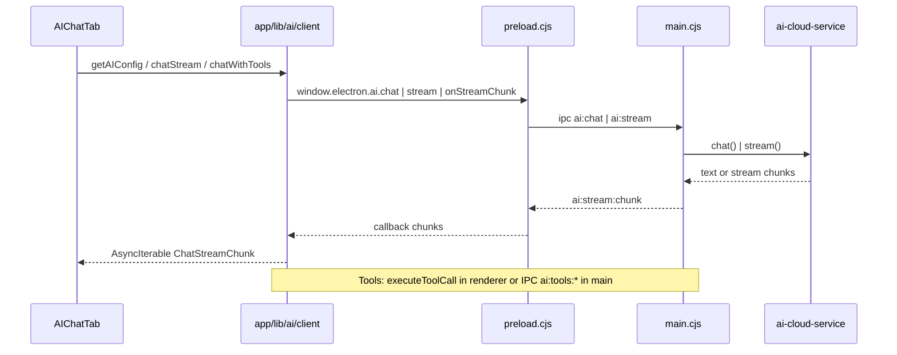

# AI/Chat Feature (Martin/Many)

Documentation for Dome's AI chat: unified client, streaming, tools, and UI. Lives in `app/lib/ai/`, `app/components/workspace/AIChatTab.tsx`, `app/components/chat/`, `app/lib/store/useMartinStore.ts`, and `electron/` (main process AI and tools).

---

## Interfaces

### Message types (`app/lib/ai/types.ts`)

```ts
type MessageRole = 'system' | 'user' | 'assistant' | 'tool';

interface ChatMessage {
  role: MessageRole;
  content: string | MessageContent[];  // MessageContent = TextContent | ImageContent | ToolCallContent | ToolResultContent
  name?: string;
}

interface ChatStreamChunk {
  type: 'text' | 'tool_call' | 'done' | 'error';
  text?: string;
  toolCall?: { id: string; name: string; arguments: string };
  error?: string;
  usage?: { promptTokens: number; completionTokens: number; totalTokens: number };
}
```

### Config and chat options (`app/lib/ai/client.ts`, `app/lib/ai/types.ts`)

```ts
type AIProvider = AIProviderType | 'local';

interface AIConfig {
  provider: AIProvider;
  apiKey?: string;
  model?: string;
  embeddingModel?: string;
  baseURL?: string;
  ollamaBaseURL?: string;
  ollamaModel?: string;
  ollamaEmbeddingModel?: string;
}

interface ChatOptions {
  model: string;
  messages: ChatMessage[];
  temperature?: number;
  maxTokens?: number;
  tools?: ToolDefinition[];
  toolChoice?: 'auto' | 'none' | 'required' | { type: 'function'; function: { name: string } };
  systemMessage?: string;
  signal?: AbortSignal;
}

interface ToolDefinition {
  type: 'function';
  function: { name: string; description: string; parameters: Record<string, unknown> };
}
```

### Tools (`app/lib/ai/tools/types.ts`)

```ts
interface AgentToolResult<T = unknown> {
  content: ToolResultContent[];  // text | image | json
  details?: T;
  isError?: boolean;
}

type ToolExecuteFunction<TParams, TResult> = (
  toolCallId: string,
  params: TParams,
  signal?: AbortSignal,
  onUpdate?: ToolUpdateCallback<TResult>,
) => Promise<AgentToolResult<TResult>>;

interface AgentTool<Schema, TResult = unknown> {
  label: string;
  name: string;
  description: string;
  parameters: Schema;  // TypeBox TSchema
  execute: ToolExecuteFunction<Static<Schema>, TResult>;
}

interface ToolCall {
  id: string;
  name: string;
  arguments: Record<string, unknown>;
}
```

### UI / state (`app/lib/store/useMartinStore.ts`, `app/components/chat/`)

```ts
type MartinStatus = 'idle' | 'thinking' | 'speaking' | 'listening';

interface MartinMessage {
  id: string;
  role: 'user' | 'assistant';
  content: string;
  timestamp: number;
}

interface MartinState {
  isOpen: boolean;
  isMinimized: boolean;
  status: MartinStatus;
  messages: MartinMessage[];
  currentInput: string;
  unreadCount: number;
  currentResourceId: string | null;
  currentResourceTitle: string | null;
  whatsappConnected: boolean;
  whatsappPendingMessages: number;
  // actions: setOpen, toggleOpen, addMessage, clearMessages, setContext, ...
}

// Chat UI (ChatMessage.tsx, ChatToolCard.tsx)
interface ChatMessageData {
  id: string;
  role: 'user' | 'assistant' | 'system';
  content: string;
  timestamp: number;
  isStreaming?: boolean;
  toolCalls?: ToolCallData[];
}

interface ToolCallData {
  id: string;
  name: string;
  arguments: Record<string, unknown>;
  status: 'pending' | 'running' | 'success' | 'error';
  result?: unknown;
  error?: string;
}
```

### Provider interface (`app/lib/ai/types.ts`)

```ts
type ProviderType = 'openai' | 'anthropic' | 'google' | 'ollama' | 'synthetic' | 'venice' | 'copilot' | 'bedrock' | ...;

interface AIProviderInterface {
  id: string;
  name: string;
  chat(options: ChatOptions): Promise<ChatResponse>;
  chatStream(options: ChatOptions): AsyncIterable<ChatStreamChunk>;
  embed?(options: EmbeddingOptions): Promise<EmbeddingResponse>;
  listModels?(): Promise<ModelDefinitionConfig[]>;
  isAvailable(): Promise<boolean>;
}
```

---

## Models and catalogs

- **Source**: `app/lib/ai/models.ts`
- **Types**: `ModelDefinition` (id, name, reasoning, input, contextWindow, maxTokens, cost, compat), `EmbeddingModelDefinition`, `ProviderDefinition`, `AIProviderType`.
- **Exports**: `PROVIDERS`, `OPENAI_MODELS`, `ANTHROPIC_MODELS`, `GOOGLE_MODELS`, `OPENAI_EMBEDDING_MODELS`, `GOOGLE_EMBEDDING_MODELS`, `FREE_COST`.
- **Helpers**: `getDefaultModelId(provider)`, `getDefaultEmbeddingModelId(provider)`, `findModelById(id)`, `modelSupportsTools(modelId)`, `providerSupportsTools(provider)`, `getModelsForProvider(provider)`, `getRecommendedModel(provider)`.

---

## Data flow



---

## Design patterns

### Cloud AI in main process

- Chat, stream, and embeddings for OpenAI/Anthropic/Google run in the main process via IPC to avoid CORS and keep API keys out of the renderer.
- API keys are read from SQLite in main; Anthropic uses direct API key, same as OpenAI and Google.
- **Handlers**: `ai:chat`, `ai:stream`, `ai:embeddings` in `electron/main.cjs`; implementation in `electron/ai-cloud-service.cjs`.

### Streaming

- Renderer calls `window.electron.ai.stream(provider, messages, model, streamId)` and subscribes to `ai:stream:chunk` with the same `streamId`.
- Main sends `{ streamId, type: 'text', text }` or `type: 'done'` / `type: 'error'`.
- In `app/lib/ai/client.ts`, each provider’s `stream*` builds an async generator: queue chunks from the IPC callback and yield `ChatStreamChunk` until `done`.

### Tools

- **Registry**: `createToolRegistry()`; tools defined as `AgentTool` with TypeBox schema and `execute` function.
- **Adapters**: `toOpenAIToolDefinitions(tools)`, `toAnthropicToolDefinitions(tools)` for API payloads.
- **Execution**: `executeToolCall(tools, toolCall, signal)` in renderer; tools that need DB/vector/files call `window.electron.invoke('ai:tools:resourceSearch', ...)` etc., implemented in `electron/ai-tools-handler.cjs` (resourceSearch, resourceGet, resourceList, resourceSemanticSearch, projectList, projectGet, interactionList, getRecentResources, getCurrentProject).
- **Tool sets**: `createDefaultTools(config)` (web + optional memory); `createAllMartinTools(config)` (web, memory, resources, context); `createResourceOnlyTools()`.

### Chat with tools

- `chatWithTools(messages, tools, { maxIterations, signal })` in `app/lib/ai/client.ts`: loop up to `maxIterations`; each iteration runs `chatStream(conversationMessages, toOpenAIToolDefinitions(tools), signal)`, collects `tool_call` chunks, runs `executeToolCall` for each, appends assistant message (tool_calls) and user message (tool result) to `conversationMessages`; stops when no tool calls or max iterations. Returns `{ response, toolResults }`.

### System prompt

- `getMartinSystemPrompt(options?)` in `app/lib/ai/client.ts`: builds Many’s system prompt with `resourceContext` (title, type, content, summary, transcription), `toolsEnabled`, `location` ('workspace' | 'home' | 'whatsapp'), and optional date/time.
- Extended personality/context from `electron/personality-loader.cjs`: SOUL.md, USER.md, MEMORY.md, memory/YYYY-MM-DD.md (loaded in main; can be exposed to renderer or used in main-side prompts if needed).

---

## Functionality

### Config

- `getAIConfig()`: reads provider, apiKey, model, embeddingModel, baseURL, ollama* from `db.getSetting` (keys like `ai_provider`, `ai_api_key`, `ai_model`, ...).
- `saveAIConfig(config)`: writes same keys via `db.setSetting`.

### Chat (non-streaming)

- `chatWithOpenAI(messages, _apiKey, model)`, `chatWithClaude(...)`, `chatWithGemini(...)`: call `window.electron.ai.chat(provider, messages, model)`; return `result.content` or throw. Used when streaming not needed.

### Chat (streaming)

- `chatStream(messages, tools?, signal?)`: reads config, then delegates to `streamOpenAI`, `streamClaude`, `streamGemini`, or synthetic provider’s `chatStream`; for cloud providers uses IPC `ai:stream` + `onStreamChunk`; yields `ChatStreamChunk` (text, tool_call, done, error).

### Chat with tools

- `chatWithTools(messages, tools, { maxIterations, signal })`: as in “Chat with tools” pattern; used by AIChatTab when tools are enabled and provider supports tools.

### Embeddings

- Via IPC `ai:embeddings` (provider, texts, model); supported for openai and google. Used for vector search (separate from chat; mention only).

### UI (AIChatTab)

- Uses `useInteractions(resourceId)` for persisted messages (interactions with type 'chat' and metadata.role).
- Builds system prompt with `getMartinSystemPrompt({ resourceContext: { title, type, content, summary, transcription }, toolsEnabled, location: 'workspace' })`.
- If tools enabled and provider supports tools: calls `chatWithTools(apiMessages, activeTools, { maxIterations: 5, signal })`, then saves response and tool results into a streaming message and interactions.
- Else: consumes `chatStream(apiMessages, toolDefinitions, signal)`, updates streaming message on each text chunk, collects tool_call chunks for display; saves final response to interactions.
- Supports abort (AbortController), regenerate (re-send last user message), and scroll-to-bottom behavior.

---

## IPC channels

| Channel | Direction | Purpose |
|--------|-----------|---------|
| `ai:chat` | invoke | Non-streaming chat (provider, messages, model) |
| `ai:stream` | invoke | Start stream (provider, messages, model, streamId) |
| `ai:stream:chunk` | on | Stream chunks { streamId, type, text? \| error? } |
| `ai:embeddings` | invoke | Embeddings (provider, texts, model) |
| `ai:tools:resourceSearch` | invoke | FTS resource search (query, options) |
| `ai:tools:resourceGet` | invoke | Get resource by id (resourceId, options) |
| `ai:tools:resourceList` | invoke | List resources (options) |
| `ai:tools:resourceSemanticSearch` | invoke | Vector search (query, options) |
| `ai:tools:projectList` | invoke | List projects |
| `ai:tools:projectGet` | invoke | Get project (projectId) |
| `ai:tools:interactionList` | invoke | List interactions (resourceId, options) |
| `ai:tools:getRecentResources` | invoke | Recent resources (limit) |
| `ai:tools:getCurrentProject` | invoke | Current project context |

---

## Key files

| Path | Role |
|-----|------|
| `app/lib/ai/client.ts` | AIConfig, get/saveAIConfig, chatStream, chatWithTools, getMartinSystemPrompt, provider-specific chat/stream wrappers |
| `app/lib/ai/types.ts` | ChatMessage, ChatOptions, ChatStreamChunk, ToolDefinition, AIProviderInterface, MessageContent, ProviderType |
| `app/lib/ai/models.ts` | ModelDefinition, ProviderDefinition, PROVIDERS, model lists, getDefaultModelId, findModelById, providerSupportsTools |
| `app/lib/ai/tools/index.ts` | createToolRegistry, toOpenAI/AnthropicToolDefinitions, executeToolCall, createDefaultTools, createAllMartinTools, createResourceOnlyTools |
| `app/lib/ai/tools/types.ts` | AgentTool, ToolCall, AgentToolResult, ToolExecuteFunction, OpenAIToolDefinition, AnthropicToolDefinition |
| `app/lib/ai/tools/web-search.ts` | createWebSearchTool |
| `app/lib/ai/tools/web-fetch.ts` | createWebFetchTool |
| `app/lib/ai/tools/memory.ts` | createMemorySearchTool, createMemoryGetTool, createMemoryTools, IPC-backed variants |
| `app/lib/ai/tools/resources.ts` | createResourceSearchTool, createResourceGetTool, createResourceListTool, createResourceSemanticSearchTool, createResourceTools |
| `app/lib/ai/tools/context.ts` | createProjectListTool, createProjectGetTool, createInteractionListTool, createGetRecentResourcesTool, createGetCurrentProjectTool, createContextTools |
| `app/lib/store/useMartinStore.ts` | Martin state (open, messages, status, context, WhatsApp); actions for chat UI and floating Martin |
| `app/components/workspace/AIChatTab.tsx` | Workspace chat tab: interactions, system prompt, handleStream (chatWithTools vs chatStream), handleSend, handleAbort, regenerate |
| `app/components/chat/ChatMessage.tsx` | Renders ChatMessageData; ChatMessageData type |
| `app/components/chat/ChatMessageGroup.tsx` | Groups messages by role; groupMessagesByRole |
| `app/components/chat/ChatToolCard.tsx` | Renders ToolCallData; ToolCallData type |
| `app/lib/hooks/useInteractions.ts` | Load/save interactions for a resource (chat history as interactions) |
| `electron/main.cjs` | IPC handlers ai:chat, ai:stream, ai:embeddings, ai:tools:*; validation and auth |
| `electron/ai-cloud-service.cjs` | chat(provider, messages, apiKey, model), stream(..., onChunk), embeddings; OpenAI/Anthropic/Google |
| `electron/ai-tools-handler.cjs` | resourceSearch, resourceGet, resourceList, resourceSemanticSearch, projectList, projectGet, interactionList, getRecentResources, getCurrentProject (DB + vectorDB) |
| `electron/personality-loader.cjs` | SOUL.md, USER.md, MEMORY.md, memory/*; getMartinDir, load personality files |
| `electron/preload.cjs` | window.electron.ai.chat, .stream, .onStreamChunk, .embeddings, .tools.* whitelist and implementation |
