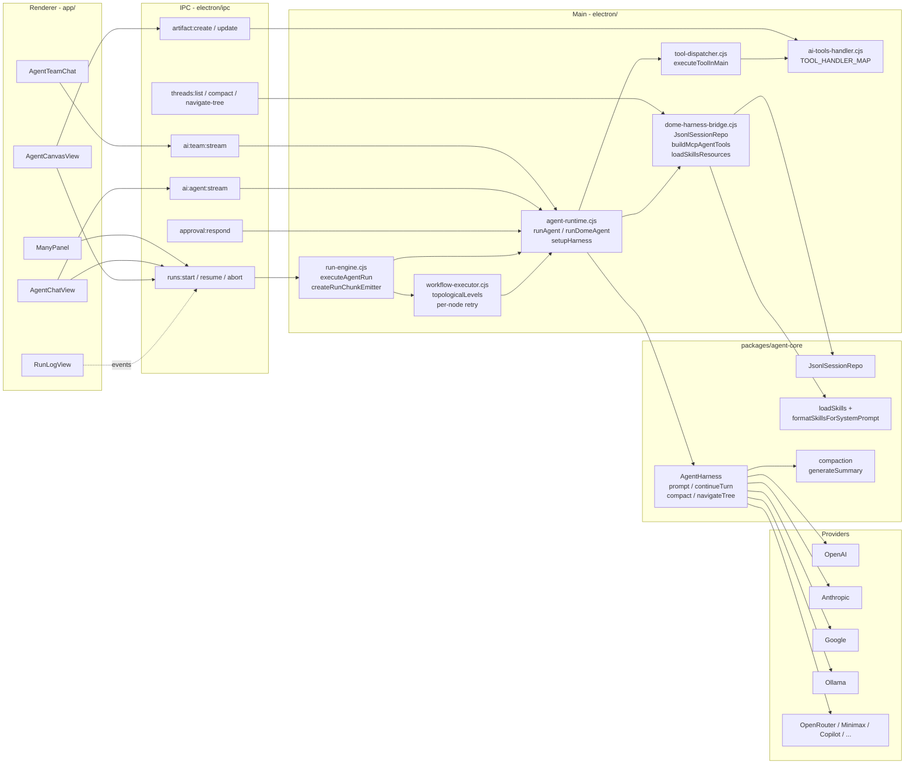
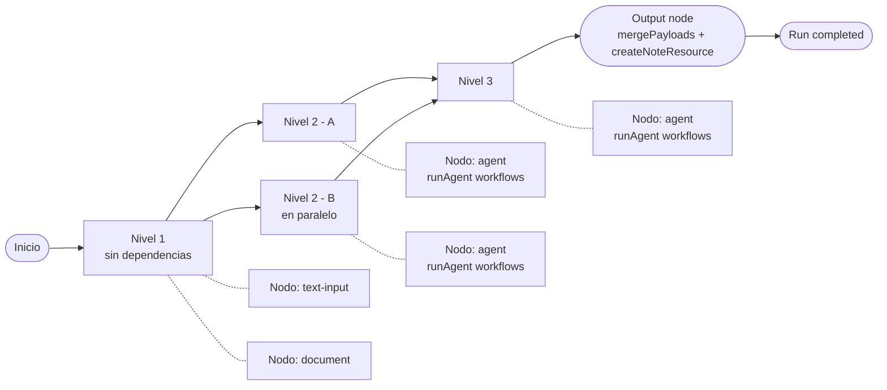
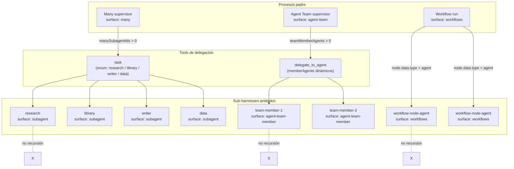
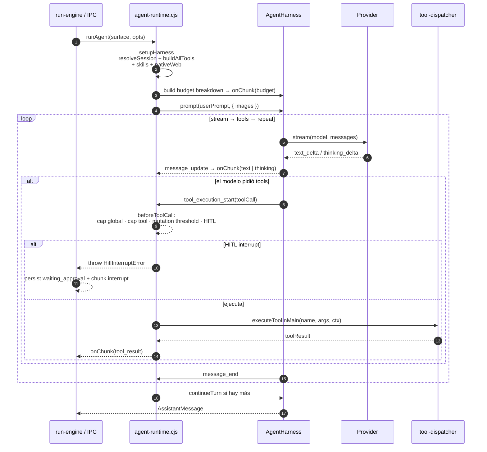
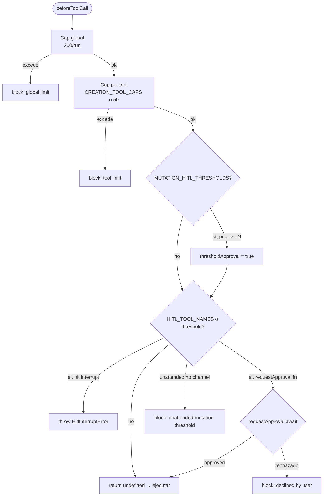
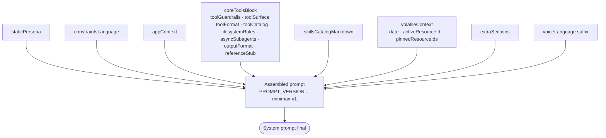
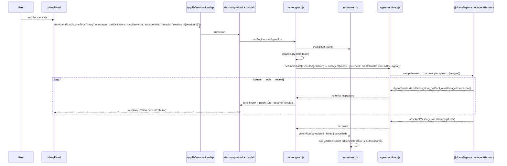

# Harness de agentes y sub-agentes

> Documento de arquitectura complementario a [agent-runtime.md](./agent-runtime.md) y
> [agent-runtime-tools.md](./agent-runtime-tools.md). Explica, con citas al código
> real, cómo Dome ejecuta turnos de agente a través de `@dome/agent-core` y cómo se
> compone con sub-agentes (Many `task`, Agent Team `delegate_to_agent`, workflows DAG,
> threads/time-travel).

## 1. Resumen ejecutivo

Dome corre **un único** runtime nativo de agentes: `@dome/agent-core` (vendored
upstream, no hay LangGraph ni LangChain en el path del agente). El módulo de entrada
es [`electron/agents/agent-runtime.cjs`](../../electron/agents/agent-runtime.cjs) que
expone `runAgent(surface, opts)`, donde `surface ∈ {many, agent-chat, workflows,
agent-team, subagent, agent-team-member, threads}`. El bucle es
`stream → tools → repeat`, con validación de argumentos, hooks
`beforeToolCall` (caps + HITL) y `context` (compactación por resumen), persistencia
de sesión en JSONL y skills inyectadas en el system prompt. Toda llamada desde el
renderer pasa por IPC (`runs:start`, `ai:team:stream`, `ai:agent:stream`, etc.) y
llega al runtime a través de `electron/agents/run-engine.cjs`.

## 2. Stack y principios

- **Electron 41** (main en `electron/`, renderer en `app/`, preload en
  `electron/preload.cjs`).
- **Runtime único de agente**: `@dome/agent-core` + `@dome/ai` (lazy ESM-import en
  el main para evitar contaminar el ciclo CommonJS).
- **LangGraph eliminado** — no quedan `langgraph`, `@langchain/langgraph`,
  `langgraph-checkpoint-sqlite` ni `deepagents` en el árbol de runtime.
- **Tools**: el registro canónico vive en [`packages/tools/`](../../packages/tools/)
  (`createToolRegistry`); el dispatcher histórico en
  [`electron/tools/tool-dispatcher.cjs`](../../electron/tools/tool-dispatcher.cjs)
  sigue siendo la fuente autoritativa del handler map.
- **Sub-agentes**: el modelo puede delegar a otro harness anidado a través de dos
  tools: `task` (Many, enum fijo de 4 nombres) y `delegate_to_agent` (Agent Team,
  members dinámicos del team). **No hay delegación recursiva** (`task` no se inyecta
  dentro de un subagente).
- **Persistencia de runs**: SQLite en `automation_runs` + `automation_run_steps` +
  `automation_run_links`. Persistencia de sesión de chat: JSONL en
  `userData/agent-sessions/` vía `JsonlSessionRepo`.

## 3. Diagrama general del flujo



## 4. Entry point — `electron/agents/agent-runtime.cjs`

El propio módulo declara su rol en el comentario de cabecera:

```1:17:electron/agents/agent-runtime.cjs
/**
 * Dome agent runtime.
 *
 * Drives `@dome/agent-core` (the Dome-native agent loop, vendored from a robust
 * upstream agent runtime) for every agent surface ("many", "agent-chat",
 * "workflows", "agent-team", "bench"). The loop is: stream → tools → repeat,
 * with argument validation, before/after tool hooks, sequential/parallel tool
 * execution and summarization-based compaction.
 *
 * The legacy LangGraph/LangChain agent stack has been removed; this
 * module is the single entry point for running an agent turn. The heavy
 * `@dome/agent-core` import is lazy so requiring this module never pulls the
 * ESM runtime into the CommonJS main process at load time.
 */
```

### 4.1 Constantes globales

```19:84:electron/agents/agent-runtime.cjs
const DEFAULT_RECURSION_LIMIT = 25;          // tope de turnos (env DOME_RECURSION_LIMIT)
const HITL_TOOL_NAMES = new Set([            // requieren aprobación humana
  'resource_delete', 'artifact_delete', 'feeder_run',
  'ppt_create', 'notebook_run_cell',
  'shell_exec', 'email_send', 'email_reply',
]);
const CREATION_TOOL_CAPS = Object.freeze({  // 19 entries; ej. resource_create:20
  resource_create: 20, resource_update: 30, resource_delete: 20,
  artifact_create: 15, artifact_update_state: 50, artifact_merge_data: 40, artifact_delete: 15,
  ppt_create: 8, flashcard_create: 8,
  generate_quiz: 5, generate_mindmap: 5, generate_guide: 5, generate_faq: 5,
  generate_timeline: 5, generate_table: 5,
  generate_audio_overview: 5, generate_video_overview: 5,
  notebook_add_cell: 50, pdf_annotation_create: 50, link_resources: 40,
});
const MUTATION_HITL_THRESHOLDS = Object.freeze({
  resource_update: 5, artifact_merge_data: 10,
});
const DEFAULT_GLOBAL_TOOL_CALL_LIMIT = 200;  // override con DOME_TOOL_CALL_LIMIT
const DEFAULT_PER_TOOL_CAP = 50;
```

### 4.2 Exports públicos

```1056:1078:electron/agents/agent-runtime.cjs
module.exports = {
  resolveRuntime, mapAgentEventToChunk, buildBudgetBreakdown,
  emitBudgetChunk, emitCompactionChunk,
  runAgent, runManyAgent, runDomeAgent, resumeDomeAgent,
  openHarnessForThread,
  HitlInterruptError, HITL_TOOL_NAMES,
  detectHarmfulContent, countPriorToolCalls, countAllPriorToolCalls,
  buildBeforeToolCall,
  CREATION_TOOL_CAPS, MUTATION_HITL_THRESHOLDS,
  DEFAULT_GLOBAL_TOOL_CALL_LIMIT, DEFAULT_PER_TOOL_CAP,
};
```

### 4.3 Tabla de superficies

| Surface | Origen de la llamada | Tool de delegación | Sub-session JSONL | Modelo y HITL |
|---|---|---|---|---|
| `many` | `run-engine.cjs#executeAgentRun` (ownerType `many`) | `task` (Many) | `session_<id>` o `run_many_<ts>` | `hitlInterrupt:true` (default) |
| `agent-chat` | `run-engine.cjs#executeAgentRun` (ownerType `agent`) | — | `session_<id>` o `run_agent_<ts>` | `hitlInterrupt:true` |
| `workflows` | `workflow-executor.cjs#runNode` (nodo-agent) | — | `<runId>_<nodeId>` | `skipHitl:true` |
| `agent-team` | `electron/ipc/agents/agent-team.cjs#ai:team:stream` | `delegate_to_agent` | `team_<teamId>` | `skipHitl:true` (supervisor) |
| `subagent` | `subagents-native.cjs#runSubagentTurn` (vía `task`) | — (no recursivo) | `<parent>_sub_<name>_<ts>` | `skipHitl:true` |
| `agent-team-member` | `subagents-native.cjs#buildDelegateToAgentTool.execute` | — | `<parent>_member_<key>_<ts>` | `skipHitl:true` |
| `threads` | `electron/ipc/agents/threads.cjs` (compact, navigate-tree) | — | thread existente | sin tools |

### 4.4 `runDomeAgent` — bootstrap y bucle

```958:1009:electron/agents/agent-runtime.cjs
async function runDomeAgent(surface, opts) {
  console.log(`[AgentRuntime] ⚡ Dome-native AgentHarness — ${surface}`);
  const ai = await import('@dome/ai');
  const rawNonSystem = (Array.isArray(opts.messages) ? opts.messages : []).filter(
    (m) => m && m.role !== 'system',
  );
  const { normalizeMessagesForProvider } = require('../ai/message-multimodal.cjs');
  const { attachmentsToImageContent } = require('../ai/image-attach.cjs');
  const normalizedNonSystem = normalizeMessagesForProvider(rawNonSystem, { provider: opts.provider, modelId: opts.model });
  const contextMessages = ai.legacyMessagesToContext('', normalizedNonSystem).messages;
  let userPrompt = lastUserText(contextMessages);
  const lastRaw = lastRawUserMessage(rawNonSystem);
  const promptImages = await attachmentsToImageContent(lastRaw?.attachments, { provider: opts.provider, modelId: opts.model });
  if (!userPrompt.trim() && promptImages.length > 0) userPrompt = '(see attached image)';

  if (process.env.DOME_GUARDRAILS === '1') {
    const reason = detectHarmfulContent(userPrompt);
    if (reason) {
      if (typeof opts.onChunk === 'function') { opts.onChunk({ type: 'text', text: reason }); opts.onChunk({ type: 'done' }); }
      return reason;
    }
  }

  const setup = await setupHarness(surface, opts);
  const { harness, threadId, cleanup } = setup;

  try {
    if (typeof opts.onChunk === 'function') {
      try {
        const breakdown = await buildBudgetBreakdown(setup, { userMemory: opts.userMemory });
        emitBudgetChunk(opts.onChunk, breakdown);
      } catch (budgetErr) { console.warn('[AgentRuntime] budget telemetry skipped:', budgetErr?.message || budgetErr); }
    }
    const assistant = await harness.prompt(userPrompt, promptImages.length > 0 ? { images: promptImages } : undefined);
    // ... mapeo a chunks, manejo de HitlInterruptError, abort, error
```

### 4.5 `setupHarness(surface, opts)` — armado del harness

Pasos del setup (líneas 616-793):

1. Lazy ESM-import de `@dome/agent-core`, `@dome/ai`, `@dome/agent-core/node`.
2. `effectiveThreadId` = `rawThreadId || (sessionId ? 'session_<sessionId>' : undefined)`.
3. `bridge.resolveSession()` abre/crea el JSONL.
4. `dispatcher.executeToolInMain` se inyecta al bridge del dispatcher.
5. `bridge.buildMcpAgentTools(database, mcpServerIds)` produce las tools MCP.
6. `bridge.buildAllTools(database, opts, executeToolInMain)` combina tools Dome + MCP.
7. Si `surface === 'many'` y `manySubagentIds().length > 0` → `tools.push(buildTaskTool(...))`.
8. Si `surface === 'agent-team'` y `opts.teamMemberAgents` → `tools.push(buildDelegateToAgentTool(...))`.
9. `nativeWeb` (search/fetch server-side del provider) → `filterClientWebTools`.
10. `bridge.loadSkillsResources()` lee `~/.dome/skills/**/SKILL.md`.
11. `new NodeExecutionEnv({ cwd: process.cwd() })` y `new core.AgentHarness({ … })` con
    `systemPrompt: async (ctx) => baseSystemPrompt + skillsBlock` y
    `shouldStopAfterTurn: buildTurnLimiter(recursionLimit())`.
12. Tres listeners:
    - `tool_call` → `buildBeforeToolCall(opts)` (caps + HITL).
    - `context` → `buildHarnessContextHook(...)` (compactación).
    - `subscribe(event)` → reenvía `tool_execution_start/end`, `message_update`,
      `message_end`, `agent_end`, `session_compact` vía `mapAgentEventToChunk`.

```673:701:electron/agents/agent-runtime.cjs
if (surface === 'many') {
  const { manySubagentIds, buildTaskTool } = require('./subagents-native.cjs');
  if (manySubagentIds().length > 0) {
    tools.push(buildTaskTool({
      provider, model, apiKey, baseUrl,
      runtimeContext: opts.runtimeContext,
      onChunk: opts.onChunk, signal: opts.signal, threadId,
    }));
  }
}

if (surface === 'agent-team' && Array.isArray(opts.teamMemberAgents) && opts.teamMemberAgents.length > 0) {
  const { buildDelegateToAgentTool } = require('./subagents-native.cjs');
  tools.push(buildDelegateToAgentTool({
    provider, model, apiKey, baseUrl,
    runtimeContext: opts.runtimeContext,
    onChunk: opts.onChunk, signal: opts.signal, threadId,
    mcpServerIds: opts.mcpServerIds,
  }, opts.teamMemberAgents));
}
```

## 5. Run-engine y DAG de workflows

### 5.1 `executeAgentRun` — el ciclo de un run individual

```570:640:electron/agents/run-engine.cjs
async function executeAgentRun(runId, params) {
  const context = activeRunContexts.get(runId);
  if (!context) return;
  patchRun(runId, {
    status: 'running',
    threadId: context.threadId,
    metadata: {
      kind: 'harness',
      provider: context.provider, model: context.model,
      mcpServerIds: params.mcpServerIds ?? [],
      subagentIds: params.ownerType === 'many' ? manySubagentIds() : (params.subagentIds ?? []),
      title: params.title ?? '',
      contextId: params.contextId ?? null,
      sessionTitle: params.sessionTitle ?? null,
      toolIds: params.toolIds ?? [],
    },
  });
  appendRunStep({ runId, stepType: 'info', title: 'Run iniciado', status: 'done', content: params.title ?? 'Ejecución de agente' });
  const useDirectToolsRun =
    params.ownerType === 'many' ||
    (params.toolDefinitions?.length ?? 0) > 0 ||
    (params.mcpServerIds?.length ?? 0) > 0;
  const automationProjectId = params.automationId ? (params.projectId ?? context.projectId ?? 'default') : undefined;
  const runtimeContext = parseRuntimeContext({
    activeResourceId: params.contextId || null,
    pinnedResourceIds: Array.isArray(params.pinnedResourceIds) ? params.pinnedResourceIds : [],
  });
  context.agentResumeOpts = {
    messages: params.messages ?? [],
    toolDefinitions: params.toolDefinitions ?? [],
    useDirectTools: useDirectToolsRun,
    mcpServerIds: params.mcpServerIds,
    subagentIds: params.ownerType === 'many' ? manySubagentIds() : params.subagentIds,
    skipHitl: !!params.skipHitl,
    automationProjectId, runtimeContext,
  };

  // Single-agent surface: Many (ownerType 'many') and agent-chat (ownerType
  // 'agent') share this path. Both run through the Dome-native harness
  // (`@dome/agent-core`) under their own surface name.
  const runSurface = params.ownerType === 'agent' ? 'agent-chat' : 'many';
  try {
    const result = await agentRuntime.runAgent(runSurface, {
      provider: context.provider, model: context.model, apiKey: context.apiKey, baseUrl: context.baseUrl,
      messages: params.messages,
      toolDefinitions: params.toolDefinitions ?? [],
      useDirectTools: useDirectToolsRun,
      mcpServerIds: params.mcpServerIds,
      subagentIds: params.ownerType === 'many' ? manySubagentIds() : params.subagentIds,
      threadId: context.threadId, sessionId: params.sessionId ?? null,
      skipHitl: !!params.skipHitl, hitlInterrupt: !params.skipHitl,
      requiresApproval: params.skipHitl ? null : agentRuntime.HITL_TOOL_NAMES,
      signal: context.controller.signal,
      onChunk: createRunChunkEmitter(runId, context),
      automationProjectId, runtimeContext,
      userMemory: params.userMemory ?? null,
    });
```

### 5.2 `createRunChunkEmitter` — traducción de chunks a eventos IPC + SQLite

`createRunChunkEmitter(runId, context)` (líneas 402-567) traduce cada chunk que
llega del runtime a una acción dual: emite un evento `runs:chunk` por el
`windowManager.broadcast` y actualiza filas en SQLite (`automation_runs`,
`automation_run_steps`) vía `patchRun`/`appendRunStep`/`updateRunStep`. Tipos
manejados:

| Chunk | Acción principal |
|---|---|
| `text` | acumula `context.fullResponse`, emite `runs:chunk`, alimenta streaming TTS si `autoSpeak` |
| `thinking` | acumula `context.fullThinking`, emite `runs:chunk` |
| `tool_call` | `context.toolCalls.push({…})`, `appendRunStep({stepType:'tool_call'})`, emite |
| `tool_result` | `updateRunStep(id, getToolStepPatch(...))`, emite |
| `budget` | emite `runs:chunk` con `breakdown` |
| `compaction` | emite `runs:chunk` con `tokensBefore/tokensAfter/summaryPreview` |
| `usage` | dos modos: `cumulative:true` (snapshot full-thread → REPLACE) o incremental → `mergeLlmUsage` |
| `interrupt` | `patchRun({status:'waiting_approval', metadata:{pendingApproval, resumeOpts}})` + `runs:chunk` |
| `error` / `done` | `runs:chunk` (+ `patchRun({status:'failed'})` en error) |

### 5.3 DAG de workflows — `workflow-executor.cjs` + `workflow-dag.cjs`

Tipos de nodo soportados:

| `node.data.type` | Comportamiento |
|---|---|
| `text-input` | Output estático `{kind:'text', text}` |
| `document` / `image` | Resuelve `resource_id` → `{kind:'resource', text, resources[]}` |
| `output` | Recoge inputs upstream vía edges, `mergePayloads`, escribe `finalOutput` y crea `createNoteResource(...)` si `outputMode ∈ {note, mixed}` |
| `agent` | **Núcleo**: `runAgent('workflows', …)` con system prompt del agente (de `loadManyAgents` o de los `SYSTEM_AGENTS`: research, library, writer, data, presenter, curator) |

Ejecución DAG level-parallel + retry:

```460:489:electron/agents/workflow-executor.cjs
// Retry policy (transient errors)
const wfRetryPolicy = {
  maxAttempts: 3,
  initialInterval: 500, backoffFactor: 2, jitter: 0.1,
  retryOn: (err) => /rate limit|timeout|network|econnreset|socket hang up/i.test(err.message),
};
...
const runNodeWithRetry = async (runner) => { /* loop con exponential backoff */ };
...
const levels = topologicalLevels(wfNodes, wfEdges);
for (const level of levels) {
  if (context.controller?.signal?.aborted || !getRun(runId)) break;
  const results = await Promise.all(level.map((node) => runNodeWithRetry(nodeRunners.get(node.id))));
  for (const result of results) if (result?.payloads) Object.assign(state.payloads, result.payloads);
}
```

**Importante**: no hay checkpoint persistido del grafo — si la app crashea a mitad
del workflow hay que relanzarlo entero.



### 5.4 Scheduler de automatizaciones

`electron/agents/automation-service.cjs` mantiene un `setInterval(tick, 60_000)` que
recorre `runEngine.listAutomations()`. `isDue(automation, ts)` decide según
`triggerType:'schedule'`, `cadence: 'daily' | 'weekly' | 'cron-lite'`, `hour`
como gate mínimo; `cron-lite` ignora `hour` y usa `intervalMinutes`.
`isAutomationBusy` mira `automation_runs` en `queued|running|waiting_approval` o
`feeder_runs` si `targetType:'feeder'`. Arranque diferido por
`STARTUP_GRACE_MS = 60_000` (120 000 en Windows sin `automation_run_on_startup`).

```46:60:electron/agents/automation-service.cjs
function isDue(automation, timestamp) {
  if (!automation?.enabled || automation.triggerType !== 'schedule') {
    return false;
  }
  const schedule = automation.schedule || {};
  const date = new Date(timestamp);
  const hour = Number(schedule.hour ?? 0);
  const cadence = schedule.cadence || schedule.mode || 'daily';
  // `hour` is a daily/weekly "earliest hour" gate; cron-lite is minute-based and ignores it.
  if (cadence !== 'cron-lite' && date.getHours() < hour) {
    return false;
  }
```

## 6. Sub-agentes — delegación anidada

Hay **tres rutas distintas** que invocan un agent runtime anidado.

### 6.1 Many → `task` tool (subagent nativo)

`electron/agents/subagents-native.cjs`:

```13:24:electron/agents/subagents-native.cjs
const SUBAGENT_NAMES = ['research', 'library', 'writer', 'data'];

const SUBAGENT_DESCRIPTIONS = {
  research: 'Delegate to the research subagent for web search, fetching URLs, and deep research...',
  library:  "Delegate to the library subagent to search, read, and organize the user's resources...",
  writer:   'Delegate to the writer subagent to create notes, flashcards, edit or delete resources, and modify notebooks...',
  data:     'Delegate to the data subagent for Excel AND PowerPoint. Use for spreadsheets or when the user wants to create a real .pptx presentation.',
};
```

Activación: `manySubagentIds()` lee `process.env.DOME_MANY_SUBAGENTS`
(default `'research,library,writer,data'`). Si retorna > 0 nombres y la surface
es `many`, el harness empuja la tool `task` al catálogo.

`runSubagentTurn(agentName, query, parentOpts)` crea una sub-session JSONL con
`threadId = '<parent.threadId>_sub_<name>_<ts>'` (regex
`_(sub|member|fork)_` la marca como "nested" y se filtra del sidebar Many) y
llama al runtime con surface `subagent`:

```77:93:electron/agents/subagents-native.cjs
const text = await agentRuntime.runAgent('subagent', {
  provider: parentOpts.provider,
  model: parentOpts.model,
  apiKey, baseUrl,
  messages, toolDefinitions: toolDefs,   // subset fijo por subagente
  useDirectTools: true, skipHitl: true,
  runtimeContext: parentOpts.runtimeContext,
  onChunk: nestedOnChunk, signal: parentOpts.signal,
  threadId, parentThreadId: parentOpts.threadId,
});
```

Los `toolDefs` vienen de `getToolDefsBySubagent()` en
[`electron/tools/tool-dispatcher.cjs`](../../electron/tools/tool-dispatcher.cjs) —
subconjuntos fijos por subagente (research → web, library → `resource_*`, writer →
`resource_create`/`docx`, data → excel+ppt).

El system prompt del subagente se carga de `prompts/martin/subagents/<name>.txt`
y se cachea en memoria.

### 6.2 Agent Team → `delegate_to_agent` (supervisor nativo)

`buildDelegateToAgentTool(parentOpts, memberAgents)` (líneas 173-269) construye la
tool `delegate_to_agent`. Su `parameters` exige `agent` (subagent key) y `task`:

```180:198:electron/agents/subagents-native.cjs
return {
  name: 'delegate_to_agent',
  label: 'Delegate',
  description: 'Delegate a subtask to a team member agent. Use the member subagent key from the team list.',
  parameters: {
    type: 'object',
    properties: {
      agent: { type: 'string', description: 'Subagent key for the team member (sanitized name)' },
      task:  { type: 'string', description: 'Specific subtask instructions for this member' },
    },
    required: ['agent', 'task'],
  },
```

Y ejecuta con surface `agent-team-member`, sub-session
`<parent>_member_<key>_<ts>`:

```235:253:electron/agents/subagents-native.cjs
const text = await agentRuntime.runAgent('agent-team-member', {
  provider, model, apiKey, baseUrl,
  messages: [{ role: 'system', content: member.systemInstructions }, { role: 'user', content: task }],
  toolDefinitions: getToolDefinitionsByIds(member.toolIds ?? []),
  useDirectTools: toolDefinitions.length > 0,
  mcpServerIds: parentOpts.mcpServerIds,
  skipHitl: true, runtimeContext, signal,
  threadId: `${parent.threadId}_member_${key}_${ts}`, parentThreadId: parent.threadId,
});
```

### 6.3 Workflows → nodo-agent (`workflows`)

Cada nodo de tipo `agent` en un workflow resuelve su agente vía
`resolveWorkflowAgent(node, projectId)`:

- Si tiene `agentId` → `loadManyAgents(projectId).find(a => a.id === ...)` → usa
  `agent.systemInstructions` y `agent.toolIds/mcpServerIds/skillIds`.
- Si tiene `systemAgentRole` → cae en `SYSTEM_AGENTS`
  (research/library/writer/data/presenter/curator) con `toolIds` y `systemPrompt`
  predefinidos.

El threadId es `<runId>_<nodeId>` y se filtra del sidebar por
`getWorkflowRunIdSet()` en `electron/ipc/agents/threads.cjs:73-87`.

### 6.4 Tabla comparativa

| Aspecto | Many `task` | Agent Team `delegate_to_agent` | Workflow node `agent` |
|---|---|---|---|
| Subagentes permitidos | enum fijo `['research','library','writer','data']` | `memberAgents` del team (dinámico) | `loadManyAgents` o `SYSTEM_AGENTS` |
| Surface del hijo | `subagent` | `agent-team-member` | `workflows` |
| Sub-session pattern | `<parent>_sub_<name>_<ts>` | `<parent>_member_<key>_<ts>` | `<runId>_<nodeId>` |
| `parentThreadId` | sí | sí | no (nodo aislado) |
| `skipHitl` | true (heredado) | true | true (workflow unattended) |
| Tool set | `getToolDefsBySubagent()[name]` | `getToolDefinitionsByIds(member.toolIds)` | `agent.toolIds` o `SYSTEM_AGENTS.toolIds` |
| `onChunk` enrichment | `agentName` (subagent type) | `agentName` (member name) | n/a |
| Recursión permitida | **no** (no se inyecta `task` dentro del subagente) | **no** (members no usan `delegate_to_agent`) | n/a |

### 6.5 Diagrama de jerarquía de sub-agentes



### 6.6 Limitación confirmada: no hay recursión

- `task` solo permite `enum: ['research','library','writer','data']` (línea 116).
- `delegate_to_agent` solo permite keys del `memberAgents` actual.
- `buildTaskTool` solo se inyecta cuando `surface === 'many'`.
- `buildDelegateToAgentTool` solo se inyecta cuando `surface === 'agent-team'`.
- **No existe** un `task` tool dentro de los subagentes ni un mecanismo de
  handoff genérico.

→ **Gap conocido**: la delegación multi-agente en cascada (sub-agent → sub-agent)
NO está implementada. Ver sección 15.

## 7. Bucle interno del harness

`harness.prompt(userPrompt, { images })` ejecuta el loop `stream → tools → repeat`
del runtime nativo. El bridge escucha los `AgentEvent`s y los mapea a chunks para
el renderer.



`buildHarnessContextHook` aplica compactación por resumen entre turnos
(`buildCompaction`):

```480:538:electron/agents/agent-runtime.cjs
function buildCompaction(core, resolvedModel, apiKey, onChunk) {
  const settings = core.DEFAULT_COMPACTION_SETTINGS;
  return async function transformContext(messages, signal) {
    try {
      const window = resolvedModel && resolvedModel.contextWindow ? resolvedModel.contextWindow : 0;
      if (!window) return messages;
      const estimate = core.estimateContextTokens(messages);
      if (!core.shouldCompact(estimate.tokens, window, settings)) return messages;
      const tokensBefore = estimate.tokens;
      // Walk back from the end keeping roughly `keepRecentTokens`.
      let acc = 0; let cut = 0;
      for (let i = messages.length - 1; i >= 0; i -= 1) {
        acc += core.estimateTokens(messages[i]);
        if (acc > settings.keepRecentTokens) { cut = i + 1; break; }
      }
      if (cut <= 0) return messages;
      const toSummarize = messages.slice(0, cut);
      const recent = messages.slice(cut);
      const result = await core.generateSummary(toSummarize, resolvedModel, settings.reserveTokens, apiKey || '', undefined, signal);
      ...
```

Y `buildTurnLimiter(limit)` acota el run a `limit` turnos:

```542:548:electron/agents/agent-runtime.cjs
function buildTurnLimiter(limit) {
  let turns = 0;
  return function shouldStopAfterTurn() {
    turns += 1;
    return turns >= limit;
  };
}
```

`DEFAULT_RECURSION_LIMIT = 25` se sobreescribe con `DOME_RECURSION_LIMIT`.

## 8. Tools

### 8.1 Dispatcher (`electron/tools/tool-dispatcher.cjs`)

`TOOL_HANDLER_MAP` mapea cada tool name a un método de
`ai-tools-handler.cjs`. API principal:

- `executeToolInMain(name, args, ctx)` — entry point único; retorna el output raw.
- `getAllToolDefinitions()` — produce un array estilo OpenAI
  (`{type:'function', function:{name, description, parameters}}`).
- `getToolDefinitionsByIds(ids)` y `getToolDefsBySubagent()` — subsets.
- `TOOL_TIMEOUT_OVERRIDES` — timeouts por tool
  (`transcribe_audio=600s`, `notebook_run_cell=300s`, `ppt_create=300s`, default `120s`).
- `DOME_LOAD_DOC_IDS` — los 12 docs cargables on-demand vía `dome_load_doc`.

### 8.2 Registry nuevo (`@dome/tools`)

[`packages/tools/`](../../packages/tools/) aloja `createToolRegistry(definitions, ops)`
que envuelve cada `ToolDefinition` en un `AgentTool` con `execute` que bridgea a
`ops.executeToolInMain(name, params)`. Familias en
[`packages/tools/src/families.ts`](../../packages/tools/src/families.ts):

| Familia | Ejemplos |
|---|---|
| `web` | `web_search`, `web_fetch`, `deep_research` |
| `resources` | 18 tools (`resource_search`, `resource_get`, `resource_create`, …) |
| `projects` | `project_list`, `project_get`, `get_current_project` |
| `memory` | `interaction_list`, `remember_fact` |
| `calendar` | 5 tools |
| `email` | 6 tools |
| `artifacts` | 8 tools |
| `feeders` | 7 tools |
| `flashcards` | `flashcard_create` |
| `notebook` | 4 tools |
| `office` | 13 tools (`excel_*`, `docx_*`, `ppt_*`) |
| `vision` | `image_describe`, `screen_understand` |
| `docs` | `dome_load_doc`, `get_tool_definition`, `skill_read` |
| `entities` | `agent_create`, `automation_create`, `workflow_create` |
| `marketplace` | varios |
| `browser` | `browser_get_active_tab` |
| `image` | `image_crop`, `image_thumbnail` |
| `file` | 5 tools |
| `shell` | `shell_exec` |
| `studio` | 7 generators (`generate_quiz`, `generate_mindmap`, …) |
| `ui` | 7 tools (UI automation) |

`TOOL_COUNT = 102` se mantiene en sync con `getAllToolDefinitions()`.

### 8.3 Bridge MCP + Dome

```166:176:electron/agents/dome-harness-bridge.cjs
async function buildAllTools(database, opts, executeToolInMain) {
  const toolsPkg = await import('@dome/tools');
  const domeTools = toolsPkg.createToolRegistry(opts.toolDefinitions, { executeToolInMain });
  const mcpTools = await buildMcpAgentTools(database, opts.mcpServerIds);
  const byName = new Map();
  for (const t of domeTools) byName.set(t.name, t);
  for (const t of mcpTools) { if (!byName.has(t.name)) byName.set(t.name, t); }
  return [...byName.values()];
}
```

MCP tools pasan por `normalizeToolParameters(rawSchema)` para evitar el error 2013
de providers estrictos como Minimax.

### 8.4 Caps, helpers y on-demand

| Concepto | Valor | Fuente |
|---|---|---|
| Global tool-call limit | 200/run (env `DOME_TOOL_CALL_LIMIT`) | `DEFAULT_GLOBAL_TOOL_CALL_LIMIT` |
| Per-tool default cap | 50/run | `DEFAULT_PER_TOOL_CAP` |
| `CREATION_TOOL_CAPS` | 19 entries explícitas | `agent-runtime.cjs:48-69` |
| `MUTATION_HITL_THRESHOLDS` | `resource_update:5`, `artifact_merge_data:10` | `agent-runtime.cjs:81-84` |
| `OPENAI_COMPAT_MAX_TOOLS` | 128 | `tool-cap.cjs:6` |
| Resultado cap | `DEFAULT_MAX_CHARS = 48_000` (head 50% + hint) | `tool-result-cap.cjs` |
| Overrides de cap | `directory_tree:12k`, `list_directory_with_sizes:24k`, `search_files`/`file_tree:32k` | idem |
| `normalizeToolInput` | inyecta `activeResourceId`, parsea JSON strings | `tool-input-normalize.cjs` |
| `formatToolResultForModel` | vision blocks para `ppt_get_slide_images` (capped `MAX_PPT_QA_SLIDES=4`) | `tool-result-format.cjs` |
| `dome_load_doc` | 12 doc IDs on-demand | `DOME_LOAD_DOC_IDS` |
| Timeouts por tool | 120s default; `transcribe_audio:600s`, `notebook_run_cell:300s`, `ppt_create:300s` | `TOOL_TIMEOUT_OVERRIDES` |

### 8.5 `tool-selector.cjs` (heurístico, no usado por el runtime nativo)

Selector determinista basado en regex sobre el último mensaje user. 12 reglas
(`INTENT_RULES`) + fallback `DEFAULT_FALLBACK_TOOLS`. `DEFAULT_MAX_TOOLS = 12`.
**No es invocado por `agent-runtime.cjs`** — el runtime pasa el catálogo completo
filtrado por `CREATION_TOOL_CAPS` y los subset selectors (`getToolDefinitionsByIds`,
`getToolDefsBySubagent`).

## 9. Skills

### 9.1 Formato `SKILL.md`

YAML frontmatter (`name`, `description`, `when_to_use`, opcional
`disableModelInvocation`) + cuerpo Markdown. Ejemplo bundled
(`electron/skills/bundled/dome-commit-helper/SKILL.md`):

```text
---
name: Commit Helper
description: Write clear, conventional git commit messages and summarize a set of changes.
when_to_use: When the user asks for a commit message, wants to summarize a diff, or is preparing to commit code.
---
```

### 9.2 Descubrimiento y carga

User dir: `~/.dome/skills/<id>/SKILL.md` (o `DOME_SKILLS_DIR`). Bundled:
`electron/skills/bundled/<id>/SKILL.md` (sembrado en primer boot por
`electron/marketplace/skills-bootstrap.cjs`, idempotente, flag
`skills_bundled_seeded_v2`).

```112:123:electron/agents/dome-harness-bridge.cjs
async function loadSkillsResources() {
  const core = await import('@dome/agent-core');
  const { NodeExecutionEnv } = await import('@dome/agent-core/node');
  const skillsIndex = require('../skills/index.cjs');
  const dir = skillsIndex.userSkillsDir();
  const env = new NodeExecutionEnv({ cwd: dir });
  const { skills, diagnostics } = await core.loadSkills(env, dir);
  for (const d of diagnostics) console.warn(`[AgentHarness] skill ${d.code}: ${d.message}`);
  return { skills: skills ?? [] };
}
```

Errores por skill individual se loggean y se tragan — un `SKILL.md` roto no rompe
el resto.

### 9.3 Inyección en el system prompt

`agent-runtime.cjs:708-730` usa el formatter XML de
`@dome/agent-core/dist/harness/system-prompt.js`:

```729:734:electron/agents/agent-runtime.cjs
systemPrompt: async (ctx) => {
  const skillsBlock = core.formatSkillsForSystemPrompt(ctx.resources.skills ?? []);
  if (!baseSystemPrompt) return skillsBlock || 'You are a helpful assistant.';
  if (!skillsBlock) return baseSystemPrompt;
  return `${baseSystemPrompt}\n\n${skillsBlock}`;
},
```

Forma del bloque (XML):

```xml
<available_skills>
  <skill>
    <name>Commit Helper</name>
    <description>Write clear, conventional git commit messages…</description>
    <location>/Users/.../SKILL.md</location>
  </skill>
</available_skills>
```

El modelo ya recibe `name` + `description` + `location`; el cuerpo completo de
cada `SKILL.md` está disponible vía `Skill.content` para cuando el modelo decida
leerlo (no hay una tool `skill_read` dedicada en el runtime — ver gap 12).

### 9.4 IPC de skills (`electron/ipc/integrations/skills.cjs`)

Canales: `skills:list`, `skills:openFolder`, `skills:installBundled`, `skills:add`,
`skills:browseRepo`, `skills:remove`, `skills:readFile`.

## 10. Memoria y contexto

### 10.1 Sesiones JSONL — `JsonlSessionRepo`

`packages/agent-core/dist/harness/session/jsonl-repo.d.ts` declara la API:

- `create({ cwd, id?, parentSessionPath? })` — crea sesión
- `open(metadata)` — abre
- `list({ cwd? })` — lista
- `delete(metadata)` — borra
- `fork(sourceMetadata, { entryId?, position?, id?, cwd, parentSessionPath? })` — fork (time-travel)

Storage root: `userData/agent-sessions/dome/<threadId>.jsonl` (configurado en
`dome-harness-bridge.cjs:51-53`). Sesiones nested (sub/member/fork) se filtran
del sidebar Many:

```14:37:electron/agents/dome-harness-bridge.cjs
const NESTED_THREAD_ID_RE = /_(sub|member|fork)_/;
const NON_MANY_THREAD_PREFIXES = ['studio-', 'canvas-'];

function isRootSessionMeta(meta) {
  if (!meta || typeof meta.id !== 'string') return false;
  if (meta.parentSessionPath) return false;
  if (isNestedThreadId(meta.id)) return false;
  if (meta.id.startsWith('many_')) return false;
  if (NON_MANY_THREAD_PREFIXES.some((p) => meta.id.startsWith(p))) return false;
  return true;
}
```

### 10.2 Compactación por resumen

Constantes en `packages/agent-core/dist/harness/compaction/compaction.js`:

```text
DEFAULT_COMPACTION_SETTINGS = {
  enabled: true,
  reserveTokens: 16384,    // reservado para summary prompt + output
  keepRecentTokens: 20000, // retención del contexto reciente
}
```

- Trigger (`shouldCompact`): `contextTokens > contextWindow - reserveTokens`.
- Cut point (`findCutPoint`): camina hacia atrás desde el final acumulando tokens
  hasta `keepRecentTokens`; lo que queda atrás se resume.
- Función resumen (`generateSummary`): usa `completeSimple` con
  `SUMMARIZATION_SYSTEM_PROMPT`.
- Output: inserta un mensaje resumen al inicio y persiste un `CompactionEntry` en
  el session tree con `{type:'compaction', summary, firstKeptEntryId, tokensBefore,
  details?, fromHook?}`.

En el harness el hook `context` aplica `buildCompaction` (ver §7). Si la
compactación es manual (`threads:compact` IPC), el harness emite `session_compact`
que el listener convierte en chunk `compaction` con `automatic: false`.

### 10.3 Persistencia de runs vs. sesión

- **Session JSONL**: transcript completo de la conversación (un entry por mensaje,
  change de thinking, change de modelo, compaction, branch_summary, label, leaf).
- **Runs SQLite** (`automation_runs`/`automation_run_steps`/`automation_run_links`):
  solo `threadId` + metadata resumida (`outputText`, `llmUsage`, `toolCalls[]`).
  El run-engine NO guarda el transcript.

### 10.4 Otras memorias

| Tipo | Fuente | Inyección |
|---|---|---|
| Personality legacy | `~/.dome/martin/{SOUL,USER,MEMORY}.md` | `electron/prompts/prompts-loader.cjs:getMartinCapabilities()` |
| Project memory (AGENTS.md) | `<projectRoot>/AGENTS.md` | manual vía `loadProjectAgentsMarkdown()` + `injectProjectMemoryIntoMessages()`; el caller debe invocarlo antes de pasar `messages` |
| `remember_fact` tool | `app/lib/ai/tools/memory.ts` | IPC `personality.rememberFact(key, value)` (destino en `interactions` o settings) |
| `userMemory` (en runs:start) | renderer → main | `agent-runtime.cjs:127-130` lo separa del `baseSystem` para medir budget |

## 11. HITL (Human-in-the-loop)

### 11.1 Tools que requieren aprobación

```35:45:electron/agents/agent-runtime.cjs
const HITL_TOOL_NAMES = new Set([
  'resource_delete',
  'artifact_delete',
  'feeder_run',
  'ppt_create',
  'notebook_run_cell',
  'shell_exec',
  'email_send',
  'email_reply',
]);
```

### 11.2 Hook `beforeToolCall` — gates en cascada

```382:469:electron/agents/agent-runtime.cjs
return async function beforeToolCall(ctx) {
  const name = ctx?.toolCall?.name;
  if (!name) return undefined;

  // 1) Cap GLOBAL: total tool calls per run.
  const totalPrior = countAllPriorToolCalls(ctx.context?.messages);
  const globalLimit = globalToolCallLimit();
  if (totalPrior > globalLimit) return { block: true, reason: `...global limit...` };

  // 2) Cap POR TOOL: CREATION_TOOL_CAPS[name] o DEFAULT_PER_TOOL_CAP.
  const runLimit = typeof limits[name] === 'number' ? limits[name] : DEFAULT_PER_TOOL_CAP;
  if (typeof runLimit === 'number' && runLimit > 0) {
    const prior = countPriorToolCalls(ctx.context?.messages, name);
    if (prior > runLimit) return { block: true, reason: `...tool limit...` };
  }

  // 3) Umbral de mutación: N llamadas gratis, luego aprobación.
  const mutationThreshold = MUTATION_HITL_THRESHOLDS[name];
  let thresholdApproval = false;
  if (typeof mutationThreshold === 'number' && !needsApproval(name)) {
    const prior = countPriorToolCalls(ctx.context?.messages, name);
    if (prior >= mutationThreshold) {
      if (hitlInterrupt || typeof requestApproval === 'function') thresholdApproval = true;
      else return { block: true, reason: `...unattended mutation threshold...` };
    }
  }

  // 4) HITL approval.
  if (needsApproval(name) || thresholdApproval) {
    if (hitlInterrupt) throw new HitlInterruptError({ id, name, arguments }, [{ actionName: name, allowedDecisions: ['approve', 'reject'] }]);
    if (typeof requestApproval === 'function') {
      const approved = await requestApproval(ctx.toolCall);
      if (!approved) return { block: true, reason: 'Tool call declined by the user.' };
    }
  }
};
```



### 11.3 `HitlInterruptError`

```22:33:electron/agents/agent-runtime.cjs
class HitlInterruptError extends Error {
  constructor(toolCall, reviewConfigs) {
    super('HITL interrupt');
    this.name = 'HitlInterruptError';
    // Contract with @dome/agent-core: interrupt-style errors thrown from hooks
    // propagate out of the loop/harness untouched instead of becoming an error
    // tool result (see prepareToolCall / normalizeHarnessError).
    this.isAgentInterrupt = true;
    this.toolCall = toolCall;
    this.reviewConfigs = reviewConfigs || [];
  }
}
```

`runDomeAgent` lo captura y emite chunk `interrupt` con
`{actionRequests, reviewConfigs, threadId, pendingToolCall}`. El run-engine lo
persiste como `status: 'waiting_approval'` en
`automation_runs.metadata.pendingApproval` + `resumeOpts` (vía
`createRunChunkEmitter`, líneas 545-567).

### 11.4 Resume

`runs:resume` IPC → `runEngine.resumeRun(runId, decisions)` →
`agentRuntime.resumeDomeAgent('many' | 'agent-chat', { threadId, decisions,
pendingApproval, … })`:

1. `setupHarness(...)` con `skipHitl: true, hitlInterrupt: false`.
2. Anexa el `assistant` con `toolCall` a la sesión.
3. Si decisión `approve`/`edit` → `executeToolInMain(name, args, { hitlApproved:
   true })` y persiste `toolResult`.
4. Si `reject` → `toolResult` con `isError: true` + mensaje.
5. `harness.continueTurn()` para que el loop siga.

### 11.5 Stale approval recovery

`run-engine.cjs#recoverStuckRuns()` marca como `cancelled` runs en
`waiting_approval` > 7 días (`RUN_WAITING_APPROVAL_STALE_MS = 7 * 24 * 60 * 60 *
1000`).

### 11.6 Renderer

`app/components/agents/HITLReviewPanel.tsx` soporta `approve | reject | edit` por
request. `ManyHitlInlineCard` muestra preview de `shell_exec` con comando + cwd.
Decisiones → `submitResume(decisions)` → IPC `runs:resume`.

## 12. System prompt assembler

### 12.1 `shared/prompt-assembler/index.cjs`

Ensamblador único reutilizado por main (`electron/prompts/system-prompt.cjs`) y
renderer (`app/lib/chat/buildDomeSystemPrompt.ts`). Orden estable (MiniMax
M-series):

```136:166:shared/prompt-assembler/index.cjs
function buildDomeSystemPrompt(options, coreSections) {
  const sections = [];
  // 1. staticPersona (role)
  if (persona) sections.push(persona);
  // 2. constraintsLanguage
  if (options.coreToolsMode !== 'minimal' && coreSections.constraintsLanguage) sections.push(coreSections.constraintsLanguage.trim());
  // 3. appContext + core tools block
  if (!options.omitCoreTools) {
    if (coreSections.appContext) sections.push(coreSections.appContext.trim());
    const toolsBlock = buildCoreToolsBlock(coreSections);
    if (toolsBlock) sections.push(toolsBlock);
  } else if (coreSections.toolGuardrails) sections.push(coreSections.toolGuardrails.trim());
  // 4. skillsCatalogMarkdown
  const catalog = options.skillsCatalogMarkdown && String(options.skillsCatalogMarkdown).trim();
  if (catalog) sections.push(catalog);
  // 5. volatileContext (date + current resource/pinned)
  const volatileParts = [];
  if (options.includeDate !== false) volatileParts.push(`Current date: ${todayEnLong()}.`);
  if (options.volatileContext?.trim()) volatileParts.push(options.volatileContext);
  if (volatileParts.length) sections.push(volatileParts.join('\n\n'));
  // 6. extraSections
  if (Array.isArray(options.extraSections)) for (const extra of options.extraSections) if (extra?.trim()) sections.push(extra.trim());
  // 7. voice suffix
  let assembled = sections.join('\n\n');
  if (options.voiceLanguage) assembled += buildVoiceSuffix(options.voiceLanguage);
  return assembled;
}
```



### 12.2 Core section keys

`CORE_SECTION_KEYS_LIST = ['constraintsLanguage', 'appContext', 'toolGuardrails',
'toolSurface', 'toolFormat', 'toolCatalog', 'filesystemRules', 'asyncSubagents',
'outputFormat', 'referenceStub']` (`shared/prompt-assembler/index.cjs:61-72`).

Loader: `electron/prompts/core-prompt-loader.cjs:6-20` mapea cada key a un
`.txt` en `prompts/martin/core/` (p. ej. `role-many.txt`,
`constraints-language.txt`, `app-context.txt`, `tool-guardrails.txt`,
`tool-surface.txt`, `tool-format.txt`, `tool-catalog.txt`,
`filesystem-rules.txt`, `async-subagents.txt`, `output-format.txt`,
`reference-stub.txt`, `entity-rules.txt`, `resource-links.txt`).

### 12.3 `dome_load_doc` (on-demand)

12 doc IDs en `DOME_LOAD_DOC_IDS`: `entity_rules, artifacts, artifact_persisted,
artifact_design, feeders, resource_links, ppt_tool, docx_tool, calendar_tool,
flashcard_tool, excel_notebook_tool, excel_artifact_tool`. Cada uno lee un
archivo bajo `prompts/martin/` con `fs.readFileSync` síncrono y cachea en
memoria. Permite al agente pedir el cuerpo detallado de un dominio sin inflar el
system prompt.

### 12.4 `prompt-budget.cjs` (telemetría)

`measurePromptDetailed({ baseSystem, skillsBlock, rulesBlock, domeTools,
mcpTools, subagentTools, history, summarizedChars })` retorna desglose
`systemApprox/toolsApprox/historyApprox/totalApprox` (chars÷4). Usado por
`buildBudgetBreakdown` para emitir chunk `budget` antes de la primera respuesta.

### 12.5 Versión

`PROMPT_VERSION = 'minimax-v1'` (`shared/prompt-assembler/index.cjs:37`).

## 13. Observabilidad

### 13.1 Langfuse

Activo si `LANGFUSE_PUBLIC_KEY + LANGFUSE_SECRET_KEY + LANGFUSE_BASEURL`
(acepta también `LANGFUSE_BASE_URL`/`LANGFUSE_HOST`):

```167:207:electron/core/observability.cjs
function getLangfuseHandler() {
  if (cachedHandler !== undefined) return cachedHandler;
  const publicKey = process.env.LANGFUSE_PUBLIC_KEY;
  const secretKey = process.env.LANGFUSE_SECRET_KEY;
  const baseUrl = process.env.LANGFUSE_BASEURL || process.env.LANGFUSE_BASE_URL || process.env.LANGFUSE_HOST;
  if (!publicKey || !secretKey || !baseUrl) { cachedHandler = null; return null; }
  try {
    const { CallbackHandler } = require('langfuse-langchain');
    cachedHandler = new CallbackHandler({
      publicKey, secretKey, baseUrl, flushAt: 1, flushInterval: 1000,
      environment: process.env.DOME_LANGFUSE_ENVIRONMENT || 'default',
      sampleRate: envSampleRate('DOME_LANGFUSE_SAMPLE_RATE', 1),
      ...(envDisabled('DOME_LANGFUSE_MASK') ? {} : { mask: buildLangfuseMask() }),
    });
    return cachedHandler;
  } catch (err) { cachedHandler = null; return null; }
}
```

**Importante**: el handler se inyecta vía `withLangfuseCallbacks(config)` (línea
213) que agrega al array `config.callbacks`. El runtime nativo de
`@dome/agent-core` **no acepta `callbacks[]` array** — la tracing queda inactiva
para Many/Agent-Team/Workflows (ver gap 5).

### 13.2 LangSmith

Activo si `LANGCHAIN_TRACING_V2=true + LANGCHAIN_API_KEY=...`. Misma limitación:
queda como path legacy porque depende del callback array de LangChain.

### 13.3 Mask / payload size caps

- `DEFAULT_MAX_STRING_CHARS = 4000` por string en observación.
- `DEFAULT_MAX_OBSERVATION_BYTES = 131072` por observation (~128KB).
- Trunca arrays (`MASK_ARRAY_HEAD_TAIL = 3` head/tail) y depth max
  `MASK_MAX_DEPTH = 12`.
- Si excede → `aggressiveTruncate`: omite `data.messages` y devuelve preview.

### 13.4 IPC observability de runs

`electron/agents/run-store.cjs` emite `runs:updated`/`runs:step`/`runs:chunk` por
cada cambio. El `RunLogView` (`app/components/automations/RunLogView.tsx`) los
escucha para mostrar la timeline. No hay OTLP nativo — el path "OTLP/Vector"
mencionado en skills/SOPs (`observability-dome`) es externo y se monta con
collectors aparte.

## 14. IPC y renderer

### 14.1 Canales principales del harness

| Canal | Handler (ruta) | Renderer consumer principal |
|---|---|---|
| `runs:start` | `electron/ipc/agents/runs.cjs` → `runEngine.startAgentRun` | `app/lib/automations/api.ts:startAgentRun` (ManyPanel, AgentChatView) |
| `runs:startWorkflow` | `runs.cjs` → `runEngine.startWorkflowRun` | Canvas UI |
| `runs:resume` | `runs.cjs` → `runEngine.resumeRun` (HITL) | `ManyHitlInlineSection`, `useAgentRunStream` |
| `runs:abort` | `runs.cjs` → `runEngine.abortRun` | `ManyPanel` (cleanup + double-text guard) |
| `runs:list` | `runs.cjs` → `runEngine.listRuns` | `RunLogView`, `RunsWorkspaceView` |
| `runs:get` | `runs.cjs` → `runEngine.getRun` | `automations/api.ts:getRun` |
| `runs:getActiveBySession` | `runs.cjs` | `ManyPanel` (resume after refresh) |
| `runs:delete` | `runs.cjs` → `deleteRun` | `RunLogView` |
| `automations:*` (6) | `runs.cjs` | `AutomationsHubView`, `AutomationEditDrawer` |
| `ai:team:stream` / `ai:team:abort` | `electron/ipc/agents/agent-team.cjs` | `AgentTeamChat.tsx:295` |
| `ai:agent:stream` / `ai:agent:abort` / `ai:agent:resume` | `electron/ipc/ai/ai.cjs:195+` | (legacy; ManyPanel y team) |
| `ai:chat` / `ai:stream` (plain) | `ai.cjs` → `llmService` | Settings, vision-only LLM |
| `ai:testConnection` | `ai.cjs:425` | Settings → AI |
| `ai:webSearch` | `ai.cjs:588` → `aiToolsHandler.webSearch` | invocada por tool |
| `db:chat:*` (9) | `electron/ipc/agents/chat.cjs` | `db/client.ts` (renderer) |
| `threads:list` / `get-state` / `get-history` / `delete` / `update-state` / `compact` / `navigate-tree` | `electron/ipc/agents/threads.cjs` | `manyThreadBridge.ts` |
| `approval:respond` | `electron/ipc/agents/approval.cjs:43` | `useApprovalStore`, `ManyHitlInlineSection` |
| `artifact:create` / `get` / `buildDesign` / `update` / `delete` / `list` / `export` / `import` / `set-linked-resource` / `refresh-linked` | `electron/ipc/agents/artifacts.cjs` | `ArtifactWorkspaceClient`, `HtmlArtifactFrame`, agent tools |
| `embeddings:getStatus` / `test` / `listModels` / `apply` | `electron/ipc/ai/embeddings.cjs` | Settings → AI → Embeddings |
| `kbllm:*` (7) | `electron/ipc/ai/kb-llm.cjs` | Settings KB LLM |
| `learn:getKpis` / `getStreak` | `electron/ipc/learn/learn.cjs` | `useLearnStore`, `HubPage` |
| `quiz:createRun` / `listRuns` / `getRun` | `electron/ipc/learn/quiz.cjs` | `app/lib/quiz/*` |
| `db:flashcards:*` (12) | `electron/ipc/learn/flashcards.cjs` | `useLearnStore` |
| `db:studio:*` (6) + `studio:cancel` | `electron/ipc/learn/studio.cjs` | Studio Hub |
| `skills:*` (7) | `electron/ipc/integrations/skills.cjs` | Settings → Skills |
| `marketplace:*` (15) | `electron/ipc/integrations/marketplace.cjs` | `MarketplaceSettings` |
| `mcp:*` / `dome-mcp:*` | `electron/ipc/integrations/{mcp,dome-mcp}.cjs` | `app/lib/mcp/*` |
| `domeauth:*` (5) | `electron/ipc/integrations/dome-auth.cjs` | `useDomeAuth` |
| `email:*` (10) | `electron/ipc/integrations/email.cjs` | `useEmailStore` |

Eventos broadcast (main → renderer): `runs:updated`, `runs:step`, `runs:chunk`,
`ai:stream:chunk`, `artifact:created/updated/deleted`, `resource:created/updated`,
`approval:requested`, `flashcard:deckCreated/Updated/Deleted`,
`flashcard:sessionEnded`, `studio:outputDeleted`, `studio:progress`.

### 14.2 Componentes renderer principales

- `app/components/many/ManyPanel.tsx` — chat principal de Many (envoltura Zustand
  + `useAgentRunStream`).
- `app/components/agent-team/AgentTeamChat.tsx` — multi-agente (consume
  `ai:team:stream` + `ai:stream:chunk`).
- `app/components/agents/AgentChatView.tsx` — chat de un agente `agent-chat`
  (surface separada).
- `app/components/agent-canvas/AgentCanvasView.tsx` + `nodes/*` — editor de
  workflows (D3-style), ejecuta via `runs:startWorkflow`.
- `app/components/automations/RunLogView.tsx` — log de runs (suscripción a
  `runs:updated` + `runs:chunk`).
- `app/components/automations/AutomationsHubView.tsx` +
  `hub/AutomationsWorkspaceView.tsx` — editor/listado de automatizaciones.
- `app/components/chat/UnifiedChatInput.tsx`, `ChatMessage`, `ChatToolCard`,
  `McpCapabilitiesSection` — UI común.

### 14.3 Stores Zustand

| Store | Responsabilidad |
|---|---|
| `useManyStore` | sesiones, mensajes, status, `currentResourceId`, persistencia localStorage (`MAX_MANY_SESSIONS=100`) |
| `useAgentTeamStore` | sesiones de team por `teamId`, localStorage `dome-team-sessions-{teamId}:v1` |
| `useAgentChatStore` | chat por agente individual |
| `useCanvasStore` | workflows del canvas |
| `useApprovalStore` | cola de HITL approvals |
| `useTabStore` | pestañas del shell (`openResourceTab`, `openAgentsTab`) |
| `useLearnStore` | KPIs, decks, quiz |

### 14.4 `useAgentRunStream` y `app/lib/automations/api.ts`

`useAgentRunStream.ts` (hook compartido):

1. Suscribe `onRunChunk(runId)` (`runs:chunk`).
2. Despacha por tipo: `text | thinking | tool_call | tool_result | usage |
   compaction | interrupt | done | error`.
3. Expone `setStreamingMessage`, `setPendingApproval`, `onRunTerminal`,
   `onCompaction`, `onUsage`, `onBudget`.

`app/lib/automations/api.ts` — wrapper tipado de todos los canales `runs:*` y
`automations:*`.

`app/lib/chat/manyThreadBridge.ts` — hidrata Many desde el JSONL
(`harnessMessagesToManyMessages`).

### 14.5 Flujo Many → chat



## 15. Gaps conocidos (verificados en código)

1. **HITL resume cross-process**: `resumeDomeAgent` re-crea harness desde cero
   con `messages: ['Continue after approval.']` cuando la app se reinició durante
   HITL. Hidrata `metadata.usage` (`run-engine.cjs:840-857`) para no perder
   tokens, pero el historial completo se reconstruye desde el JSONL session (no
   hay buffer nativo en memoria cross-restart).
2. **Multi-agent cascade / handoffs**: confirmado por inspección. No existe un
   mecanismo para que un sub-agent (`task`) delegue a otro sub-agent. `task` enum
   está fijo en 4 valores; `delegate_to_agent` solo conoce los miembros del team
   actual. **Falta un mecanismo genérico de sub-delegation recursiva.**
3. **Thread time-travel UI**: el harness expone `navigateTree(targetId)` y
   `compact()` (`agent-harness.d.ts:73-78`); el IPC `threads:compact` /
   `threads:navigate-tree` (`threads.cjs:258-327`) los invoca. El renderer
   `ThreadTimeline.tsx` existe pero el path para fork UI→IPC está expuesto solo
   como stub.
4. **MCP-in-loop**: MCP tools se inyectan como `AgentTool` desde el bridge
   (`dome-harness-bridge.cjs:130-158`) pero **NO se recargan** durante un run —
   el set de tools queda fijo al `setupHarness`. No hay mecanismo "discover new
   MCP tools mid-run".
5. **Langfuse/LangSmith nativos**: el código de observabilidad existe y se carga
   solo en paths legacy; el runtime nativo de `@dome/agent-core` no acepta
   `callbacks[]` array, así que **la tracing queda inactiva para Many /
   Agent-Team / Workflows**.
6. **Guardrails**: heurístico (regex) en `detectHarmfulContent`, solo activo si
   `DOME_GUARDRAILS=1`. **NO es un security boundary** (lo dice el propio
   comentario línea 87). Llamado desde `runDomeAgent` línea 981.
7. **Sub-agent continuation**: `task` retorna `capped` result al supervisor pero
   no hay un canal de feedback persistente entre el sub-agent y el supervisor
   entre turnos — la comunicación es one-shot.
8. **Compactación manual persistente**: `threads:compact` ejecuta pero **no
   tiene un IPC que la conecte a un botón UI "force compact"** en el chat actual
   (existe UI budget breakdown pero no el botón).
9. **AGENTS.md no es inyectado automáticamente**: `loadProjectAgentsMarkdown`
   existe pero **ningún call site lo invoca automáticamente** — el caller debe
   hacerlo.
10. **`personality-loader.cjs` (SOUL.md / USER.md / MEMORY.md)** está
    completamente disociado del `agent-runtime.cjs` actual — el runtime native
    no lee estos archivos. Solo se usan en un path legacy.
11. **`agent-runtime-context.cjs#parseRuntimeContext`** se valida con Zod pero
    solo lo inyecta el run-engine para `activeResourceId` + `pinnedResourceIds`
    — no se usa en la compactación ni en el system prompt builder.
12. **Skills sin invocación explícita**: el modelo recibe `<available_skills>` en
    el system prompt, pero **no hay un tool `skill_read` que cargue el cuerpo
    del SKILL.md bajo demanda** — el contenido completo ya viene en
    `Skill.content` (de `loadSkills`). La invocación explícita vía
    `harness.skill(name, additionalInstructions)` existe en la API
    (`agent-harness.d.ts:55`) pero ningún call site la usa.

## 16. Apéndice — archivos clave (referencias)

### Entry point y runtime
- [`electron/agents/agent-runtime.cjs`](../../electron/agents/agent-runtime.cjs)
- [`electron/agents/agent-runtime-context.cjs`](../../electron/agents/agent-runtime-context.cjs)
- [`electron/agents/dome-harness-bridge.cjs`](../../electron/agents/dome-harness-bridge.cjs)
- [`electron/agents/subagents-native.cjs`](../../electron/agents/subagents-native.cjs)

### Run engine y workflow
- [`electron/agents/run-engine.cjs`](../../electron/agents/run-engine.cjs)
- [`electron/agents/run-store.cjs`](../../electron/agents/run-store.cjs)
- [`electron/agents/run-lifecycle.cjs`](../../electron/agents/run-lifecycle.cjs)
- [`electron/agents/run-retention.cjs`](../../electron/agents/run-retention.cjs)
- [`electron/agents/automation-service.cjs`](../../electron/agents/automation-service.cjs)
- [`electron/agents/workflow-executor.cjs`](../../electron/agents/workflow-executor.cjs)
- [`electron/agents/workflow-dag.cjs`](../../electron/agents/workflow-dag.cjs)

### Tools
- [`electron/tools/tool-dispatcher.cjs`](../../electron/tools/tool-dispatcher.cjs)
- [`electron/tools/ai-tools-handler.cjs`](../../electron/tools/ai-tools-handler.cjs)
- [`electron/tools/tool-selector.cjs`](../../electron/tools/tool-selector.cjs)
- [`electron/tools/tool-cap.cjs`](../../electron/tools/tool-cap.cjs)
- [`electron/tools/tool-input-normalize.cjs`](../../electron/tools/tool-input-normalize.cjs)
- [`electron/tools/tool-result-format.cjs`](../../electron/tools/tool-result-format.cjs)
- [`electron/tools/tool-result-cap.cjs`](../../electron/tools/tool-result-cap.cjs)
- [`packages/tools/src/families.ts`](../../packages/tools/src/families.ts)

### Skills y memoria
- [`electron/skills/index.cjs`](../../electron/skills/index.cjs)
- [`electron/skills/bundled/`](../../electron/skills/bundled/)
- [`electron/marketplace/skills-bootstrap.cjs`](../../electron/marketplace/skills-bootstrap.cjs)
- [`electron/personality/personality-loader.cjs`](../../electron/personality/personality-loader.cjs)
- [`electron/personality/project-memory.cjs`](../../electron/personality/project-memory.cjs)

### Prompt assembler
- [`shared/prompt-assembler/index.cjs`](../../shared/prompt-assembler/index.cjs)
- [`electron/prompts/core-prompt-loader.cjs`](../../electron/prompts/core-prompt-loader.cjs)
- [`electron/prompts/prompts-loader.cjs`](../../electron/prompts/prompts-loader.cjs)
- [`electron/prompts/system-prompt.cjs`](../../electron/prompts/system-prompt.cjs)
- [`prompts/martin/`](../../prompts/martin/)

### IPC
- [`electron/ipc/ai/ai.cjs`](../../electron/ipc/ai/ai.cjs)
- [`electron/ai/llm-service.cjs`](../../electron/ai/llm-service.cjs)
- [`electron/ipc/ai/embeddings.cjs`](../../electron/ipc/ai/embeddings.cjs)
- [`electron/ipc/ai/kb-llm.cjs`](../../electron/ipc/ai/kb-llm.cjs)
- [`electron/ipc/agents/runs.cjs`](../../electron/ipc/agents/runs.cjs)
- [`electron/ipc/agents/agent-team.cjs`](../../electron/ipc/agents/agent-team.cjs)
- [`electron/ipc/agents/threads.cjs`](../../electron/ipc/agents/threads.cjs)
- [`electron/ipc/agents/approval.cjs`](../../electron/ipc/agents/approval.cjs)
- [`electron/ipc/agents/artifacts.cjs`](../../electron/ipc/agents/artifacts.cjs)
- [`electron/ipc/agents/chat.cjs`](../../electron/ipc/agents/chat.cjs)
- [`electron/ipc/learn/`](../../electron/ipc/learn/)
- [`electron/ipc/integrations/skills.cjs`](../../electron/ipc/integrations/skills.cjs)

### Observabilidad
- [`electron/core/observability.cjs`](../../electron/core/observability.cjs)
- [`electron/agents/run-store.cjs`](../../electron/agents/run-store.cjs) (eventos `runs:*`)

### Renderer (vista general)
- [`app/components/many/ManyPanel.tsx`](../../app/components/many/ManyPanel.tsx)
- [`app/components/agent-team/AgentTeamChat.tsx`](../../app/components/agent-team/AgentTeamChat.tsx)
- [`app/components/agents/AgentChatView.tsx`](../../app/components/agents/AgentChatView.tsx)
- [`app/components/agent-canvas/AgentCanvasView.tsx`](../../app/components/agent-canvas/AgentCanvasView.tsx)
- [`app/components/automations/RunLogView.tsx`](../../app/components/automations/RunLogView.tsx)
- [`app/components/agents/HITLReviewPanel.tsx`](../../app/components/agents/HITLReviewPanel.tsx)
- [`app/lib/chat/useAgentRunStream.ts`](../../app/lib/chat/useAgentRunStream.ts)
- [`app/lib/automations/api.ts`](../../app/lib/automations/api.ts)
- [`app/lib/chat/manyThreadBridge.ts`](../../app/lib/chat/manyThreadBridge.ts)
- [`app/lib/store/useManyStore.ts`](../../app/lib/store/useManyStore.ts)
- [`app/lib/store/useAgentTeamStore.ts`](../../app/lib/store/useAgentTeamStore.ts)
- [`app/lib/store/useApprovalStore.ts`](../../app/lib/store/useApprovalStore.ts)
- [`app/lib/store/useCanvasStore.ts`](../../app/lib/store/useCanvasStore.ts)

### Documentos relacionados
- [`docs/architecture/agent-runtime.md`](./agent-runtime.md)
- [`docs/architecture/agent-runtime-tools.md`](./agent-runtime-tools.md)
- [`docs/architecture/ipc-channels.md`](./ipc-channels.md)
- [`docs/architecture/domains.md`](./domains.md)
- [`docs/architecture/boundaries.md`](./boundaries.md)
- [`docs/architecture/layers.md`](./layers.md)
