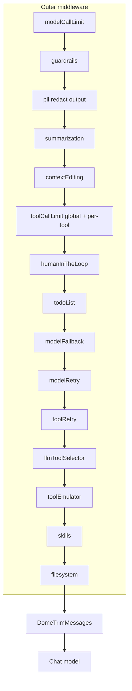

# Middleware de agentes LangChain / DeepAgents

Referencia viva del stack de middleware que envuelve cada invocación del modelo en Dome. Implementación central: [`electron/agent-middleware.cjs`](../../electron/agent-middleware.cjs). Ensamblaje del agente principal: [`electron/langgraph-agent.cjs`](../../electron/langgraph-agent.cjs) (`createConfiguredLangGraphAgent`).

---

## Perfiles

| Perfil | Uso | Checkpointer |
|--------|-----|--------------|
| `full` | Many, agent chat, runs, automations | Sí (`SqliteSaver`) |
| `worker` | Subagents (`subagents.cjs`), miembros de Agent Team | No (persistencia del grafo padre) |

---

## Pipeline (perfil `full`)

Orden **outer → inner** (el primero intercepta antes cada llamada al modelo):

Perfil `worker` omite: PII, contextEditing, HITL, todoList, modelFallback, llmToolSelector, toolEmulator. Incluye retry, limits, summarization (opcional), skills (si aplica), filesystem solo en subagent `data`.

---

## Inventario

| Middleware | Origen | Perfil | Estado | Archivo / notas |
|------------|--------|--------|--------|-----------------|
| `modelCallLimitMiddleware` | langchain | full, worker | Integrado | `agent-middleware.cjs` — run/thread limits |
| `buildGuardrailsMiddleware` | Dome | full, worker | Integrado | `guardrails.cjs` — contenido dañino (no PII) |
| `piiMiddleware` | langchain | full | Integrado | email + credit_card en **output** |
| `summarizationMiddleware` | langchain | full, worker | Integrado | Comprime historial al acercarse al budget |
| `contextEditingMiddleware` | langchain | full | Integrado | `ClearToolUsesEdit` — limpia tool outputs viejos |
| `toolCallLimitMiddleware` | langchain | full, worker | Integrado | Global + per-tool (`CREATION_TOOL_CAPS`) |
| `humanInTheLoopMiddleware` | langchain | full | Integrado | Writer/data subagents + calendar mutations |
| `todoListMiddleware` | Dome (port de langchain) | full | Integrado | Tool `write_todos` para tareas multi-paso. Versión Dome tolerante a `description`→`content` y campos extra (`id`) — ver nota abajo |
| `modelFallbackMiddleware` | langchain | full | Integrado | Cadena por provider (sin fallback en Ollama) |
| `modelRetryMiddleware` | langchain | full, worker | Integrado | 429 / 5xx / timeout |
| `toolRetryMiddleware` | langchain | full, worker | Integrado | `web_search`, `web_fetch`, `deep_research` |
| `llmToolSelectorMiddleware` | langchain (+ wrapper Dome) | full | Integrado | Auto si `tools.length > 15`; excluye `minimax`, `ollama` y `dome` (sin structured output fiable). Wrapper Dome verifica `withStructuredOutput` y degrada a tool list completa si el endpoint devuelve `undefined` |
| `toolEmulatorMiddleware` | langchain | full | Opt-in dev | `DOME_EMULATE_TOOLS=1` |
| `createSkillsMiddleware` | deepagents | full, worker | Integrado | `~/.dome/skills` |
| `createFilesystemMiddleware` | deepagents | full, worker data | Integrado | `/memories/` → StoreBackend persistente |
| `DomeTrimMessages` | Dome | full, worker | Integrado | Trim por provider budget (innermost) |
| `capToolResultString` | Dome | — | Paralelo | `tool-result-cap.cjs` — no es middleware |
| `createSubAgentMiddleware` | deepagents | — | **No adoptado** | Dome usa `subagents.cjs` + async tasks |

---

## Variables de entorno

| Variable | Default | Efecto |
|----------|---------|--------|
| `DOME_GUARDRAILS` | off | `1` activa guardrails de contenido dañino |
| `DOME_PII_REDACT` | off | `1` redacta email/tarjeta en respuestas del modelo |
| `DOME_LANGGRAPH_SUMMARIZATION` | on | `0` desactiva summarization |
| `DOME_LANGGRAPH_MODEL_CALL_LIMIT` | on | `0` desactiva límite de llamadas al modelo |
| `DOME_LANGGRAPH_TOOL_CALL_LIMIT` | on | `0` desactiva límites de tools |
| `DOME_LANGGRAPH_CONTEXT_EDITING` | on | `0` desactiva ClearToolUsesEdit |
| `DOME_LANGGRAPH_TODO_LIST` | on | `0` desactiva write_todos |
| `DOME_LANGGRAPH_MODEL_FALLBACK` | on | `0` desactiva fallback entre providers |
| `DOME_LANGGRAPH_MODEL_RETRY` | on | `0` desactiva reintentos del modelo |
| `DOME_LANGGRAPH_TOOL_RETRY` | on | `0` desactiva reintentos de tools de red |
| `DOME_LANGGRAPH_TOOL_SELECTOR` | auto | `1` fuerza selector; `0` desactiva |
| `DOME_LANGGRAPH_FILESYSTEM` | on | `0` desactiva VFS deepagents |
| `DOME_EMULATE_TOOLS` | off | `1` emula tools con LLM (dev/test) |
| `DOME_TRIM_DEBUG` | off | `1` log de tipos de mensaje en trim |

---

## Human-in-the-loop

Requiere checkpointer durable ([`electron/checkpointer.cjs`](../../electron/checkpointer.cjs)). Tools con aprobación:

- `call_writer_agent`, `call_data_agent` (modo subagent)
- `calendar_create_event`, `calendar_update_event`, `calendar_delete_event` (+ alias `calendar_*`)

Automations y runs pueden pasar `skipHitl: true`.

---

## Límites per-tool (creation caps)

Definidos en `CREATION_TOOL_CAPS` dentro de `agent-middleware.cjs`. Sustituyen el contador casero que vivía en `langgraph-agent.cjs`. Ejemplos: `resource_create: 5`, `ppt_create: 3`, `notebook_add_cell: 30`.

---

## Subagents vs DeepAgents subagent middleware

Dome **no** migra a `createSubAgentMiddleware` porque ya tiene:

- Subagents síncronos como tools (`call_*_agent`)
- Subagents async en background (`async-subagents.cjs`)
- HITL, streaming y caps integrados con la UI de chat/runs

Ver [`docs/features/agent-teams.md`](../features/agent-teams.md) para el supervisor multi-agente (StateGraph padre).

---

## Tool selector resiliente (Dome)

`createLlmToolSelectorMiddlewareMaybe` envuelve `llmToolSelectorMiddleware()` de LangChain con dos capas defensivas:

1. **Pre-check**: si el modelo no expone `withStructuredOutput()` (proxies, stubs deterministas, providers parciales), el selector NO se instala — se loguea un único `[LLMToolSelector] provider=… model has no withStructuredOutput(); skipping`.
2. **Runtime fallback**: si el endpoint sí expone `withStructuredOutput()` pero `.invoke()` retorna `undefined` (síntoma típico: `MiddlewareError: Expected object response with tools array, got undefined`), el wrapper captura ese error específico y delega al `handler(request)` original — el agente continúa con la lista completa de tools en lugar de abortar el run.

El provider `dome` se añade al set `TOOL_SELECTOR_UNSUPPORTED_PROVIDERS` (junto a `minimax` y `ollama`) porque su proxy Phase 1 retorna stubs deterministas.

---

## `write_todos` tolerante (Dome)

`createTodoListMiddlewareMaybe` en [`electron/agent-middleware.cjs`](../../electron/agent-middleware.cjs) no delega al `todoListMiddleware()` de LangChain: monta un middleware Dome con idéntico nombre (`todoListMiddleware`), mismo estado (`{ todos: [{ content, status }] }`), mismo system prompt (`TODO_LIST_MIDDLEWARE_SYSTEM_PROMPT`) y misma guardia contra `write_todos` paralelos. La única diferencia: el schema del tool aplica `z.preprocess` para aceptar variantes habituales que los modelos emiten por hábito (típicamente la forma de `TodoWrite` de Claude Code):

- `description` se acepta como alias de `content`.
- Campos extra (`id`, etc.) se descartan silenciosamente.
- `content` final exige `min(1)`: si modelo envía ambos vacíos, zod rechaza y el modelo recibe un tool error para reintentar.

El JSON Schema expuesto al modelo sigue siendo el canónico `{ content, status }`, así que no se le “enseña” la forma incorrecta; solo se tolera cuando ocurre. Para reusar la descripción larga upstream (con ejemplos), el código instancia `todoListMiddleware()` solo para leer `description` del tool y la propaga.

---

## Respuesta vacía del modelo

Cuando el proveedor devuelve `content` vacío (rehúse por política, `max_tokens` antes de texto, o tool call sin texto adjunto), `invokeLangGraphAgent` y `resumeLangGraphAgent` emiten un chunk `text` con un mensaje informativo y loggean un warning con `stop_reason` y si había `tool_calls`. Esto evita burbujas vacías en el chat tras una rehúse silenciosa típica del endpoint Anthropic / MiniMax-via-Anthropic.

---

## Relacionado

- [Plan de adopción](../plans/middleware-audit.md)
- [AI Chat](../features/ai-chat.md)
- [Agent runtime tools](./agent-runtime-tools.md)
