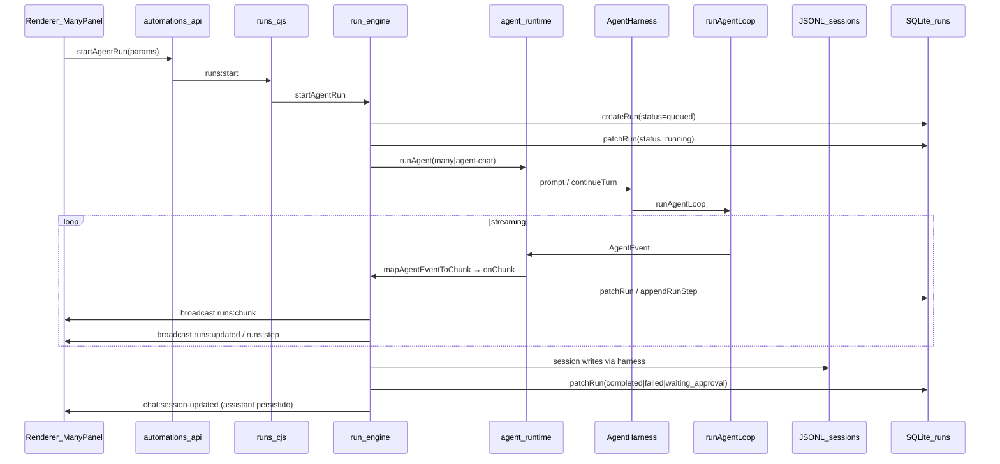
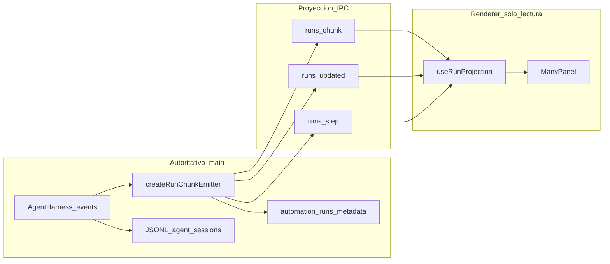

# Auditoría Dome AI: UI, Harness y Fuente de Verdad

> **Fecha:** 2026-06-29  
> **Alcance:** Many, Agent Chat (con/sin tools), run-engine, `@dome/agent-core` / harness, JSONL, SQLite, IPC.  
> **Relacionado:** [agent-runtime.md](../architecture/agent-runtime.md), [pi-parity-audit.md](./pi-parity-audit.md), [runs.md](../features/runs.md)

## Resumen ejecutivo

Dome AI tiene **varias fuentes parciales de verdad** que la UI combina con heurísticas locales. El síntoma reportado — *"Running in background..."* en una ventana/tab activa de Many — **no viene del harness**: es un label fallback del renderer (`chat.running_background`) usado cuando se crea o rehidrata una burbuja streaming sin contenido.

El run **sí** se ejecuta correctamente vía `runs:start` → `run-engine` → `agent-runtime` → `AgentHarness` → `runAgentLoop`. "Background" en el código significa *async en main process* (no bloquea el renderer), no *usuario ausente*. La UI traduce mal esa semántica.

**Veredicto:** la capa de ejecución (harness + run-engine) es razonablemente trazable en SQLite + JSONL; la capa de **presentación** (labels, fases, rehidratación multi-ventana) está desacoplada y produce estados engañosos y pérdida de contexto visible.

---

## 1. Mapa de flujo runtime

### 1.1 Camino principal (Many / Agent Chat con tools)



**Archivos clave:**

| Capa | Archivo | Rol |
|------|---------|-----|
| UI entrada | `app/components/many/ManyPanel.tsx` | `handleSend` → `startAgentRun`, estado local + `useManyStore` |
| UI stream | `app/lib/chat/useAgentRunStream.ts` | Suscripción `runs:chunk/updated/step` |
| API renderer | `app/lib/automations/api.ts` | Tipos `RunChunkPayload`, wrappers IPC |
| IPC | `electron/ipc/agents/runs.cjs` | Handlers `runs:*` |
| Orquestación | `electron/agents/run-engine.cjs` | `createRunChunkEmitter`, `executeAgentRun`, persistencia |
| Runtime | `electron/agents/agent-runtime.cjs` | `runAgent`, `mapAgentEventToChunk`, hooks HITL/compaction |
| Bridge | `electron/agents/dome-harness-bridge.cjs` | JSONL `{userData}/agent-sessions/` |
| Core | `packages/agent-core/` | `AgentHarness`, `runAgentLoop`, eventos `AgentEvent` |
| Persistencia runs | `electron/agents/run-store.cjs` | `automation_runs`, `automation_run_steps` |

### 1.2 Emisión de chunks (main → renderer)

`createRunChunkEmitter` en `run-engine.cjs` es el **adaptador autoritativo** de streaming hacia la UI:

- `text` / `thinking` → acumula en `context.fullResponse` / `context.fullThinking`, emite `runs:chunk`, parchea `outputText` en SQLite.
- `tool_call` / `tool_result` → actualiza `context.toolCalls`, crea/actualiza steps, emite chunk + `runs:step`.
- `budget`, `compaction`, `usage`, `interrupt`, `error`, `done` → emitidos tal cual.

El harness solo reenvía un **subconjunto** de `AgentEvent` vía `mapAgentEventToChunk` + `harness.subscribe`:

```764:780:electron/agents/agent-runtime.cjs
  const unsubEvents = harness.subscribe((event) => {
    if (!event || typeof event.type !== 'string') return;
    if (event.type === 'session_compact' && event.compactionEntry) { /* compaction chunk */ }
    if (event.type === 'agent_end' || event.type === 'message_update' ||
        event.type === 'tool_execution_start' || event.type === 'tool_execution_end' ||
        event.type === 'message_end') {
      const chunk = mapAgentEventToChunk(event);
      if (chunk && typeof onChunk === 'function') onChunk(chunk);
    }
  });
```

**No se reenvían:** `agent_start`, `turn_start/end`, `tool_execution_update`, `before_provider_request`, `save_point`, `settled`, fases del harness (`idle|turn|compaction|…`).

### 1.3 Caminos alternativos (trazabilidad distinta)

| Superficie | Inicio | Observación | Persistencia run | Fuente chat visible |
|------------|--------|-------------|------------------|---------------------|
| Many (tools) | `runs:start` | `runs:chunk` broadcast | `automation_runs` | JSONL + `chat_messages` al final |
| Agent chat (tools) | `runs:start` (`skipHitl: true`) | idem | idem | idem |
| Agent chat (sin tools) | `ai:stream` | `ai:stream:chunk` | **ninguna** | manual en renderer |
| Agent Team | `ai:team:stream` | `ai:stream:chunk` solo sender | **ninguna** | manual al terminar |
| Workflows | `runs:startWorkflow` | `runs:*` | idem | note resource opcional |
| Legacy agent stream | `ai:agent:stream` | sender-only | **ninguna** | in-process Map |

---

## 2. Inventario de fuentes de verdad

| Dato | Fuente primaria | Fuente secundaria | Usada por UI live | Usada post-mortem |
|------|-----------------|-------------------|-------------------|-------------------|
| Mensajes Many | JSONL `agent-sessions/` | `chat_messages` | `threads:get-state` al terminar run | JSONL |
| Lista sesiones Many | `threads:list?rootOnly=true` | localStorage meta | sidebar historial | JSONL |
| Run operativo | `activeRunContexts` (memoria) | — | vía chunks | — |
| Run persistido | `automation_runs` | steps + metadata | `runs:updated`, `getRun` | Hub Runs, RunLogView |
| Streaming parcial | `runs:chunk` (no persistido chunk-a-chunk) | `outputText` en run row | `useAgentRunStream` | `outputText` + JSONL |
| Tool calls en UI | chunks live | `metadata.toolCalls` al final | `ChatToolCard` | run metadata + JSONL |
| Context budget | chunk `budget` | — | `ContextUsageIndicator` | — |
| Compaction | chunk `compaction` | entry `compaction` en JSONL (solo manual) | `CompactionNotice` | JSONL branch |
| HITL | chunk `interrupt` + run `waiting_approval` | `metadata.pendingApproval` | `ManyHitlInlineSection` | resume vía `runs:resume` |
| Traces tool/MCP | `chat_traces` | — | **no** (sin evento) | DB only |
| Fase sesión (historial) | `useManyStore.activeRunBySessionId` | BroadcastChannel sync | spinner historial | — |
| Status global Many | `useManyStore.status` | heurística local | header badge, FAB | — |

### 2.1 Correlación de IDs

| ID | Generación | Correlación |
|----|------------|-------------|
| `runId` | UUID en `createRun` | 1 run ↔ N steps; chunks llevan `runId` |
| `threadId` | Many: `currentSessionId`; agent: `session_{sessionId}` | 1 chat ↔ 1 JSONL; subagentes `_sub_`, `_member_`, `_fork_` |
| `sessionId` | `db:chat:createSession` (puede fallar silenciosamente) | `getActiveRunBySession(sessionId)` — si null, no rehidrata |
| `ownerType` + `ownerId` | Many: `many` + session UUID | Hub Runs **excluye** `ownerType === 'many'` |

### 2.2 PI (provider-independent) como fuente de contexto

Los mensajes normalizados del core (`piMessageToHistoryEntry`, `buildSessionContext`, entries JSONL) son la **fuente de verdad del contexto LLM**. La UI de Many **no** muestra el árbol JSONL completo en vivo; solo refleja chunks mapeados + refresh post-run vía `refreshManySessionFromThread`.

Ver también [pi-parity-audit.md](./pi-parity-audit.md) para gaps de paridad pi ↔ Dome (compaction, `tool_execution_update`, colas steering, etc.).

---

## 3. Matriz de estados visibles en UI

| Estado visible | Componente | Origen real | ¿Emitido por core? | Problema |
|----------------|------------|-------------|-------------------|----------|
| "Running in background..." | `ChatMessage` / `ManyMinimalStatusRow` | `useAgentRunStream`, `applyRunSnapshot`, efecto `currentSessionRunPhase` | **No** — label i18n local | Semántica incorrecta en ventana activa |
| "Thinking and evaluating tools..." | burbuja Many al enviar | `ManyPanel.handleSend` | **No** | OK al enviar; choca con rehidratación |
| "Processing..." | fallback `ChatMessage` | i18n | **No** | Genérico |
| Rotación `thinking_l1…l6` | Agent chat | interval 3s en `AgentChatView` | **No** | Many no rota; misma hook, UX distinta |
| Badge "Pensando" / "Hablando" | `ManyChatHeader` | `useManyStore.status` | parcial (`thinking` manual) | No distingue tools vs texto vs HITL |
| `ContextUsageIndicator` 23% | composer/header | chunks `budget` + `usage` | **Sí** | Puede mostrarse sin label de fase claro |
| Tool cards "running" | `ChatToolCard` | chunk `tool_call` | **Sí** | OK |
| Bloque "Reasoning" | `ChatMessage.thinking` | chunk `thinking` | **Sí** | Se pierde si llega antes de crear burbuja |
| Spinner historial otra sesión | `ChatHistorySessionList` | `activeRunBySessionId` | parcial | Depende de BroadcastChannel |
| Timeline steps | `AgentRunTimeline` | `runs:step` | **Sí** | No siempre visible en Many |
| HITL "Waiting for approval" | header + inline | chunk `interrupt` / snapshot | **Sí** | OK |

### 3.1 Por qué aparece "Running in background..." en ventana activa

**Causa raíz:** el string es fallback cuando `streamingMessage.content` está vacío pero `isStreaming === true`:

```443:454:app/components/chat/ChatMessage.tsx
              ) : message.isStreaming ? (
                surfaceVariant === 'many' ? (
                  <ManyMinimalStatusRow variant="dots" label={message.streamingLabel || t('chat.processing')} />
```

Se asigna en tres puntos del renderer:

1. **`useAgentRunStream`** — primer chunk `text` o `runStep` sin burbuja previa → `t('chat.running_background')`.
2. **`ManyPanel.applyRunSnapshot`** — rehidratación de run activo → `prev?.streamingLabel || t('chat.running_background')`.
3. **Efecto `currentSessionRunPhase`** — otra ventana/tab reportó run vía `BroadcastChannel` → burbuja `synced-run-*` con `running_background` si fase `streaming`.

En ningún caso el main process emite un evento `background`. El run está **foreground en la ventana que lo observa**.

**Efecto colateral:** en cuanto llega texto, `ChatMessage` deja de mostrar el label (renderiza markdown). El header puede seguir en `status === 'thinking'` mientras el usuario ya ve tokens — desincronización header ↔ burbuja.

---

## 4. Pérdidas de contexto y trazabilidad

Prioridad: **P0** (usuario ve estado incorrecto) → **P3** (diagnóstico / Hub).

### P0 — Estados UI engañosos

| ID | Problema | Evidencia |
|----|----------|-----------|
| P0-1 | Label `running_background` en UI activa | `useAgentRunStream.ts:168,275`, `ManyPanel.tsx:216,406` |
| P0-2 | Label desaparece al primer token aunque sigan tools/HITL | `ChatMessage.tsx` — branch `content ? markdown : status row` |
| P0-3 | `status` global Many no refleja fase real (`streaming` solo en `activeRunBySessionId`) | `useManyStore.ts` — `ManyStatus` sin variante `streaming` |
| P0-4 | Header avatar siempre `idle`; animación solo en hilo | `ManyChatHeader.tsx` |

### P1 — Contexto/traza no visible en vivo

| ID | Problema | Evidencia |
|----|----------|-----------|
| P1-1 | Chunks `thinking` ignorados si no hay burbuja previa | `useAgentRunStream.ts:174-177` — `prev ? … : prev` |
| P1-2 | Eventos harness no reenviados (`turn_*`, `tool_execution_update`, fases) | `agent-runtime.cjs` subscribe filter |
| P1-3 | Compaction automática no persiste entry JSONL; UI ve chunk pero árbol no | `agent-runtime.cjs` hook `context` vs `session_compact` manual |
| P1-4 | `db:chat:appendTrace` sin evento → traces invisibles en vivo | `electron/ipc/agents/chat.cjs` |
| P1-5 | Assistant en `chat_messages` solo al **final** del run | `run-engine.cjs` `tryPersistRunAssistantMessage` |
| P1-6 | TTS (`ManyVoiceBridge`) pone `status: idle` al terminar audio aunque run siga | desincronización FAB/header |

### P2 — Rehidratación y multi-ventana

| ID | Problema | Evidencia |
|----|----------|-----------|
| P2-1 | Rehidratación crea burbuja `synced-run-*` con labels distintos al run real | `ManyPanel.tsx:203-218` |
| P2-2 | `getActiveRunBySession` falla si `createChatSession` no persistió | `ManyPanel.handleSend` catch silencioso |
| P2-3 | `recoverStuckRuns` actualiza SQLite **sin** emitir `runs:updated` | `run-engine.cjs:1120-1169` |
| P2-4 | Agent Team / `ai:agent:stream` — sin `automation_runs`, sin reconexión | `agent-team.cjs`, `ai.cjs` |
| P2-5 | `runs:chunk` broadcast vs `ai:stream:chunk` sender-only — asimetría multi-ventana | preload + handlers |

### P3 — Observabilidad producto

| ID | Problema | Evidencia |
|----|----------|-----------|
| P3-1 | Runs Many excluidos del Hub Runs | `RunsWorkspaceView.tsx` filter `ownerType !== 'many'` |
| P3-2 | Tres pipelines sin unificar (`runs:start`, `ai:team:stream`, `ai:agent:stream`) | docs desactualizados en agent-teams |
| P3-3 | Tool results truncados en metadata (`capResultText`) — post-mortem incompleto | `run-engine.cjs`, ELECTRON-7 |
| P3-4 | Workflows: downstream no ve tool traces internos del nodo | `agent-runtime.md` |

---

## 5. Propuesta: contrato de estado/eventos único

Objetivo: **una proyección autoritativa en main** que el renderer consume sin inferir labels.

### 5.1 Nuevo campo: `run.uiPhase` (persistido en `automation_runs.metadata`)

Derivado en `createRunChunkEmitter` / `patchRun` desde eventos harness:

```typescript
type RunUiPhase =
  | 'queued'
  | 'starting'           // agent_start, budget emitido
  | 'thinking'           // thinking_delta sin text aún
  | 'tool_running'       // tool_execution_start sin result
  | 'tool_progress'      // tool_execution_update (nuevo)
  | 'generating'         // text_delta activo
  | 'compacting'         // compaction hook
  | 'waiting_approval'   // interrupt
  | 'speaking'           // TTS activo (opcional)
  | 'completed' | 'failed' | 'cancelled';
```

**Reglas:**

- Main es la única fuente de `uiPhase` y `uiLabelKey` (i18n key, no string libre).
- Renderer **no** asigna `running_background` localmente; usa `run.metadata.uiLabelKey` o traduce `uiPhase`.
- Cada `runs:chunk` incluye `{ uiPhase, uiLabelKey? }` opcional para sincronizar sin esperar `runs:updated`.

### 5.2 Ampliar `RunChunkPayload`

Añadir tipos (compatibles hacia atrás):

```typescript
| { runId: string; type: 'phase'; phase: RunUiPhase; labelKey?: string; detail?: string }
| { runId: string; type: 'harness'; event: string; payload?: Record<string, unknown> }
```

Eventos harness candidatos a reenviar (filtrados, no todos):

- `turn_start`, `turn_end`
- `tool_execution_update`
- `session_before_compact`, `session_compact`
- `agent_start`, `agent_end` (ya parcialmente cubiertos por `done`)

### 5.3 Unificar proyección UI

Nuevo hook `useRunProjection(runId)` que combine:

- snapshot `getRun` / `runs:updated`
- stream `runs:chunk`
- steps `runs:step`

y exponga:

```typescript
interface RunProjection {
  phase: RunUiPhase;
  labelKey: string;
  streamingContent: string;
  thinking: string;
  toolCalls: ToolCallData[];
  runSteps: PersistentRunStep[];
  pendingApproval: … | null;
  budget: BudgetBreakdown | null;
  usage: PersistentRunUsage | null;
}
```

`ManyPanel` y `AgentChatView` dejan de duplicar lógica de labels.

### 5.4 Semántica "background"

Reservar `chat.running_background` **solo** cuando:

- `run.sessionId !== currentSessionId`, o
- `activeRunId === null` pero `getActiveRunBySession(otherSession)` activo (historial spinner).

En ventana/tab **activa** con `activeRunId` ligado: usar `chat.generating_response`, `chat.tool_running`, etc.

---

## 6. Cambios recomendados por fase

### Fase 1 — Quick wins (sin cambiar harness)

| Cambio | Archivos | Impacto |
|--------|----------|---------|
| Eliminar `running_background` como default en ventana activa | `useAgentRunStream.ts`, `ManyPanel.tsx`, `AgentChatView.tsx` | Corrige síntoma captura |
| Crear burbuja en chunk `thinking` si no existe | `useAgentRunStream.ts` | Recupera reasoning inicial |
| Mostrar fase en header derivada de `streamingMessage.toolCalls` + `pendingApproval` | `ManyPanel.loadingHint`, `ManyChatHeader` | Mejor UX sin IPC nuevo |
| Documentar que Hub Runs excluye Many | `docs/features/runs.md` | Expectativas claras |

### Fase 2 — Contrato `uiPhase` en main

| Cambio | Archivos |
|--------|----------|
| Calcular y persistir `metadata.uiPhase` en `createRunChunkEmitter` | `run-engine.cjs` |
| Emitir chunk `phase` en transiciones | `run-engine.cjs`, `api.ts` |
| Consumir en `useAgentRunStream` / header | `useAgentRunStream.ts`, `ManyPanel.tsx` |
| Emitir `runs:updated` tras `recoverStuckRuns` | `run-engine.cjs` |

### Fase 3 — Trazabilidad harness completa

| Cambio | Archivos |
|--------|----------|
| Reenviar `tool_execution_update`, `turn_*` seleccionados | `agent-runtime.cjs` |
| Persistir compaction automática como entry JSONL | `agent-runtime.cjs`, `@dome/agent-core` |
| Evento `chat:trace-appended` o incluir traces en refresh | `chat.cjs`, renderer |
| Unificar Agent Team bajo `runs:start` (opcional, breaking) | `agent-team.cjs`, `run-engine.cjs` |

### Fase 4 — Observabilidad

| Cambio | Archivos |
|--------|----------|
| Vista diagnóstico Many runs (filtro opt-in en Hub) | `RunsWorkspaceView.tsx` |
| Panel debug: correlación runId ↔ threadId ↔ sessionId | settings dev / Many debug |

---

## 7. Criterios de aceptación

1. **Ventana Many activa con run en curso:** nunca muestra "Running in background..." salvo que el run pertenezca a **otra** sesión.
2. **Reapertura de tab/ventana mid-run:** rehidrata contenido parcial (`outputText`) + fase correcta (`tool_running` / `generating`) sin burbuja `synced-run-*` parpadeante.
3. **Tool en ejecución:** label visible aunque ya haya texto parcial en la burbuja (status row auxiliar o badge en header).
4. **HITL:** fase `waiting_approval` coherente en header, burbuja e historial.
5. **Compaction:** `CompactionNotice` + entry JSONL tras autocompact (Fase 3).
6. **Post-crash:** `recoverStuckRuns` emite `runs:updated`; UI no muestra run stale como `running`.
7. **Correlación:** dado `runId`, DevTools/Hub puede resolver `threadId` y viceversa en metadata.

---

## 8. Smoke checks y validación

### 8.1 Manual (Electron dev)

| # | Escenario | Pasos | Esperado |
|---|-----------|-------|----------|
| S1 | Many ventana activa | Enviar mensaje con tools | Label ≠ "background"; muestra tool o "generating" |
| S2 | Popout + sidebar | Iniciar run en popout; observar sidebar misma sesión | Ambos sincronizados vía `runs:chunk` |
| S3 | Otra sesión | Run en sesión A; ver historial sesión B | Spinner en A; **no** label background en chat activo B |
| S4 | Rehidratación | Mid-run, cambiar tab y volver | Contenido parcial + fase correcta |
| S5 | HITL | Invocar tool en `HITL_TOOL_NAMES` | `waiting_approval` + UI inline |
| S6 | Cancel | Abort durante tool | `cancelled`, partial persistido |
| S7 | Context meter | Run largo | `budget` chunk → indicador coherente con fase |

### 8.2 Automatizable

```javascript
// electron/__tests__/run-ui-phase.test.mjs (propuesto)
// - createRunChunkEmitter asigna uiPhase en tool_call → tool_running
// - text después de tool → generating
// - interrupt → waiting_approval
```

```typescript
// app/lib/chat/__tests__/useAgentRunStream.test.ts (propuesto)
// - chunk thinking sin prev → crea burbuja
// - chunk phase → actualiza streamingLabel desde labelKey
```

### 8.3 Correlación harness ↔ UI

Checklist post-run:

1. `runs:get(runId)` → `threadId`, `metadata.toolCalls`, `outputText`.
2. `threads:get-state(threadId)` → mismos turnos assistant/tool en JSONL.
3. `db:chat:getSession(sessionId)` → assistant message al final (puede lag vs JSONL).
4. Comparar: tool count en UI === metadata === JSONL toolResult entries.

---

## 9. Diagrama de fuentes de verdad (estado deseado)



---

## 10. Referencias cruzadas

- Arquitectura runtime: [docs/architecture/agent-runtime.md](../architecture/agent-runtime.md)
- Paridad pi: [docs/audits/pi-parity-audit.md](./pi-parity-audit.md)
- Canales IPC: [docs/architecture/ipc-channels.md](../architecture/ipc-channels.md)
- Feature runs: [docs/features/runs.md](../features/runs.md)
- Feature ai-chat: [docs/features/ai-chat.md](../features/ai-chat.md)

---

## Apéndice A — Locales afectados

Clave i18n `chat.running_background` en `packages/i18n/locales/*/chat.json`. Tras Fase 1, añadir claves propuestas:

- `chat.generating_response`
- `chat.tool_running`
- `chat.reconnecting_run`
- `chat.compacting_context`

Traducir en en/es/fr/pt según [app/lib/i18n.ts](../../app/lib/i18n.ts) o paquete i18n correspondiente.

---

## Apéndice B — Estado de implementación (2026-06-29)

Implementación del plan de auditoría en el repo `dome`. **No modificar el plan original**; este apéndice refleja el estado real del código.

### Fase 1 — Completada

| Ítem | Estado | Notas |
|------|--------|-------|
| Eliminar `running_background` en ventana activa | ✅ | `streamingLabels.ts`, `useAgentRunStream.ts`, `ManyPanel`, `AgentChatView` |
| Burbuja en chunk `thinking` | ✅ | `useAgentRunStream.ts` |
| Labels semánticos (generating, tool, reconnect, compact) | ✅ | i18n en en/es/fr/pt (`chat.json`) |
| Documentar Hub excluye Many | ✅ | `docs/features/runs.md` |

### Fase 2 — Completada

| Ítem | Estado | Notas |
|------|--------|-------|
| `metadata.uiPhase` en main | ✅ | `electron/agents/run-ui-phase.cjs`, `run-engine.cjs` |
| Chunk `type: 'phase'` | ✅ | Emite `phase`, `labelKey`, `detail`; persiste en run metadata |
| Consumo en renderer | ✅ | `useAgentRunStream`, `streamingLabelFromRunMetadata`, rehidratación |
| `recoverStuckRuns` → `runs:updated` | ✅ | Query IDs antes del UPDATE + broadcast |
| Tests unitarios | ✅ | `electron/__tests__/run-ui-phase.test.mjs` (3 tests) |

### Fase 3 — Parcial (scope acotado)

| Ítem | Estado | Notas |
|------|--------|-------|
| Reenviar `turn_*`, `tool_execution_update`, `agent_start` | ✅ | `agent-runtime.cjs` → chunks `harness` / `tool_progress` |
| Persistir compaction automática en JSONL | ⏭️ | **Descartado**: riesgo de `firstKeptEntryId` incorrecto sin cambio en `@dome/agent-core` |
| `chat:trace-appended` | ⚠️ | Emitido en `chat.cjs` + whitelist preload; **renderer no suscrito aún** |
| Agent Team bajo `runs:start` | ⏭️ | Opcional/breaking; fuera de scope |

### Fase 4 — Completada

| Ítem | Estado | Notas |
|------|--------|-------|
| Filtro Many opt-in en Hub Runs | ✅ | `RunsWorkspaceView.tsx`, `runLog.filter_owner_many` (en/es/fr/pt) |
| Panel diagnóstico correlación IDs | ✅ | `ManyRunDiagnostics.tsx` en `ManyPanel` (runId, sessionId, threadId, uiPhase) |

### Validación automatizada

- `pnpm run typecheck` — ✅
- `pnpm run lint` — ✅ (0 errors; warnings preexistentes)
- `node --test electron/__tests__/run-ui-phase.test.mjs` — ✅

### Criterios de aceptación (§7) — evaluación

| # | Criterio | Estado |
|---|----------|--------|
| 1 | Ventana activa ≠ "background" | ✅ Implementado (Fase 1) |
| 2 | Rehidratación mid-run con fase correcta | ✅ `applyRunSnapshot` + `uiPhase` metadata |
| 3 | Label tool con texto parcial | ✅ `tool_running` / `streamingLabelForActiveRun` |
| 4 | HITL coherente | ✅ `waiting_approval` en phase + metadata |
| 5 | Compaction JSONL tras autocompact | ⏭️ Pendiente (Fase 3 descartada) |
| 6 | Post-crash sin run stale | ✅ `recoverStuckRuns` broadcast |
| 7 | Correlación runId ↔ threadId | ✅ Panel diagnóstico + Hub filtro Many |

### Smoke checks manuales (§8.1)

Pendientes de ejecución manual en `pnpm run electron:dev` (S1–S7). Recomendado antes de merge/release.
