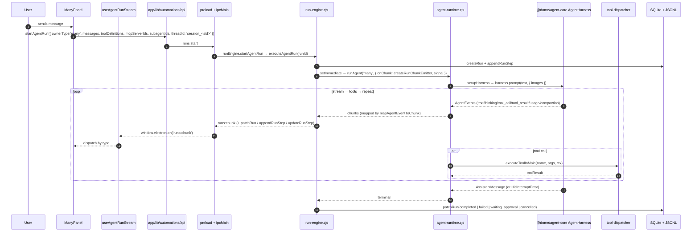
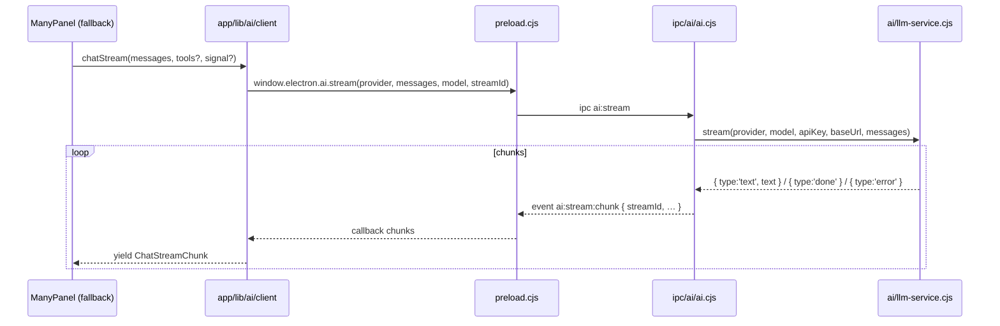

# AI / Chat feature (Many)

Dome's AI chat surface: unified renderer client, native agent runtime in main,
provider-agnostic LLM service, tool registry, and stream pipeline.

**Main chat UI**: `ManyPanel` (`app/components/many/ManyPanel.tsx`).
**Many Agents** (custom assistants): `app/components/agents/`, `app/lib/agents/`.
**Agent Teams** (multi-agent supervisor + members): `electron/ipc/agents/agent-team.cjs`. See [agent-teams.md](./agent-teams.md).
**Agent Canvas** (visual workflow builder): `app/components/agent-canvas/`. See [agent-canvas.md](./agent-canvas.md).

State (Zustand): `app/lib/store/useManyStore.ts` (Many chat) and
`app/lib/store/useAgentChatStore.ts` (per-agent sessions). Main-process agent
runtime: `electron/agents/agent-runtime.cjs` → `@dome/agent-core`. Deep dive:
[../architecture/agent-runtime.md](../architecture/agent-runtime.md) and
[../architecture/harness-and-subagents.md](../architecture/harness-and-subagents.md).

---

## 1. Architecture overview

Dome runs **one** agent runtime — the Dome-native loop in `@dome/agent-core`
(vendored workspace package, no LangGraph). Every agent surface (Many chat,
agent-chat, Agent Team, workflows) goes through it via
`electron/agents/agent-runtime.cjs`.

```text
Renderer (app/)                    Main (electron/)                        Workspace packages
─────────────────                  ─────────────────                       ──────────────────
ManyPanel ─┐                       ipc/ai/ai.cjs                           @dome/agent-core
AgentChatView ─┼─► runs:start ───► agents/run-engine.cjs ──►  AgentHarness  @dome/agent-core/node
Many Agents ──┘                     │   executeAgentRun ──►   prompt()       @dome/ai
                                    │                       stream→tools→rep @dome/tools
                                    │   chunks ◄── emit ──    events → chunks
                                    ▼
                                    agents/agent-runtime.cjs
                                      ├── dome-harness-bridge.cjs (JsonlSessionRepo, MCP, skills)
                                      ├── subagents-native.cjs (task / delegate_to_agent)
                                      ├── tools/tool-dispatcher.cjs → tools/ai-tools-handler.cjs
                                      └── ai/llm-service.cjs (provider wrappers)
```

The legacy LangGraph / `@langchain/langgraph` / `deepagents` stack has been
fully removed. `@langchain/core` remains only as the base type for the plain
LLM wrappers in `electron/ai/llm-service.cjs`; `@langchain/mcp-adapters`
powers the MCP client that the bridge converts into native `AgentTool[]`.

**Personality / system prompt**: `shared/prompt-assembler/index.cjs` (single
assembler reused by main + renderer), loaded from `prompts/martin/core/*.txt`,
prefixed by `agent-runtime.cjs` with a `<available_skills>` block from
`~/.dome/skills/`. `electron/personality/personality-loader.cjs` still ships
legacy SOUL.md / USER.md / MEMORY.md scaffolding under `userData/martin/`,
but the native harness does not auto-inject these into the system prompt
(see gap in `harness-and-subagents.md` §15).

---

## 2. Main process files

| Path | Role |
|------|------|
| `electron/agents/agent-runtime.cjs` | **Single entry point** — `runAgent(surface, opts)` → `runDomeAgent` → `AgentHarness.prompt()`. Surfaces: `many`, `agent-chat`, `workflows`, `agent-team`, `subagent`, `agent-team-member`, `threads`. Also exports `runManyAgent`, `resumeDomeAgent`, `mapAgentEventToChunk`, `buildBudgetBreakdown`, `HitlInterruptError`, `HITL_TOOL_NAMES`, `CREATION_TOOL_CAPS`. |
| `electron/agents/run-engine.cjs` | Run façade. `startAgentRun` / `startWorkflowRun` / `resumeRun` / `abortRun`; `executeAgentRun`, `createRunChunkEmitter`, automation scheduler hooks. Public API unchanged for IPC handlers and `automation-service.cjs`. |
| `electron/agents/run-store.cjs` | Run / step / link SQLite persistence + renderer events (`runs:updated`, `runs:step`, `runs:chunk`). |
| `electron/agents/dome-harness-bridge.cjs` | Wires harness to Dome: `JsonlSessionRepo` at `userData/agent-sessions/`, `loadSkills` + `formatSkillsForSystemPrompt`, `buildMcpAgentTools`, `buildAllTools` (Dome + MCP merge with `normalizeToolParameters`). |
| `electron/agents/subagents-native.cjs` | Native subagent delegation. `task` tool (Many, enum of 4) and `delegate_to_agent` tool (Agent Team, dynamic members). See [§6](#6-subagents). |
| `electron/agents/agent-runtime-context.cjs` | `parseRuntimeContext` (Zod-validated `activeResourceId` + `pinnedResourceIds`). |
| `electron/agents/workflow-executor.cjs` | DAG executor (`executeWorkflowRun`, `topologicalLevels`, per-node retry); static-agent resolution (`SYSTEM_AGENTS`: research, library, writer, data, presenter, curator). |
| `electron/agents/workflow-dag.cjs` | Pure DAG helpers (`topologicalLevels`, `mergePayloads`, `getInputPayloads`). Unit-tested in `electron/__tests__/workflow-dag.test.mjs`. |
| `electron/agents/automation-service.cjs` | `setInterval(tick, 60_000)` automation scheduler; `STARTUP_GRACE_MS = 60_000` (120 000 on Windows without `automation_run_on_startup`). |

---

## 3. LLM service (`electron/ai/llm-service.cjs`)

Provider-agnostic. Exports `{ chat, stream, buildImageContent }`.

- Providers: OpenAI, Anthropic, Google, OpenRouter, Minimax/MiniMax, Copilot,
  Synthetic, Venice, Bedrock, Ollama, Dome Provider (`dome-provider-url.cjs`),
  plus a generic `openai-compat` path.
- API keys are read from SQLite in main (`db.getSetting`); Anthropic uses a
  direct API key the same way as OpenAI and Google. No provider key ever
  reaches the renderer.
- `chat({ provider, model, apiKey, baseUrl, messages })` → `{ text, usage? }`.
- `stream({ … })` → async iterable of `{ type, text|tool|usage|done|error }`.
- Embeddings live in a separate service (`electron/services/embeddings.service.cjs`,
  IPC `embeddings:*`, `db:semantic:*`) — semantic search does not go through
  the chat pipeline. See [indexing.md](./indexing.md).

---

## 4. IPC handlers (`electron/ipc/ai/ai.cjs`)

The IPC layer is intentionally thin. Cloud-only chat goes through
`llmService`; everything that needs tools or sessions goes through
`agentRuntime`.

| Channel | Direction | Purpose | Backend |
|---------|-----------|---------|---------|
| `ai:chat` | invoke | Non-streaming chat (provider, messages, model). | `llmService.chat` |
| `ai:stream` | invoke | Start a plain LLM stream (provider, messages, model, `streamId`). | `llmService.stream` |
| `ai:agent:stream` | invoke | Chat-with-tools via the native runtime. `(provider, messages, model, streamId, tools?, threadId?, mcpServerIds?, subagentIds?, sessionId?, skipHitl?)`. | `agentRuntime.runManyAgent` → surface `many` |
| `ai:agent:abort` | invoke | Abort a stream by `streamId`. | `AbortController` map |
| `ai:agent:resume` | invoke | Resume after a HITL pause (`streamId`, `decisions`). | `agentRuntime.resumeDomeAgent('many', …)` |
| `ai:testConnection` | invoke | Smoke-test the current provider config. | `llmService` + provider model listing |
| `ai:provider:listModels` / `ai:openrouter:listModels` | invoke | List models for a provider. | `openrouter-models.cjs` / `provider-models.cjs` |
| `ai:testWebSearch` / `ai:webSearch` | invoke | Direct web search (used by Settings + tools). | `aiToolsHandler.webSearch` |
| `ai:stream:chunk` | event (main → renderer) | Stream chunks `{ streamId, type, text?, thinking?, toolCall?, toolResult?, usage?, budget?, compaction?, interrupt?, done, error }`. | emitted from `runManyAgent` and `llmService.stream` |
| `ai:team:stream` / `ai:team:abort` | invoke | Agent Team supervisor stream / abort. | `electron/ipc/agents/agent-team.cjs` → `agentRuntime.runAgent('agent-team', …)` |
| `ai:tools:*` | invoke | Tool handlers exposed to the renderer (resource/project/etc. — see [§5](#5-tools)). | `electron/ipc/ai/ai-tools.cjs` → `tools/ai-tools-handler.cjs` |
| `runs:start` / `runs:resume` / `runs:abort` / `runs:list` / `runs:get` / `runs:getActiveBySession` / `runs:delete` | invoke | The unified run API used by `ManyPanel` and `AgentChatView`. | `electron/ipc/agents/runs.cjs` → `run-engine.cjs` |
| `threads:list` / `threads:get-state` / `threads:get-history` / `threads:delete` / `threads:update-state` / `threads:compact` / `threads:navigate-tree` | invoke | Session persistence + time-travel (replaces the LangGraph checkpointer). | `electron/ipc/agents/threads.cjs` |
| `approval:respond` | invoke | HITL decisions. | `electron/ipc/agents/approval.cjs` |

Preload whitelisting: `electron/preload.cjs` declares every channel above in
`ALLOWED_CHANNELS` (search for `ai:` / `runs:` / `threads:` / `approval:` /
`ai:tools:`).

> **Removed channels**: `ai:langgraph:stream` and `ai:langgraph:resume` are
> gone — there is no LangGraph agent anywhere. Use `ai:agent:stream` /
> `ai:agent:resume` (or, for the modern path, `runs:start` / `runs:resume`).

---

## 5. Tools

The canonical registry is `createToolRegistry` in `packages/tools/`; the
authoritative dispatcher map for the main process is
`electron/tools/tool-dispatcher.cjs`. Every tool name → handler mapping lives
in `TOOL_HANDLER_MAP` (lazy-required `electron/tools/ai-tools-handler.cjs`).

| Path | Role |
|------|------|
| `electron/tools/tool-dispatcher.cjs` | `executeToolInMain(name, args, ctx)`, `getAllToolDefinitions()`, `getToolDefinitionsByIds(ids)`, `getToolDefsBySubagent()`, `TOOL_TIMEOUT_OVERRIDES` (`transcribe_audio=600s`, `notebook_run_cell=300s`, `ppt_create=300s`, default `120s`). |
| `electron/tools/ai-tools-handler.cjs` | The handler map: `resourceSearch`, `resourceGet`, `resourceGetSection`, `resourceList`, `resourceSemanticSearch`, `resourceHybridSearch`, `projectList`, `projectGet`, `getRecentResources`, `getCurrentProject`, `interactionList`, `pdfRenderPage`, `pdfExtractText`, `pdfGetMetadata`, `pdfGetStructure`, `pdfSummarize`, `pdfExtractTables`, `webSearch`, `webFetch`, `domeLoadDoc`, `rememberFact`, `generateQuiz`, `generateMindmap`, `generateGuide`, `generateFaq`, `generateTimeline`, `generateTable`, `generateAudioOverview`, `generateVideoOverview`, `studioGenerate`, `notebookRunCell`, `notebookAddCell`, `excelCreate`, `excelRead`, `excelEdit`, `excelAddSheet`, … (full list ~102 tools, `TOOL_COUNT` kept in sync). |
| `electron/tools/ai-tools-extra.cjs` | Secondary tool set (calendar, email, shell, browser, vision, etc.) merged into `TOOL_HANDLER_MAP`. |
| `electron/tools/tool-cap.cjs` | `OPENAI_COMPAT_MAX_TOOLS = 128`. |
| `electron/tools/tool-result-cap.cjs` | `DEFAULT_MAX_CHARS = 48 000` (head 50% + hint); overrides for `directory_tree`, `list_directory_with_sizes`, `search_files`, `file_tree`. |
| `electron/tools/tool-input-normalize.cjs` | Injects `activeResourceId`, parses JSON-string tool arguments. |
| `electron/tools/tool-result-format.cjs` | Vision blocks for `ppt_get_slide_images` (capped `MAX_PPT_QA_SLIDES=4`). |
| `electron/tools/tool-selector.cjs` | Heuristic selector (12 regex rules). **Not invoked by `agent-runtime.cjs`** — the runtime passes the full registry, filtered by `CREATION_TOOL_CAPS` and the per-subagent subsets. |
| `packages/tools/src/families.ts` | Canonical tool families (`web`, `resources`, `projects`, `memory`, `calendar`, `email`, `artifacts`, `feeders`, `flashcards`, `notebook`, `office`, `vision`, `docs`, `entities`, `marketplace`, `browser`, `image`, `file`, `shell`, `studio`, `ui`). |
| `electron/ipc/ai/ai-tools.cjs` | IPC bridge that exposes the `ai:tools:*` channels to the renderer (legacy / agent-chat fallback). |

### Renderer-side tool helpers (`app/lib/ai/tools/`)

- `index.ts` — `createToolRegistry`, `toOpenAIToolDefinitions`, `toAnthropicToolDefinitions`, `executeToolCall`, `createDefaultTools`, `createResourceOnlyTools`, `createAllTools`.
- `types.ts` — `AgentTool`, `ToolCall`, `AgentToolResult`, `ToolExecuteFunction`.
- `web-search.ts` — `createWebSearchTool` (HTTP providers).
- `web-fetch.ts` — `createWebFetchTool` (`include_screenshot` deprecated).
- `memory.ts` — `createMemorySearchTool`, `createMemoryGetTool`, `createMemoryTools`, IPC-backed variants.
- `resources.ts` — `createResourceSearchTool`, `createResourceGetTool`, `createResourceListTool`, `createResourceSemanticSearchTool`, `createResourceTools`.
- `context.ts` — `createProjectListTool`, `createProjectGetTool`, `createInteractionListTool`, `createGetRecentResourcesTool`, `createGetCurrentProjectTool`, `createContextTools`.

### Web search & fetch (HTTP providers)

Settings → AI → Tools (`AIWebSearchTab.tsx`). Keys: `web_search_provider`,
`web_fetch_provider`, `web_search_tavily_key`, `web_search_brave_key`.

| Tool | Default (zero-config) | Optional (API key) | Main process |
|------|----------------------|--------------------|--------------|
| `web_search` | SearXNG public instances → DuckDuckGo HTML | Tavily Search, Brave Search API | `electron/services/web/search-dispatcher.cjs` (uses `electron/feeders/web-scraper.cjs`) |
| `web_fetch` | Jina Reader → HTTP + Readability | Tavily Extract | `electron/services/web/fetch-dispatcher.cjs` (uses `electron/feeders/web-scraper.cjs`, `electron/feeders/youtube-service.cjs` for YouTube) |

- `include_screenshot` on `web_fetch` is **deprecated** (returns `null` +
  warning); HTTP providers cannot render JS-heavy pages like a headless
  browser.
- YouTube URLs are routed through `electron/feeders/youtube-service.cjs`
  (transcript + metadata extraction).
- Configure keys in Settings for higher-quality research; without keys the
  stack still works out of the box.

### Caps and limits

| Concept | Value | Source |
|---------|-------|--------|
| Global tool-call limit | 200/run (env `DOME_TOOL_CALL_LIMIT`) | `agent-runtime.cjs#DEFAULT_GLOBAL_TOOL_CALL_LIMIT` |
| Per-tool default cap | 50/run | `agent-runtime.cjs#DEFAULT_PER_TOOL_CAP` |
| `CREATION_TOOL_CAPS` | 19 entries (`resource_create:20`, `ppt_create:8`, `flashcard_create:8`, generators:5, `notebook_add_cell:50`, `pdf_annotation_create:50`, `link_resources:40`, …) | `agent-runtime.cjs` |
| `MUTATION_HITL_THRESHOLDS` | `resource_update:5`, `artifact_merge_data:10` | `agent-runtime.cjs` |
| Result cap | `DEFAULT_MAX_CHARS = 48 000` (head 50% + hint) | `tool-result-cap.cjs` |
| HITL tools | `resource_delete`, `artifact_delete`, `feeder_run`, `ppt_create`, `notebook_run_cell`, `shell_exec`, `email_send`, `email_reply` | `agent-runtime.cjs#HITL_TOOL_NAMES` |

---

## 6. Subagents

`electron/agents/subagents-native.cjs` exposes two delegation tools backed by
nested `AgentHarness` turns. **No recursion**: the `task` tool is only
injected when `surface === 'many'`, and `delegate_to_agent` only when
`surface === 'agent-team'`. Subagents never get a delegation tool of their
own.

### 6.1 `task` tool (Many)

`SUBAGENT_NAMES = ['research', 'library', 'writer', 'data']` — fixed enum.
Activated by `manySubagentIds()` which reads `process.env.DOME_MANY_SUBAGENTS`
(default `'research,library,writer,data'`).

- `research` — web search, fetch, deep research. Tool set: `web_search`,
  `web_fetch`, `deep_research`.
- `library` — search/read/organize the user's resources. Tool set:
  `resource_*` (read-heavy).
- `writer` — create notes, flashcards, edit resources, modify notebooks.
  Tool set: `resource_create`, `resource_update`, `flashcard_create`,
  `notebook_*`, `docx_*`.
- `data` — Excel and PowerPoint. Tool set: `excel_*`, `ppt_*`.

`runSubagentTurn(name, query, parentOpts)` opens a child JSONL session
`<parent>_<threadId>_sub_<name>_<ts>` (filtered out of the Many sidebar by
the `_(sub|member|fork)_` regex in `dome-harness-bridge.cjs`) and calls
`agentRuntime.runAgent('subagent', { skipHitl: true, … })`. System prompts
are loaded from `prompts/martin/subagents/<name>.txt` (in-memory cache).

### 6.2 `delegate_to_agent` tool (Agent Team)

`buildDelegateToAgentTool(parentOpts, memberAgents)` accepts dynamic members
from the current team. Sub-session is `<parent>_member_<key>_<ts>`, surface
`agent-team-member`. Tool set is `getToolDefinitionsByIds(member.toolIds)`;
MCP IDs are inherited.

### 6.3 Workflow `agent` node (workflows)

Workflows use a **separate** static-agent table (`SYSTEM_AGENTS` in
`workflow-executor.cjs`) with 6 entries: `research`, `library`, `writer`,
`data`, `presenter`, `curator`. A node either references a user agent by
`agentId` (resolved via `loadManyAgents(projectId)`) or a `systemAgentRole`
from this table. Surface is `workflows`, session `<runId>_<nodeId>`, filtered
from the sidebar via `getWorkflowRunIdSet()` in `threads.cjs`.

Deep comparison (parent thread propagation, `skipHitl`, tool set, recursion
guards): see [../architecture/harness-and-subagents.md §6](../architecture/harness-and-subagents.md#6-sub-agentes--delegación-anidada).

---

## 7. Personality

`electron/personality/personality-loader.cjs` — loads the legacy persona
scaffolding under `app.getPath('userData') + '/martin/'`:

| File | Purpose |
|------|---------|
| `SOUL.md` | Identity, tone, limits (Many persona, `DEFAULT_SOUL` fallback). |
| `USER.md` | Long-term user info. |
| `MEMORY.md` | Cross-session memory. |
| `memory/YYYY-MM-DD.md` | Daily logs. |

The directory is auto-created on first read.

**Important gap** (verified in code): the native `@dome/agent-core` harness
in `agent-runtime.cjs` does **not** inject these files into the system
prompt. They are still consumed by a legacy capability loader exposed from
`electron/prompts/prompts-loader.cjs`. New personality work goes through
`shared/prompt-assembler/index.cjs` (`PROMPT_VERSION = 'minimax-v1'`) and
`electron/prompts/core-prompt-loader.cjs`,
which loads `prompts/martin/core/*.txt` (`role-many.txt`,
`constraints-language.txt`, `app-context.txt`, `tool-guardrails.txt`,
`tool-surface.txt`, `tool-format.txt`, `tool-catalog.txt`,
`filesystem-rules.txt`, `async-subagents.txt`, `output-format.txt`,
`reference-stub.txt`, `entity-rules.txt`, `resource-links.txt`). On-demand
detail docs are loaded by the `dome_load_doc` tool (`DOME_LOAD_DOC_IDS`,
12 entries: `entity_rules`, `artifacts`, `artifact_persisted`,
`artifact_design`, `feeders`, `resource_links`, `ppt_tool`, `docx_tool`,
`calendar_tool`, `flashcard_tool`, `excel_notebook_tool`, `excel_artifact_tool`).

`electron/personality/project-memory.cjs` provides `loadProjectAgentsMarkdown()`
for `<projectRoot>/AGENTS.md`; call sites must invoke it explicitly before
handing `messages` to the runtime (it is not auto-injected).

---

## 8. Renderer

### 8.1 Client (`app/lib/ai/client.ts`)

Unified renderer-side interface over `window.electron.*`. Exports:

- `AIConfig`, `getAIConfig`, `saveAIConfig`, `saveChatModelForProvider`,
  `getCustomModelsByProvider`, `saveCustomModelsByProvider`,
  `appendCustomModelId`, `checkChatProviderReady`.
- Per-provider wrappers: `chatWithOpenAI`, `chatWithClaude`, `chatWithGemini`,
  `chatWithMiniMax`, `chatWithOpenRouter`, `chatWithDome`, plus their `streamX`
  counterparts (`streamOpenAI`, `streamClaude`, `streamGemini`,
  `streamMiniMax`, `streamOpenRouter`, `streamDome`, `streamOllama`).
- Unified `chat(messages, opts)` / `chatStream(messages, tools?, signal?)` /
  `chatWithToolsStream(messages, tools, opts)` / `chatWithTools(messages, tools, opts)`.
- `chunkText(text, maxChunkSize)` for chunked TTS / streaming displays.
- Re-exports: types from `./types` and `./tools`.

The client no longer exposes the legacy Many floating-prompt builder or the
old system-prompt helper; system-prompt assembly lives in the main process
(`shared/prompt-assembler/index.cjs`) and is sent as `baseSystem` in run
options.

### 8.2 Stores

| Store | Responsibility |
|-------|----------------|
| `app/lib/store/useManyStore.ts` | Many chat sessions, messages, status, `currentResourceId`, `currentResourceTitle`. LocalStorage-backed (`MAX_MANY_SESSIONS=100`). Per-session persistence via `app/lib/store/manySessionStorage.ts` and `app/lib/store/chatSessionTypes.ts`. |
| `app/lib/store/useAgentChatStore.ts` | Per-agent sessions (localStorage key `dome-many-sessions-{agentId}:v1`). Max 20 sessions per agent; `addMessage`, `clearMessages`, `startNewChat`, `switchSession`, `deleteSession`, `updateSessionTitle`. Used by Many Agents (`app/components/agents/AgentChatView.tsx`). |
| `app/lib/store/useAgentTeamStore.ts` | Agent Team sessions keyed by `teamId`. |
| `app/lib/store/useApprovalStore.ts` | HITL approval queue (`approval:requested` → `runs:resume`). |

### 8.3 Components

| Component | Path | Role |
|-----------|------|------|
| `ManyPanel` | `app/components/many/ManyPanel.tsx` | Main chat UI. `useManyStore` + `useAgentRunStream`. Handles `runs:start`, abort, save-as-note, tool toggles, smart scroll. |
| `ManyChatHeader` | `app/components/many/ManyChatHeader.tsx` | Model selector, context controls, `ContextUsageIndicator` (donut ring + budget popup). |
| `ManyChatInput` / `ManyComposerRichInput` | `app/components/many/` | Rich composer with attachment rows, TTS, etc. |
| `ManyFloatingButton` / `ManyFloatingTrigger` | `app/components/many/` | Floating entry point. |
| `ManyChatHistoryPanel` | `app/components/many/` | Sidebar session list (uses `threads:list?rootOnly=true`). |
| `ManyHitlInlineCard` / `ManyHitlInlineSection` | `app/components/many/` | Inline HITL approval UI (`preview shell_exec`, `approve | reject | edit`). |
| `CompactionNotice` | `app/components/many/` | Notifies the user when autocompaction fires. |
| `ContextUsageIndicator` / `TokenBudgetBadge` | `app/components/many/` | Live context-usage UI driven by `budget` + `usage` + `compaction` chunks. |
| `AgentChatView` | `app/components/agents/AgentChatView.tsx` | Chat UI for a custom Many Agent; uses `useAgentChatStore`. |
| `AgentOnboarding` | `app/components/agents/AgentOnboarding.tsx` | Wizard: name → instructions → tools → MCP → skills → icon → `createManyAgent`. |
| `AgentTeamChat` | `app/components/agent-team/AgentTeamChat.tsx` | Multi-agent supervisor UI; consumes `ai:team:stream` + `ai:stream:chunk`. |
| `HITLReviewPanel` | `app/components/agents/HITLReviewPanel.tsx` | Modal HITL reviewer (`approve | reject | edit`). |
| `ThreadTimeline` | `app/components/agents/ThreadTimeline.tsx` | Time-travel fork UI for threads. |
| `AgentCanvasView` | `app/components/agent-canvas/` | Visual workflow editor; executes via `runs:startWorkflow`. |
| `RunLogView` | `app/components/automations/RunLogView.tsx` | Subscribes to `runs:updated` + `runs:chunk` for the run timeline. |

Shared UI primitives: `app/components/chat/ChatMessage.tsx`,
`ChatMessageGroup.tsx`, `ChatToolCard.tsx`, `UnifiedChatInput.tsx`,
`McpCapabilitiesSection.tsx`. The `ChatMessageData` and `ToolCallData` types
are exported from the chat components and consumed by every surface.

### 8.4 Hooks

| Hook | Path | Role |
|------|------|------|
| `useAgentRunStream` | `app/lib/chat/useAgentRunStream.ts` | Subscribes to `runs:chunk`; dispatches by `text | thinking | tool_call | tool_result | usage | compaction | interrupt | done | error`. Exposes `setStreamingMessage`, `setPendingApproval`, `onRunTerminal`, `onCompaction`, `onUsage`, `onBudget`. |
| `useInteractions` | `app/lib/hooks/useInteractions.ts` | Load/save interactions for a resource (chat history as interactions). |
| `useManyConversationSettings` | `app/components/many/` | Per-conversation settings (model, tools, voice). |

### 8.5 Renderer-side API wrappers

- `app/lib/automations/api.ts` — typed wrapper for `runs:*` and
  `automations:*`. Used by `ManyPanel`, `AgentChatView`, `RunLogView`.
- `app/lib/chat/manyThreadBridge.ts` — hydrates the Many sidebar from JSONL
  sessions via `threads:get-state` (`harnessMessagesToManyMessages`).
- `app/lib/agents/api.ts` — CRUD for `ManyAgent`
  (`getManyAgents`, `createManyAgent`, `updateManyAgent`,
  `deleteManyAgent`, `getManyAgentById`). Persisted in `settings.many_agents`.
- `app/lib/agents/catalog.ts` — `MANY_TOOL_CATALOG` (grouped tools: web,
  memory, resources, context, flashcards, studio, audio, research, graph,
  notebook, excel, …).

---

## 9. Data flow

### 9.1 Modern path (Many / Many Agents via `runs:start`)



### 9.2 Legacy cloud path (Settings, vision-only LLM)



Use this path only for plain-text completions (Settings tests, vision-only
LLM, no tools). Anything that needs tools or sessions must use
`runs:start` / `ai:agent:stream`.

---

## 10. Streaming chunk shape

`app/lib/ai/types.ts`:

```ts
type MessageRole = 'system' | 'user' | 'assistant' | 'tool';

interface ChatMessage {
  role: MessageRole;
  content: string | MessageContent[];  // MessageContent = TextContent | ImageContent | ToolCallContent | ToolResultContent
  name?: string;
}

interface ChatStreamChunk {
  type: 'text' | 'tool_call' | 'done' | 'error';
  text?: string;
  toolCall?: { id: string; name: string; arguments: string };
  error?: string;
  usage?: { promptTokens: number; completionTokens: number; totalTokens: number };
}

interface ChatOptions {
  model: string;
  messages: ChatMessage[];
  temperature?: number;
  maxTokens?: number;
  tools?: ToolDefinition[];
  toolChoice?: 'auto' | 'none' | 'required' | { type: 'function'; function: { name: string } };
  systemMessage?: string;
  signal?: AbortSignal;
}

interface ToolDefinition {
  type: 'function';
  function: { name: string; description: string; parameters: Record<string, unknown> };
}
```

The agent runtime emits a richer superset of chunk types that the renderer
hook dispatches: `text`, `thinking`, `tool_call`, `tool_result`, `usage`,
`budget`, `compaction`, `interrupt`, `done`, `error` — all carrying a
`streamId` and (for nested turns) an `agentName`.

`app/lib/ai/tools/types.ts`:

```ts
interface AgentToolResult<T = unknown> {
  content: ToolResultContent[];   // text | image | json
  details?: T;
  isError?: boolean;
}

type ToolExecuteFunction<TParams, TResult> = (
  toolCallId: string,
  params: TParams,
  signal?: AbortSignal,
  onUpdate?: ToolUpdateCallback<TResult>,
) => Promise<AgentToolResult<TResult>>;

interface AgentTool<Schema, TResult = unknown> {
  label: string;
  name: string;
  description: string;
  parameters: Schema;             // TypeBox TSchema
  execute: ToolExecuteFunction<Static<Schema>, TResult>;
}

interface ToolCall {
  id: string;
  name: string;
  arguments: Record<string, unknown>;
}
```

`app/types/index.ts` also defines `ManyAgent`:

```ts
interface ManyAgent {
  id: string;
  name: string;
  description: string;
  systemInstructions: string;
  toolIds: string[];
  mcpServerIds: string[];
  skillIds: string[];
  iconIndex: number;
  createdAt: string;
  updatedAt: string;
}
```

Persisted in `settings.many_agents` (JSON array).

---

## 11. HITL (Human-in-the-loop)

HITL is enforced by `agent-runtime.cjs#buildBeforeToolCall` and surfaced via
`HitlInterruptError`:

- Tools in `HITL_TOOL_NAMES` (`resource_delete`, `artifact_delete`,
  `feeder_run`, `ppt_create`, `notebook_run_cell`, `shell_exec`,
  `email_send`, `email_reply`) always throw `HitlInterruptError`.
- Tools in `MUTATION_HITL_THRESHOLDS` (`resource_update:5`,
  `artifact_merge_data:10`) escalate to HITL after N prior calls in the
  same run.
- `runManyAgent` returns `{ __interrupt__: true, threadId, actionRequests,
  reviewConfigs, pendingToolCall }` on pause. `ai.cjs` stashes this in
  `agentPendingInterrupts` keyed by `streamId`.
- Renderer: `ManyHitlInlineSection` / `HITLReviewPanel` → `approval:respond`
  IPC → `runs:resume` → `runEngine.resumeRun` → `agentRuntime.resumeDomeAgent('many', …)`.
- Stale `waiting_approval` runs (>7 days) are auto-cancelled by
  `runEngine.recoverStuckRuns()` (`RUN_WAITING_APPROVAL_STALE_MS`).

Full gate cascade (global cap → per-tool cap → mutation threshold → HITL):
[../architecture/harness-and-subagents.md §11](../architecture/harness-and-subagents.md#11-hitl-human-in-the-loop).

---

## 12. Session persistence

JSONL session model — not a dual localStorage + SQLite list:

| Concern | Source of truth |
|---------|-----------------|
| Messages | `userData/agent-sessions/` JSONL via `threads:get-state` / harness |
| Session list (sidebar) | `threads:list?rootOnly=true` — **excludes** subagent (`_sub_`), team member (`_member_`), fork (`_fork_`), and legacy `many_*` per-run sessions |
| UI meta (title, pin, active id) | `localStorage` `dome-many-sessions-ui:v1` + `dome-many-sessions-meta:v1` |
| Traceability | SQLite `chat_sessions` / `chat_messages` (secondary; not used to hydrate Many UI) |

Stable `threadId`: Many uses `currentSessionId` as the JSONL session id for
every run in that chat. Nested subagent runs create child JSONL files with
`parentSession` pointing at the parent path; they never appear in the
sidebar. Compaction is automatic (`shouldCompact` in the harness `context`
hook) or manual via `threads:compact` (emits `compaction` chunk,
`CompactionNotice` UI).

---

## 13. Context usage UI

`ContextUsageIndicator` (donut ring + `N%` click-to-expand) is driven by:

| Piece | Source |
|-------|--------|
| `budget` chunk | `buildBudgetBreakdown()` + `measurePromptDetailed()` at run start |
| `usage` chunk | Provider `inputTokens` after each turn |
| `compaction` chunk | Harness `context` hook (`buildCompaction`) when autocompaction fires; `CompactionNotice` surfaces it |

Estimates use `chars÷4` (refined with `estimateContextTokens` when usage
blocks exist). Full breakdown: system prompt, tool defs, rules, skills,
MCP, subagents, summarized conversation, conversation.

---

## 14. Version

Current: **v2.6.1** (`package.json`).

---

## 15. Related docs

- [../architecture/agent-runtime.md](../architecture/agent-runtime.md) — entry point, bridge, removed stack, session model.
- [../architecture/harness-and-subagents.md](../architecture/harness-and-subagents.md) — deep harness + subagent reference (sections 1–16).
- [../architecture/agent-runtime-tools.md](../architecture/agent-runtime-tools.md) — tool families, caps, dispatcher map.
- [../architecture/ipc-channels.md](../architecture/ipc-channels.md) — full IPC inventory.
- [./agent-teams.md](./agent-teams.md), [./agent-canvas.md](./agent-canvas.md) — multi-agent + workflow surfaces.
- [./indexing.md](./indexing.md) — semantic index / embeddings (separate pipeline).
