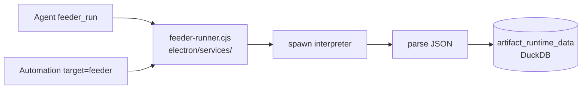

# Artifact Feeders

Sandbox scripts that **deterministically** feed persisted artifacts (Kind B) with external data — without asking the user to paste JSON or run commands manually.

## Problem

Persisted artifact iframes are sandboxed: they cannot call local APIs (Redfish/iDRAC, LAN services, databases). Today the workaround is “run this script and paste the JSON here”, which is fragile and not schedulable.

## Solution

A **feeder** is a stored script (Python, Node, Bash, or curl args) that:

1. Runs in an isolated workspace under `userData/feeders/<id>/workspace`
2. Resolves secrets from an OS-encrypted vault (`safeStorage`)
3. Parses JSON from stdout (or `OUTPUT_FILE`)
4. Merges into `artifact_runtime_data` + `artifacts.state.data`
5. Broadcasts `artifact:updated` to refresh the iframe



## Agent tools

| Tool | Description |
|------|-------------|
| `feeder_create` | Create feeder (pending approval) |
| `feeder_list` | List feeders for an artifact |
| `feeder_run` | Execute approved feeder |
| `feeder_update_script` | Update script (resets approval) |
| `feeder_delete` | Delete feeder |
| `feeder_history` | Run history |
| `feeder_secret_request` | Prompt user to store a vault secret |

Load `dome_load_doc('feeders')` before first use.

## Approval model

- Feeders are **not** HITL per run (unlike `shell_exec`)
- User approves the script **once** in the artifact **Feeders** tab
- Script hash is pinned; changes require re-approval

## Secrets

Stored in `feeder_secrets` table (DuckDB), values encrypted with Electron `safeStorage`. Referenced by name in `env_secret_refs`:

```json
[{ "envName": "IDRAC_PASS", "secretName": "idrac_password" }]
```

## Automations

Create an automation with:

- `target_type: "feeder"`
- `target_id: "<feeder_uuid>"`
- `trigger_type: "schedule"` + `schedule.intervalMinutes`

No LLM in the refresh loop.

## IPC channels

- `feeders:create|get|list|update-script|approve|delete|run|history|request-secret`
- `feeder-secrets:list|set|delete|vault-status`

## Key files

| File | Role |
|------|------|
| `electron/services/feeder-runner.cjs` | Spawn + parse + apply to artifact |
| `electron/services/feeder-vault.cjs` | safeStorage wrapper |
| `electron/services/artifact-data-merge.cjs` | Shared JSON merge helpers |
| `electron/ipc/integrations/feeders.cjs` | IPC handlers (`feeders:*`, `feeder-secrets:*`) |
| `app/lib/ai/tools/feeder-tools.ts` | Agent tools |
| `app/components/feeders/FeedersPanel.tsx` | UI in artifact workspace |
| `prompts/martin/feeders.txt` | Agent guidance (legado) — ver `prompts/feeders/` |

## Example: iDRAC monitor

1. `artifact_create` — dashboard UI reading `DOME_DATA`
2. `feeder_secret_request('idrac_password')` — user stores password once
3. `feeder_create` — Python Redfish script with `env_secret_refs`
4. User approves in Feeders tab
5. `feeder_run` — live hardware data
6. Optional schedule automation every 10 minutes
