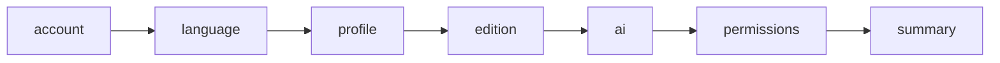

# Onboarding Feature

Dome's first-run wizard: account gate (when `VITE_ENABLE_DOME_PROVIDER=true`), language, profile, **edition** (`pro` | `study` | `dev`), AI provider, macOS permissions and a summary that applies everything. Lives in `app/components/onboarding/` and `app/lib/onboarding/`. Product contract for editions: [docs/product/editions.md](../product/editions.md).

---

## Flow

`computeSteps(data, env)` (`app/lib/onboarding/flow.ts`) builds the visible list from what is already known:

| Step | Shown when | Notes |
|------|------------|-------|
| `account` | `DOME_PROVIDER_ENABLED` | Log in, create account or continue locally. A returning user with `alreadyOnboarded` skips the wizard (`onSkip`). |
| `language` | always | Welcome + language (`changeLanguage`, persisted in `dome:language`); the rest of the wizard renders in that language. |
| `profile` | the account did not bring a name | Name + email. |
| `edition` | always | Pro / Study / Dev + free text for Many's memory. |
| `ai` | always | Same `AIProviderList` + `AIProviderDetail` as Settings → AI (compact), including OAuth panels. "Set up later" continues without a provider. |
| `permissions` | macOS (`window.electron.isMac`) | `PermissionCallout` for microphone and screen recording. Optional. |
| `summary` | always | Review, then `applyOnboardingConfig`. |

`useOnboardingFlow` keeps `{ step, data }` in one state object; `next(patch)` merges data and recomputes the list, so answers change which steps follow (e.g. a Dome account with a name removes `profile`).

Each step renders its own `OnboardingStep` frame and footer handlers — no window `CustomEvent`s.

---

## AI step

- Reuses `AIChatProviderPanels` (`compact`): API key + model for cloud providers, Ollama / LM Studio / vLLM availability, Dome / Copilot / Claude / Codex sign-in.
- "Continue" is enabled when the provider is usable: Dome (connects later if needed), a connected account (polled via `db:settings:aiProviderKeyStatus` while signing in), a reachable local server, or an API key.
- Saves with `buildAISaveConfig` (`app/components/settings/ai/aiSectionHelpers.ts`), the same builder Settings uses.
- `localModeOnly` (continue without account) hides Dome.

---

## Completion

`applyOnboardingConfig` (`app/lib/onboarding/applyOnboardingConfig.ts`):

1. Profile (`updateUserProfile`), identity (`USER.md`, `SOUL.md`, memory seed), edition modules — **essential**.
2. Recommended skills (`skills:installBundled`) — reported, not blocking.
3. If an essential part failed it throws `OnboardingApplyError(failed)` and does **not** set `onboarding_completed`; the summary shows which parts failed and offers "Retry".
4. Otherwise `completeOnboarding()` sets `onboarding_completed = 'true'` and the overlay closes.

`init:check-onboarding` returns whether onboarding is completed; Home shows the fullscreen overlay when it is not.

---

## Key files

| Path | Role |
|------|------|
| `app/components/onboarding/Onboarding.tsx` | Fullscreen portal host, closes on finish / skip |
| `app/components/onboarding/OnboardingWizard.tsx` | Renders the current step from `useOnboardingFlow` |
| `app/components/onboarding/OnboardingStep.tsx` | Step frame: Many + message + progress, content (`narrow` / `wide`), footer |
| `app/components/onboarding/steps/*` | `AccountStep`, `LanguageStep`, `ProfileStep`, `EditionStep`, `AISetupStep`, `PermissionsStep`, `SummaryStep` |
| `app/lib/onboarding/flow.ts` | Step list + navigation (unit-tested in `flow.test.ts`) |
| `app/lib/onboarding/useOnboardingFlow.ts` | Wizard state |
| `app/lib/onboarding/applyOnboardingConfig.ts` | Applies the choices; atomic on essential parts |
| `electron/auth/dome-native-login.cjs` | Native login + `alreadyOnboarded` |
| `electron/core/init.cjs` | `init:check-onboarding` |
