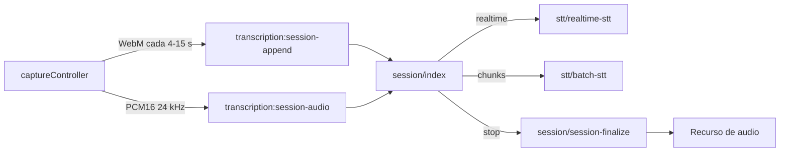

# Transcripción

Graba el micrófono, el audio del sistema o ambos y guarda el resultado como un recurso de audio con la transcripción en `metadata.transcription` (texto) y `metadata.transcription_structured` (segmentos con hablantes).

- UI: micrófono de la barra superior (`app/components/transcription/`): popover de inicio, píldora de grabación y panel en vivo.
- Ajustes: IA → Transcripción (`app/components/settings/transcription/`).
- Main: `electron/transcription/` (sesión y STT) y `electron/permissions/` (permisos de macOS).
- IPC: `transcription:*` para la sesión y `permissions:*` para los permisos.

## Flujo

1. El popover lista ventanas y pantallas (`transcription:list-capture-sources`) cuando se elige audio del sistema, y muestra `PermissionCallout` para los permisos que falten.
2. `captureController` obtiene los streams (`getUserMedia` / `getDisplayMedia`) **antes** de crear la sesión, para no dejar filas a medias si se deniega un permiso.
3. `transcription:session-start` responde con `sessionId` y `liveEngine`. Cada `MediaRecorder` sube sus fragmentos WebM, que se guardan en disco y en `transcription_session_chunks`.
4. Al detener, `session-finalize` une las pistas con ffmpeg, hace una pasada STT completa por lotes (con diarización si el modelo la soporta) e importa el MP3 como recurso.
5. `transcription:state` difunde fase, segundos, texto en vivo, motor y avisos. El renderer lo refleja en `useTranscriptionStore`.

## Texto en vivo

`stt-engine.resolveLiveEngine` decide el motor al empezar:

| Motor | Cuándo | Cómo |
|-------|--------|------|
| `realtime` | Proveedor OpenAI, sin endpoint personalizado, con API key y preferencia "En streaming" | Un AudioWorklet (`public/worklets/pcm16-capture.js`) mezcla mic y sistema a PCM16 mono de 24 kHz. `PcmStreamer` envía tramas de 100 ms. Main abre el WebSocket de OpenAI Realtime (`?intent=transcription`, VAD de servidor) y arma el texto con `delta` / `completed`, ordenado por `previous_item_id`. |
| `chunks` | Groq, endpoint personalizado o preferencia "Cada pocos segundos" | Main vuelve a transcribir los fragmentos WebM acumulados de la pista (nunca dos a la vez). |

La API key nunca llega al renderer: el WebSocket vive en main. Si el socket se cae, la sesión cambia a `chunks`, publica `notice: realtime_connection_failed` y sigue grabando. Main responde `realtime_inactive` a las tramas PCM y el renderer deja de enviarlas.

El texto final siempre sale de la pasada por lotes. Si esa pasada falla y hay texto en vivo, se guarda el texto en vivo en lugar de perder la grabación.

## Errores

Main devuelve códigos estables (`electron/transcription/errors.cjs`) y la UI los traduce con `transcriptionErrorMessage` (`transcriptions.errors.*`): `missing_api_key`, `missing_groq_key`, `mic_permission_denied`, `screen_capture_permission`, `no_audio_track`, `session_already_active`, `realtime_connection_failed`, `transcription_failed`, etc. El detalle técnico solo va al log.

Los hablantes detectados heurísticamente se guardan con `label: ''` y `ordinal`. El renderer los nombra en el idioma del usuario ("Persona A") con `resolveSpeakerLabel` y el usuario puede renombrarlos.

## Permisos de macOS

`electron/permissions/media-permissions.cjs` centraliza micrófono y Grabación de pantalla:

- `permissions:get` → `{ managedByApp, microphone, screen }` (fuera de macOS todo es `granted`).
- `permissions:request` → micrófono con diálogo nativo; pantalla con una sonda de `desktopCapturer`. Si macOS ya no mostrará el diálogo (denegado o restringido), abre el panel correspondiente de Ajustes del Sistema.
- `permissions:open-settings` y `permissions:relaunch` (macOS aplica Grabación de pantalla tras reiniciar).

`useMediaPermissions` relee el estado al recuperar el foco (vuelta desde Ajustes del Sistema). `PermissionCallout` se usa en el popover, en Ajustes → Transcripción y en el onboarding.

El build de macOS declara `NSMicrophoneUsageDescription`, `NSScreenCaptureUsageDescription` y `NSAudioCaptureUsageDescription` (`build.mac.extendInfo`) y el entitlement `com.apple.security.device.audio-input`. Sin ese entitlement, el runtime endurecido deniega el micrófono sin avisar en la app firmada. Valida los permisos en un build empaquetado (`pnpm run electron:build`), no en dev.

## Recuperación

`electron/transcription/recovery.cjs` corre al registrar el IPC: las sesiones que quedaron en `recording`, `paused` o `transcribing` tras un cierre inesperado se finalizan con el mismo camino que `stop`, o se marcan como canceladas si no hay audio.

## Ajustes (`settings`)

| Clave | Uso |
|-------|-----|
| `transcription_stt_provider` | `openai` · `groq` · `custom` |
| `transcription_model` | Modelo de la pasada final (y del streaming si es compatible) |
| `transcription_live_engine` | `realtime` (por defecto) · `chunks` |
| `transcription_language` / `transcription_prompt` | Idioma ISO-639-1 y vocabulario |
| `transcription_openai_api_key` / `transcription_groq_api_key` | Claves dedicadas (cifradas) |
| `transcription_api_base_url` | Endpoint OpenAI-compatible personalizado |
| `transcription_pause_threshold_sec` | Pausa que separa turnos en la heurística de hablantes |

## Validación

- `node --test electron/__tests__/transcription-realtime.test.mjs electron/__tests__/media-permissions.test.mjs`
- `pnpm run typecheck`
- Build empaquetado de macOS: conceder, denegar y reconceder micrófono y pantalla; grabar con streaming y cortar la red a mitad para ver la caída a `chunks`.
