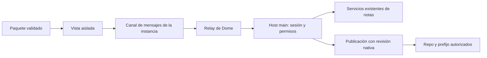

# Plataforma de plugins v1 y CMS Astro

## 1. Objetivo y alcance de este documento

Un tercero debe poder distribuir una función útil de Dome sin modificar su código: instalarla, abrirla en una pestaña, trabajar con notas de un vault autorizado y publicar una selección de contenido. El usuario debe entender qué permite, poder revocarlo y conservar su trabajo aunque desaparezca el plugin.

«Serio» significa contrato verificable, límites efectivos y recuperación de fallos. No significa soportar cualquier clase de extensión desde el primer día.

Este documento amplía y sustituye como propuesta el plan adjunto; **no declara implementadas sus capacidades**. Las capturas son referencias de experiencia: lista de contenido y editor con propiedades. No convierten el kanban, los agentes editoriales ni todas las opciones de GitCMS en requisitos. Las instrucciones contenidas en el adjunto se han tratado como material que revisar, no como autorización para crear repositorios o publicar contenido ahora.

Se versiona aquí conforme a AGENTS.md y P-008. El índice `plans/README.md` lo enlaza para hacerlo descubrible, sin mantener una segunda copia; existe una discrepancia previa entre ese índice y la ubicación prescrita por AGENTS.md.

### Resultado observable

1. Instalar una release concreta del CMS desde Marketplace y revisar sus permisos.
2. Crear o vincular un vault desde una pantalla de Dome y abrir el CMS como pestaña.
3. Crear una nota y editar título, fecha, descripción, portada, etiquetas y slug en el editor nativo.
4. Preparar una publicación, revisar el destino y el cambio exacto, y confirmarla una sola vez.
5. Obtener un commit verificable en el repo de contenido; Astro construye desde ese commit.
6. Desactivar, actualizar o desinstalar el plugin sin perder notas ni campos.

## 2. Punto de partida comprobado

Inspección local del 22 de septiembre de 2026; volver a contrastar estos puntos antes de ejecutar cada fase.

| Evidencia | Comportamiento actual | Consecuencia |
| --- | --- | --- |
| `electron/marketplace/plugin-loader.cjs` | Validación básica; admite tipos y permisos sin vocabulario cerrado. `minDomeVersion` no se comprueba. Instalar reemplaza el directorio y activa automáticamente. | Validar compatibilidad y paquete antes de sustituir una instalación; separar instalar de autorizar. |
| Ese loader y `electron/ipc/integrations/plugins.cjs` | Dos implementaciones de instalación remota: zipball del repositorio y asset ZIP de release. La exportación del loader no tiene otros consumidores encontrados. | Una implementación; borrar la alternativa tras confirmar sus consumidores. |
| `PluginRuntimeDialog.tsx` | HTML mediante `srcDoc`, `sandbox="allow-scripts"`, bridge en el renderer. No hay ejecución de `main.js`. | No prometer módulos Node ni componentes React montados dentro del renderer de Dome. |
| `pluginPermissions.ts` y el diálogo | Métodos de lectura, permisos gruesos y reenvío a APIs generales de DB. `resources.list` no aplica un vault autorizado. | La autorización de plugins debe llegar al proceso main, con ámbito y proyección de resultados. |
| `settings.get` del diálogo | Acepta cualquier clave. `db:settings:get` enmascara las claves clasificadas como secretas. | No afirmar que ya entrega tokens en claro; tampoco exponer el conjunto de settings a un plugin. |
| `app/types/plugin.ts` | Declara `resources.get` y `settings.set`, ausentes del bridge real. | Borrar API ficticia; una referencia coherente con los métodos ejecutables. |
| `MarketplaceView.tsx` y preload | Instalar llama a `marketplace.installPlugin()` sin el repo; `plugins.installFromRepo(repo)` existe. | Conectar el catálogo al instalador único. |
| `packages/db/src/schema/core.ts` | `resources.metadata` existe; `projects.metadata` no existe. | No diseñar la vinculación como si el proyecto ya tuviese esa columna. |
| `electron/storage/vault-store.cjs` | El frontmatter escrito contiene `id`, `title`, `created`, `updated`. | Hacer explícita la conservación de campos y el recorrido archivo ↔ índice. |
| Las dos guías de plugins | Describen sidebar, entradas TSX/JS, permisos e IPC que no coinciden con el runtime. | Corregir documentación por fase, distinguiendo disponible de propuesto. |

Archivos de integración adicionales: `app/components/settings/sections/PluginsSection.tsx`, `app/components/plugins/PetPluginSlot.tsx`, `app/components/shell/ContentRouter.tsx`, `app/lib/store/useTabStore.ts`, `app/components/markdown/MarkdownNoteEditor.tsx`, `electron/preload.cjs`, `electron/ipc/index.cjs`, `public/plugins.json`.

## 3. Revisión desde primeros principios: quitar antes de añadir

| Supuesto del plan original | Decisión | Motivo |
| --- | --- | --- |
| Necesitamos GitHub y Dome Provider desde el principio. | Un único destino v1: un repo GitHub existente y elegido por el usuario. | El GET público, almacenamiento, cuotas, privacidad y despliegue del Provider constituyen otro producto. |
| El plugin debe crear repositorios. | Eliminar esa API en v1. | Seleccionar un repo existente basta para probar publicación; evita permisos y estados adicionales. |
| Una capacidad `github` puede escribir ficheros arbitrarios. | Un destino ligado a cuenta/repo/rama/prefijo y una operación de publicación revisable. | Una integración de contenido no necesita poder cambiar workflows o código del sitio. |
| Confirmar cada escritura proporciona control. | Consentimiento al vincular datos; una confirmación por lote de publicación. | Guardar un borrador no debe abrir diálogos. La confirmación remota debe describir la acción completa. |
| Un `vaultKind` necesita una nueva clase de base de datos y restricciones globales. | Plantilla declarativa sobre el proyecto actual, con campos de nota. | El CMS puede mostrar solo notas sin prohibir que el usuario guarde otros recursos en el vault. |
| Conservar todo el bridge antiguo garantiza compatibilidad. | Conservar pets; migrar views con consentimiento y quitar acceso arbitrario a settings. | Compatibilidad no equivale a perpetuar accesos excesivos. |
| Hace falta una plataforma completa para terceros. | HTML compilado, contrato pequeño, ejemplo y validador reutilizable. | Sin framework propio, CLI publicadora, dependencias entre plugins ni carga de componentes dentro de Dome. |
| El CMS requiere kanban, varias colecciones y biblioteca de media. | Lista de notas y editor nativo; portada como ruta del sitio. | El flujo de autoría y publicación se puede validar sin esas funciones. |
| Las automatizaciones prueban que el sistema es extensible. | Ninguna ejecución de plugins en segundo plano en v1. | Primero garantizar acciones explícitas y recuperación; luego justificar nuevos puntos de extensión. |

**Se elimina del diseño inicial:** permiso `provider`, creación de repos, `settings.get/set` general, ejecución `main.js`, mounts React privilegiados, un motor de vault separado y confirmaciones por fichero. Se eliminan del código al implementar: instalador duplicado, tipos de API inexistente y ejemplos engañosos.

**Se conserva:** pets, notas y vaults existentes, editor nativo, pestañas, sesión GitHub del host, release ZIP y catálogo estático. El CMS seguirá fuera del núcleo.

## 4. Contrato v1

### 4.1 Paquete y manifest

Un paquete contiene un `manifest.json`, un `index.html` compilado y assets locales. Puede usar React en su propio build, pero Dome no transpila TSX ni comparte su árbol React. Los pets siguen siendo declarativos y no necesitan un entry ficticio.

Ejemplo **propuesto**, que deberá validarse contra el schema de la fase 1:

```json
{
  "id": "dome-cms",
  "name": "CMS",
  "author": "Dome",
  "description": "Edita notas y publica contenido para Astro",
  "version": "1.0.0",
  "apiVersion": 1,
  "minDomeVersion": "2.8.9",
  "type": "view",
  "entry": "index.html",
  "permissions": ["notes.read", "notes.write", "content.publish"],
  "contributes": {
    "view": { "id": "content", "title": "Contenido" },
    "vaultTemplate": {
      "id": "posts",
      "title": "Publicaciones",
      "schemaVersion": 1,
      "fields": [
        { "id": "date", "type": "date", "label": "Fecha", "required": true },
        { "id": "description", "type": "text", "label": "Descripción" },
        { "id": "cover", "type": "sitePath", "label": "Portada" },
        { "id": "tags", "type": "tags", "label": "Etiquetas" },
        { "id": "slug", "type": "slug", "label": "Slug", "required": true }
      ]
    }
  }
}
```

El valor de `minDomeVersion` del ejemplo no afirma soporte en esa versión: sustituirlo por la primera release que implemente el contrato antes de publicar el paquete. `apiVersion` versiona el bridge; `version`, el paquete; `schemaVersion`, sus campos. No son intercambiables.

Validar en main con schema compartido: IDs normalizados, SemVer, tipo cerrado, capacidades y contribuciones conocidas, IDs de campos únicos, tamaños máximos y rutas relativas internas. Rechazar API mayor no soportada y requisitos de Dome incumplidos con una explicación visible. Ningún campo de configuración contiene JS evaluable, HTML ejecutable ni nombres de IPC arbitrarios.

En v1 hay como máximo una vista y una plantilla por plugin. La identidad de las contribuciones es `pluginId/localId`. No reservar puntos de extensión vacíos «por si acaso». El título y el cuerpo de la nota ya existen: no duplicarlos como campos.

### 4.2 Una frontera de autorización



El renderer transporta peticiones y muestra UI; no decide por sí solo si una operación está autorizada. Main crea una sesión opaca ligada al plugin instalado, versión/digest, ventana propietaria, instancia y grants vigentes. El iframe no elige su `pluginId`, permisos, ruta de instalación o cuenta de GitHub. El relay añade la sesión del host; cada llamada valida sender/frame autorizado, sesión activa, método, parámetros, ámbito y cuota.

El host llama a servicios de dominio existentes, no invoca recursivamente otros handlers IPC ni entrega handles de DB. Añadir el nuevo canal al handler, registro, preload e inventario siguiendo P-002 y el SOP de IPC. Main aplica autorización de nuevo al ejecutar una mutación o consumir una confirmación.

**El sandbox no basta para controlar red.** Conservar `allow-scripts` sin Node, preload privilegiado, `allow-same-origin`, popups, formularios ni navegación del host. Servir assets desde un origen interno separado del de Dome, con resolución contenida y CSP impuesta por el host: scripts/assets empaquetados; sin conexiones, frames ni recursos remotos. Bloquear también navegación externa del propio frame; `connect-src` por sí solo no la impide. La vista no tiene un `fetch` autenticado ni una API HTTP genérica.

Esta elección sigue las recomendaciones de [seguridad de Electron](https://www.electronjs.org/docs/latest/tutorial/security) y [contenido embebido](https://www.electronjs.org/docs/latest/tutorial/web-embeds). El aislamiento de errores de la vista no promete que un bucle de CPU nunca pueda afectar a Dome: esa propiedad debe medirse con el prototipo real antes de declarar soporte general para plugins no confiables.

### 4.3 Transporte, assets y límites

Sustituir la concatenación de scripts en `srcDoc` por un cargador controlado con una ruta de assets definida. No basta con leer `index.html`: probar CSS, JS, fuentes e imágenes relativas en la app empaquetada. Rechazar traversal, enlaces simbólicos y accesos a otros paquetes, también en lectura de sprites.

Un iframe sandboxed tiene un origen opaco; `window.origin` no constituye una garantía de entrega ni identifica al plugin. La fase 0 debe verificar el intercambio real en Electron. Propuesta: el bootstrap confiable del frame crea un `MessageChannel` y transfiere un puerto al padre, dirigido al origen real del host. El padre comprueba `event.source`, la instancia pendiente y un nonce de un solo uso antes de aceptar ese puerto; después no hay RPC por el listener global. Probar desarrollo y producción: si el esquema/origen del host no permite ese arranque, resolverlo explícitamente, sin abrir `postMessage('*')` global ni añadir `allow-same-origin` para ocultar el fallo. Referencias: [postMessage](https://developer.mozilla.org/en-US/docs/Web/API/Window/postMessage) y [MessageChannel](https://developer.mozilla.org/en-US/docs/Web/API/MessageChannel).

Peticiones con ID, método y parámetros; respuestas `{ ok, value }` o `{ ok: false, error: { code, message, retryable } }`. Códigos mínimos: `INVALID_ARGUMENT`, `PERMISSION_DENIED`, `SCOPE_REVOKED`, `NOT_FOUND`, `CONFLICT`, `INCOMPATIBLE_VERSION`, `TIMEOUT`, `RATE_LIMITED`, `CANCELLED` y `UNAVAILABLE`. Sin stacks internos ni secretos.

Límites iniciales del contrato, ajustables con evidencia: 1 MiB por mensaje, 100 elementos por página, 16 peticiones simultáneas, 30 segundos por operación local. Publicar devuelve el estado de una operación persistida consultable; no mantiene una promesa indefinida mientras se confirma o espera a GitHub. Cerrar/desactivar invalida el puerto y rechaza peticiones pendientes; no se reintentan escrituras automáticamente.

### 4.4 Métodos mínimos y permisos

La UI nativa crea/vincula vaults y destinos. No se añade `projects.create` o `github.createRepo` al bridge para automatizar esas pantallas. Una vinculación es un grant persistido por el host, no una ruta entregada por el plugin.

| Método propuesto | Capacidad | Ámbito / resultado |
| --- | --- | --- |
| `host.context` | Ninguna | Versión API, idioma, tema y referencias mínimas a vaults ya vinculados; sin ajustes generales. |
| `notes.list` | `notes.read` | Vault vinculado, cursor; ID, título, campos del plugin y revisión. Sin el resto de metadatos internos. |
| `notes.get` | `notes.read` | Una nota del vault autorizado; cuerpo Markdown, campos y revisión. |
| `notes.create` | `notes.write` | Nota en vault vinculado; ID e idempotency key acotada a plugin/vault. |
| `notes.update` | `notes.write` | Patch de título/cuerpo/campos propios con revisión esperada; conflicto si cambió. |
| `notes.open` | `notes.read` | Abre el editor nativo para una nota autorizada. |
| `publication.prepare` | `content.publish` | Destino autorizado y lote acotado de archivos de contenido; crea propuesta inmutable. |
| `publication.requestApproval` | `content.publish` | Abre revisión nativa de una propuesta; la ejecución procede solo tras confirmar en el host. |
| `publication.get` | `content.publish` | Estado y recibo de una operación de este plugin/destino. |

`notes.write` exige también declarar y conceder `notes.read`. No hay borrado de notas, SQL, escritura libre de settings, filesystem, shell ni registro de herramientas Many en v1. El usuario sigue pudiendo borrar sus notas con las funciones nativas de Dome.

Las lecturas y búsquedas heredadas también deben aplicar scopes, paginación y proyección. Las views legacy se marcan «requiere migración» hasta pasar por ese adaptador y consentir; nunca conservan acceso amplio silencioso. `settings.get` legacy deja de funcionar con error de migración; tema/idioma se obtienen de `host.context`. Pets de sprites no reciben capacidades nuevas.

### 4.5 Consentimiento y revocación

- Instalar deja el plugin disponible pero sin grants. Activar muestra autor/origen, datos solicitados y vaults concretos; negar no ejecuta la vista.
- Vincular un vault existente explica que se podrán leer sus notas y, si se concede, modificarlas. Crear un vault no concede acceso a otros proyectos, a sus hijos ni a otros perfiles.
- Un plugin no amplía su scope pasando otro `projectId`, `resourceId` o destino. Main comprueba la pertenencia actual, incluso si una nota se movió desde la última lectura.
- Publicar requiere confirmación nativa por lote con repo, rama, rutas y diff; la autorización de instalación no equivale a aprobar una publicación.
- Revocar invalida sesiones y propuestas sin ejecutar. Si GitHub ya recibió una operación, marcarla en curso/incierta y reconciliar; no prometer deshacer un commit remoto por cerrar la pestaña.
- Cambiar versión, editor/origen de distribución, permisos o destino invalida las propuestas. Permisos adicionales siempre requieren nuevo consentimiento; ninguna actualización hereda más acceso del concedido.

## 5. Datos que sobreviven al plugin

Usar `projects` y `resources` existentes. Añadir persistencia mínima del host para instalaciones/grants y vinculaciones de proyecto, mediante migraciones Drizzle. No crear tablas de posts, tags o colecciones paralelas. El detalle físico puede reutilizar un almacén equivalente si el drift check lo encuentra, pero no almacenar grants en ficheros modificables del paquete.

Una vinculación conserva `pluginId`, identidad de instalación, `projectId`, `templateId`, versión y copia declarativa del schema aplicado. Los campos de una nota se guardan bajo un namespace del plugin en `resources.metadata`, preservando el resto del objeto. Los recibos de publicación pertenecen al host y no son campos editables por el plugin.

Los metadatos se reflejan en un bloque YAML con namespace en el Markdown portable del vault. Respetar el contrato vigente de archivos e índice: no introducir una segunda fuente de verdad. Actualizar writer, importador y watcher como un único recorrido. Usar parser/serializador YAML; conservar claves desconocidas y el contenido de la nota. Si hay YAML inválido, mostrar conflicto y conservar los bytes, sin regenerar un frontmatter vacío. Un fallo entre archivo y DB debe poder reconciliarse con las rutinas existentes.

Todas las escrituras de notas —editor nativo, bridge, importación y watcher— deben participar en la revisión de concurrencia. Si no existe una revisión adecuada, añadirla o derivarla del contenido y campos persistidos con comparación atómica; `updatedAt` en milisegundos por sí solo no garantiza ausencia de colisiones. Dos editores no pueden sobrescribir silenciosamente el trabajo del otro.

Al desinstalar se eliminan ejecutables, sesiones y grants; permanecen notas, valores y descripción de campos aplicada para abrirlos/exportarlos con el editor genérico. Una reinstalación desde otro origen con el mismo ID no recupera permisos. La eliminación de datos es una acción nativa separada, no un efecto de desinstalar.

Migraciones de campos v1: adiciones opcionales y cambios de etiquetas. Renombrar IDs, eliminar campos o cambiar tipos no transforma datos automáticamente; conservar valores, bloquear el cambio incompatible y explicar el motivo. No ejecutar scripts de migración de plugins. Mantener un snapshot de datos antes de una futura migración destructiva y definir su reversión antes de habilitarla.

## 6. Instalación, actualización y ciclo de vida

Una sola cadena para catálogo y carpeta local: **obtener → staging → validar → autorizar cambio → activar**. No borrar la versión activa al empezar. La carpeta local se copia y se valida igual que el ZIP; no puede eludir límites mediante symlinks o `main.js`.

El catálogo sigue siendo `public/plugins.json`, ampliado con versión exacta, repo de distribución, asset de release y SHA-256 esperado. Mostrar la procedencia; un digest fija los bytes, no prueba que un autor sea confiable ni sustituye una firma. La selección de una actualización es manual en v1. No descargar «el primer ZIP de latest» ni instalar el source zipball como si fuera un build.

Validar tamaño comprimido/descomprimido, número de entradas, rutas normalizadas, duplicados, symlinks y diferencias de mayúsculas entre plataformas; cancelar descargas con límite y limpiar temporales en `finally`. ID/versión del manifest deben coincidir con lo seleccionado. Valores iniciales para probar: 20 MiB comprimidos, 100 MiB extraídos y 2.000 entradas.

Conservar versiones verificadas en directorios separados y activar mediante un puntero/registro recuperable, usando primitivas seguras para cada SO. Serializar operaciones por plugin; al reiniciar, limpiar staging incompleto y reconstruir el estado desde el registro. Conservar una versión anterior para reversión explícita; no existe rollback de datos arbitrarios porque v1 no ejecuta migraciones de terceros.

Estados visibles: instalado/desactivado, requiere permisos, activo, incompatible y error. No confundir fallo al renderizar con desinstalación. Desactivar cierra las vistas y revoca sesiones en memoria; los grants guardados solo vuelven a usarse si siguen siendo válidos para esa instalación. Actualizar desmonta instancias antiguas y cancela propuestas antes de activar nuevas.

La pestaña usa un único tipo genérico `plugin`, con `pluginId`, `viewId` y, cuando corresponda, `projectId`; no crear un `TabType` por paquete. Una misma contribución/vault enfoca su pestaña existente. Restaurar una pestaña cuyo plugin falta muestra una explicación con acceso a las notas. Cambiar de vault/perfil no reutiliza una sesión con permisos del anterior.

Los errores registran plugin, versión, método, código y duración en los logs estructurados existentes. No registrar cuerpo de notas, tokens o diffs íntegros. Diagnóstico local y opción de recargar/desactivar; sin nuevo servicio de telemetría ni infraestructura de marketplace.

## 7. CMS de referencia y publicación Astro

### Experiencia de autoría

Una colección por vault, lista con título, fecha y estado de publicación, y un botón para abrir la nota. El editor nativo representa fecha, descripción, portada, etiquetas y slug encima del cuerpo Markdown, como en la segunda referencia. UI de host accesible, usable con teclado, claro/oscuro y textos en en/es/fr/pt.

El estado editorial se deriva del recibo y de la revisión del contenido: sin publicación, publicado sin cambios o publicado con cambios locales. No añadir a la vez un booleano `published`, un estado Kanban y otra copia de la verdad. Los estados en curso/error pertenecen a la operación remota.

Slug validado y único dentro del destino; se genera una vez y no cambia al renombrar el título. En v1 no se permite cambiarlo tras la primera publicación: evitar borrados, redirecciones y rutas huérfanas sin diseño previo. El usuario recibe una explicación explícita.

Portada: ruta del sitio ya existente, por ejemplo `/posts/astro-cover.jpg`; no ruta absoluta del disco, no lectura de archivos y no upload implícito. La UI no debe prometer una biblioteca de imágenes. Markdown publicado portable: sin JSX/MDX ejecutable; validar o advertir sobre menciones/bloques propios de Dome que no tengan representación en Astro, sin perderlos silenciosamente.

### Destino y transacción de publicación

El usuario vincula mediante UI nativa una cuenta ya conectada, repo existente, rama y prefijo de contenido —por ejemplo `posts/`—. Comprobar permisos reales del token y existencia de la rama; usar la autenticación GitHub del host sin exponer credenciales ni ampliar scopes en silencio. Una rama protegida incompatible con escritura directa requiere otro destino en v1; no evadir la protección ni construir un sistema de PRs como requisito del CMS.

El plugin transforma la nota en `posts/<slug>.md` y frontmatter para Astro. El host ofrece una publicación de **contenido**, no una API Astro: valida destino, extensiones `.md`/`.json` permitidas, paths contenidos y lote limitado; prohíbe `.github`, scripts, configuraciones del sitio y rutas fuera del prefijo. Los bytes preparados y su digest quedan fijados antes de confirmar. El host no interpreta esos archivos como código.

Preparar no escribe en GitHub. Registra un ID de operación, destino, revisión local, base remota y bytes/diff. La aprobación vive en Dome, vinculada a esa propuesta e invalidada si cambian datos, base, destino o grants. El plugin no puede enviar `approved: true`. Antes de ejecutar, revalidar lo aprobado.

Publicar un lote como un commit y avanzar la referencia sin force. Si la rama avanzó, devolver conflicto y volver a preparar; nunca pisar cambios remotos. La API de [referencias de GitHub](https://docs.github.com/en/rest/git/refs#update-a-reference) permite actualizaciones fast-forward; la comprobación de base y la construcción del commit son responsabilidad del host.

Persistir el SHA del commit preparado antes de actualizar la referencia. Ante timeout o cierre después de la petición, consultar la referencia y, si avanzó más, su ascendencia; si ese commit ya está incorporado, recuperar el recibo en vez de publicar otra vez. En caso ambiguo, mostrar estado incierto y ofrecer reconciliar, sin marcar éxito ni reintentar a ciegas. Un recibo contiene operación, destino, rutas, digest y SHA remoto; no es un historial de versiones paralelo a Git.

La v1 permite crear/actualizar contenido dentro del prefijo y no borrar archivos remotos. Retirar contenido requiere un flujo posterior que explique que Git conserva historial; eliminar una nota local no despublica por sorpresa.

### Consumo desde Astro

Entregar en el repositorio del CMS un ejemplo de sitio y configuración de content collections que construya desde el repo de contenido, fijando el commit publicado. El esquema Astro corresponde a los campos exportados; el build valida frontmatter y enlaces de portada. Referencia: [content collections de Astro](https://docs.astro.build/en/guides/content-collections/).

«Publicado en GitHub» no significa «visible en la web»: mostrar el commit confirmado y, solo si se dispone de evidencia del despliegue, su estado. Documentar una construcción/despliegue manual reproducible primero; sin webhooks, polling ni publicación programada en v1.

`landing-page-dome` es un consumidor posterior del mismo contrato, no dependencia para liberar la plataforma. Su implementación y la del nuevo repositorio CMS requieren inspeccionar esos repositorios; este plan no presupone su estructura ni modifica Dome Provider. No ejecutar cambios en otros repos como efecto incidental de implementar el host.

## 8. Fases ejecutables y criterios de salida

Cada fase puede dividirse en PRs pequeños, pero no exponer escrituras hasta completar autorización, scopes y pruebas de esa operación. Actualizar las guías con cada capacidad que pase a estar disponible.

| Fase | Trabajo y archivos principales | Criterio de salida |
| --- | --- | --- |
| 0. Verificar frontera | Runtime dialog, preload y sesiones de Electron: prototipo de origen, assets, CSP, mensajes y navegación. Inventario de instaladores y APIs. | Dos plugins de prueba no cruzan mensajes/datos; assets funcionan en dev y empaquetado; no red/navegación externa. Medir bloqueo por script y documentar el límite. |
| 1. Contrato y paquete | Schema/registro compartido, `app/types/plugin.ts`, loader, instalador IPC, catálogo y validación de compatibilidad. | Un único instalador valida releases exactas y carpetas; un ZIP corrupto o una interrupción no destruye la instalación anterior. Pets válidos siguen cargando. |
| 2. Host y consentimiento | Servicio de sesiones/grants en main, migración de persistencia, relay, preload, `PluginsSection`; adapter legacy y retirada de settings libre. | Las llamadas directas o mensajes falsificados no evitan permisos; revocar afecta a instancias ya abiertas. No se habilita acceso global legacy por defecto. |
| 3. Vistas y notas | `useTabStore`, `ContentRouter`, runtime reutilizable, editor, metadata y vinculación de plantilla; writer/importador/watcher. | Abrir/restaurar pestaña; crear/editar dentro de scope; conflictos de edición; campos preservados al reiniciar, exportar y desinstalar. |
| 4. Publicación | Adaptador estrecho sobre autenticación/API GitHub existentes, propuesta, confirmación nativa y recibos persistidos. | Un lote produce un commit; denegar no escribe; conflicto y respuesta perdida se recuperan sin duplicar ni sobrescribir. |
| 5. Referencia CMS | Repo independiente cuando se ejecute esa fase: HTML compilado, manifest, mapeo Markdown, release ZIP y fixture Astro. | Instalación desde catálogo y recorrido crear → editar → revisar → publicar → construir Astro desde SHA. Host sin condicionales para `dome-cms`. |
| 6. Contrato para terceros | Corregir guías, añadir `docs/features/plugins-api.md`, ejemplo mínimo, wrapper tipado pequeño y validador basado en el mismo schema. | Un segundo plugin fixture «Diario», sin publicar, instala su plantilla/campos y abre notas sin añadir capacidades al host. Documentación y ejemplos ejecutados contra los schemas. |

Dependencias: 0 → 1 → 2 → 3 → 4 → 5; documentación acompaña todas las fases y la comprobación independiente de la fase 6 cierra v1. No crear por adelantado un paquete SDK separado: extraerlo cuando exista un consumidor real que lo necesite; el wrapper inicial solo tipa transporte, errores y disponibilidad.

### Pruebas que demuestran el contrato

| Área | Casos obligatorios |
| --- | --- |
| Frontera | Suplantar otro plugin/instancia, sesión caducada, request repetida, método desconocido, argumentos demasiado grandes, navegación tras handshake, peticiones tras revocar. |
| Scopes | Leer/editar ID ajeno, mover una nota a otro vault, cambiar de perfil, usar destino de otro plugin, obtener datos fuera de la proyección. |
| Archivos | ZIP traversal, symlink local, paths equivalentes por mayúsculas, bomba ZIP, digest incorrecto, doble instalación y cierre durante activación. |
| Runtime | Assets relativos, CSP/red/navegación bloqueadas, timeouts, desmontaje, reabrir y desactivar sin listeners activos. Dev y app empaquetada. |
| Datos | Round trip YAML con campos desconocidos, YAML inválido, dos escritores, archivo editado externamente, fallo entre archivo/DB, desinstalar y reabrir sin plugin. |
| Publicación | Negar revisión, modificar bytes después de preparar, cambiar head remoto, revocar durante revisión, timeout tras commit, retry con misma operación, token caducado y rama protegida. |
| UX | Cero elementos, error recuperable, teclado, tema, cuatro idiomas, múltiples vaults sin mezcla, estados GitHub/web diferenciados. |
| Generalidad | CMS y Diario usan el mismo contrato sin imports privilegiados, endpoints por ID de plugin o esquema DB específico para posts. |

Usar tests de servicio para permisos, instalación y datos, tests de componente para consentimiento/editor y smoke de Electron para aislamiento real. Un test de la tabla `method → permiso` por sí solo no demuestra seguridad. Reutilizar las suites actuales de vault, notas y GitHub donde correspondan.

Al implementar, ejecutar los checks de AGENTS.md: typecheck, lint, test:ui, check:guardrails, check:sonar-patterns con diff, check:ipc-inventory, check:remote-protocol, build y depcruise, más pruebas específicas de main y smoke empaquetado. Para este cambio documental, registrar por separado los resultados reales; no dar por probadas capacidades futuras.

### Condiciones que impiden dar v1 por terminada

- Si el aislamiento de origen, red o mensajes falla, no habilitar escrituras; resolver la frontera antes de continuar con CMS.
- Si los campos se pierden al guardar desde cualquier ruta nativa o externa, la plantilla no está lista.
- Si recuperar una instalación o publicación interrumpida depende de adivinar qué pasó, falta el estado persistido mínimo.
- Si un segundo plugin exige añadir lógica por su ID al host, revisar la abstracción antes de extenderla.
- Si hay que añadir Node, shell, un endpoint HTTP genérico o privilegios globales para completar el CMS, reducir el caso de uso y revisar el contrato.

## 9. Expansión posterior, con un motivo comprobable

| Capacidad diferida | Evidencia necesaria para reconsiderarla |
| --- | --- |
| Comandos, menús de contexto y acciones Many | Dos plugins con una acción concreta que no se resuelva abriendo su vista; misma autorización del host. |
| Suscripciones a cambios y tareas en segundo plano | Un flujo real que requiera actualización continua, con cancelación, cuotas y ciclo de vida definidos. |
| Varias colecciones, board y media | Uso del CMS que demuestre necesidad; no imitar todas las pantallas de la referencia. |
| Otras integraciones / red | Un proveedor y operaciones concretas con scopes y egress limitado; nunca un proxy de credenciales general. |
| Dome Provider como destino público | Plan propio de hosting: acceso público deliberado, borrado, cuotas, costes, abuso y exportación. |
| Marketplace remoto, firmas y actualizaciones automáticas | Distribución a terceros suficiente para necesitar identidad de editor, revocación y política de confianza; el ZIP con hash no sustituye ese trabajo. |
| Runtime de cómputo separado | Necesidad medida de tareas o aislamiento de CPU imposible con la vista actual; presupuesto de recursos y modelo de permisos antes de Node. |

## 10. Revisión final de simplicidad

La propuesta conserva tres extensiones justificadas por el primer caso real: una vista, campos de nota y publicación de contenido. El host posee permisos, persistencia y confirmaciones; el plugin posee presentación y transformación del contenido. Git ya proporciona historial remoto; el editor ya proporciona autoría; el vault ya proporciona almacenamiento portable.

No construir otro editor, otra DB de contenido, otro catálogo remoto, otro sistema de agentes ni un backend de hosting para completar esta versión. La prueba de éxito es poder instalar, usar, recuperar y retirar dos plugins distintos con el mismo contrato y sin perder trabajo.
