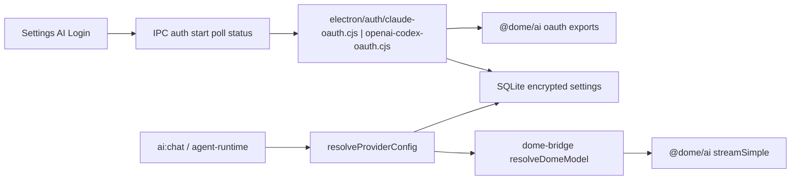

# Suscripciones Claude / ChatGPT en Dome (investigación)

> **Spike (2026-07-18):** cableado experimental en `feat/subscription-provider-auth` — Settings + IPC + `resolveProviderConfig` para `claude-oauth` y `openai-codex`. Listo para prueba manual; no GA.

## Contexto

Los usuarios quieren usar Dome con la **suscripción** de Claude (Pro/Max) o ChatGPT (Plus/Pro), además de (o en lugar de) API keys de plataforma. La intuición habitual es “como OpenCode Go”, pero en Dome **OpenCode Go no es auth por suscripción**: es un proxy con API key (`OPENCODE_API_KEY` → `https://opencode.ai/zen/go/v1`).

Los paralelos reales de “login con suscripción, sin API key de plataforma” ya existen en producto:

| Proveedor | Auth | Código vivo |
|-----------|------|-------------|
| **GitHub Copilot** | Device-code OAuth → token Copilot de corta vida | `electron/auth/github-copilot-oauth.cjs` + IPC `copilot:auth:*` |
| **Dome** | OAuth PKCE + sesión | `electron/auth/dome-oauth.cjs` + IPC `domeauth:*` |

Y el código de OAuth Claude / ChatGPT **ya está vendorado** en `@dome/ai` (copia de pi), pero **dormido**: no hay Settings, IPC ni ramas en `resolveProviderConfig`. Ver [pi-parity-audit.md](../audits/pi-parity-audit.md) (capa D: OAuth vendorado, no consumido).

Esta rama **solo documenta**. No cablea runtime ni UI.

## Hallazgos

### Comparativa de auth (estado actual vs planificado)

| Proveedor | Tipo de auth | En Dome app hoy | Endpoint de inference | Notas |
|-----------|--------------|-----------------|----------------------|-------|
| **OpenCode Go** | API key | Sí | `opencode.ai/zen/go/v1` | No es suscripción del usuario a Claude/ChatGPT |
| **OpenCode Zen** | API key | Sí | `opencode.ai/zen/v1` | Igual: key de OpenCode |
| **OpenAI** | API key | Sí | `api.openai.com` | Plataforma de pago por uso |
| **Anthropic** | API key | Sí | `api.anthropic.com` | Plataforma de pago por uso |
| **Dome** | OAuth PKCE | Sí | Dome provider API | Suscripción Dome |
| **GitHub Copilot** | Device-code | Sí | `api.*.githubcopilot.com` | Suscripción GitHub |
| **Claude Pro/Max** | OAuth PKCE (localhost) | Solo en `@dome/ai` | Anthropic Messages + betas OAuth | Client ID estilo Claude Code |
| **ChatGPT Plus/Pro (Codex)** | Browser PKCE o device-code | Solo en `@dome/ai` | `chatgpt.com/backend-api` (`openai-codex-responses`) | Client ID Codex CLI |

### Claude Pro/Max — flujo en `@dome/ai`

Fuente: [`packages/ai/src/utils/oauth/anthropic.ts`](../../packages/ai/src/utils/oauth/anthropic.ts).

| Pieza | Valor |
|-------|--------|
| Authorize | `https://claude.ai/oauth/authorize` |
| Token | `https://platform.claude.com/v1/oauth/token` |
| Callback | `http://localhost:53692/callback` (PKCE + servidor HTTP local) |
| Scopes | `org:create_api_key user:profile user:inference user:sessions:claude_code user:mcp_servers user:file_upload` |
| Exports | `loginAnthropic`, `refreshAnthropicToken`, `anthropicOAuthProvider` |
| Provider OAuth id (pi) | `anthropic` (nombre UI: “Anthropic (Claude Pro/Max)”) |

Inference (ya implementada en el streamer Anthropic):

- Token OAuth se detecta si contiene `sk-ant-oat` (`isOAuthToken` en [`providers/anthropic.ts`](../../packages/ai/src/providers/anthropic.ts)).
- Headers: `Authorization` vía `authToken`, betas `claude-code-20250219` + `oauth-2025-04-20`, `user-agent` tipo `claude-cli/…`, `x-app: cli`.
- Env: `ANTHROPIC_OAUTH_TOKEN` tiene prioridad sobre `ANTHROPIC_API_KEY` en [`env-api-keys.ts`](../../packages/ai/src/env-api-keys.ts) — hoy Dome **no** lee eso en Settings; usa slots SQLite.

### ChatGPT / Codex — flujo en `@dome/ai`

Fuente: [`packages/ai/src/utils/oauth/openai-codex.ts`](../../packages/ai/src/utils/oauth/openai-codex.ts), streamer [`openai-codex-responses.ts`](../../packages/ai/src/providers/openai-codex-responses.ts).

| Pieza | Valor |
|-------|--------|
| Auth base | `https://auth.openai.com` |
| Browser callback | `http://localhost:1455/auth/callback` |
| Device flow | `…/api/accounts/deviceauth/*` + verificación `…/codex/device` |
| Client ID | `app_EMoamEEZ73f0CkXaXp7hrann` (Codex) |
| Scope | `openid profile email offline_access` |
| Exports | `loginOpenAICodex`, device-code variant, `refreshOpenAICodexToken`, `openaiCodexOAuthProvider` |
| Provider id | `openai-codex` |
| Inference base | `https://chatgpt.com/backend-api` |
| API type | `openai-codex-responses` |

Modelos ya en catálogo generado (`models.generated.ts`): p. ej. `gpt-5.3-codex-spark`, `gpt-5.4`, `gpt-5.4-mini`, `gpt-5.5`.

Método recomendado en Electron: **device_code** (mismo UX que Copilot: código + URL de verificación, sin pelear por puerto local ni deep link).

### Por qué OpenCode Go no sirve de plantilla

- Auth: key obligatoria (`provider-auth.cjs` → `API_KEY_CHAT_PROVIDERS` incluye `opencode-go`).
- Resolución: `readProviderApiKey` / `OPENCODE_API_KEY`.
- No hay login, refresh ni sesión de suscripción ChatGPT/Claude.
- Plantilla de producto: **Copilot** (device-code + settings cifrados + `resolveProviderConfig` branch).

## Decisión (ids y storage — para futura `feat/`)

Separar siempre **API key de plataforma** vs **suscripción**, para que un usuario pueda tener ambos.

| Id en Settings / `ai_provider` | Auth | Storage SQLite (propuesto) | Inference |
|-------------------------------|------|----------------------------|-----------|
| `anthropic` | API key (como hoy) | `ai_api_key_anthropic` | `api.anthropic.com` |
| `claude-oauth` | OAuth Claude Pro/Max | `claude_oauth_credentials` (JSON cifrado: access, refresh, expires) | Anthropic Messages + token OAuth |
| `openai` | API key (como hoy) | `ai_api_key_openai` | `api.openai.com` |
| `openai-codex` | OAuth ChatGPT/Codex | `openai_codex_oauth_credentials` (JSON cifrado + `chatgpt_account_id` si aplica) | `chatgpt.com/backend-api` |

Motivos:

- En pi, el OAuth Anthropic reutiliza el id `anthropic`, lo que choca con el slot API key de Dome. Un id distinto (`claude-oauth`) evita ambigüedad en Settings y en `KEYLESS_PROVIDERS`.
- `openai-codex` ya es el id del catálogo y del OAuth provider en `@dome/ai`; `dome-bridge.ts` aún no lo mapea.

Alternativa descartada para v1: un solo provider `anthropic` con toggle “API key / Login”. Más frágil en migration de settings y en `assertProviderAuthReady`.

## Arquitectura de cableado futuro

### Archivos a tocar (checklist `feat/`)

Orden sugerido:

1. **Auth wrappers (main)**  
   - `electron/auth/claude-oauth.cjs` — envuelve `loginAnthropic` / `refreshAnthropicToken`; abre URL con `shell.openExternal`; persiste credenciales.  
   - `electron/auth/openai-codex-oauth.cjs` — preferir `loginOpenAICodexDeviceCode` (o forzar device_code en UI); refresh; persistir.

2. **IPC + preload**  
   - Nuevo dominio o extensión bajo `electron/ipc/` (patrón [`electron/ipc/integrations/copilot.cjs`](../../electron/ipc/integrations/copilot.cjs)):  
     `claude:auth:start|status|disconnect` y `openai-codex:auth:start|poll|status|disconnect`.  
   - Whitelist en `electron/preload.cjs` + tipos en `app/types/global.d.ts`.  
   - Registrar en `electron/ipc/index.cjs`.

3. **Resolución de provider**  
   - `KEYLESS_PROVIDERS` en `provider-keys.cjs`: añadir `claude-oauth`, `openai-codex`.  
   - Ramas en `resolve-provider-config.cjs` (junto a `dome` / `copilot`): refresh si `expires`, devolver `apiKey = access`.  
   - `provider-auth.cjs` / `ALL_CHAT_PROVIDERS` / defaults de modelo.

4. **Bridge y tipos renderer**  
   - `packages/ai/src/dome-bridge.ts`: case `openai-codex` → `getModel('openai-codex', modelId)`; case `claude-oauth` → modelo Anthropic Messages (mismo catálogo `anthropic`, provider string que no rompa headers OAuth — el streamer mira el **token**, no el id Dome).  
   - `app/lib/ai/types.ts`, `models.ts`, `provider-options.ts`: entradas de catálogo + labels.  
   - `OAUTH_CHAT_PROVIDERS` + `checkChatProviderReady` en `app/lib/ai/client.ts`.

5. **UI Settings**  
   - Parallel a Copilot en `AISection.tsx`: botones conectar / desconectar / estado; **sin** pedir API key para estos ids.  
   - Copy: experimental / no oficial (ver riesgos).

6. **Refresh en runs largos**  
   - Gap ya documentado: `getApiKey` por llamada en agent loop ([pi-parity-audit](../audits/pi-parity-audit.md)).  
   - Mínimo viable: refresh en `resolveProviderConfig` / `getCopilotToken`-style cache con margen de 5 min (pi ya resta 5 min a `expires`).  
   - Ideal: refrescar antes de cada `streamSimple` en agent-runtime.

7. **Docs de producto**  
   - Actualizar matriz canónica [`ai-provider-auth.md`](../features/ai-provider-auth.md) de “planificado” a “sí” al shippear.  
   - i18n en `app/lib/i18n.ts` (en/es/fr/pt).

### Detalle Electron: callback local vs device / deep link

| Provider | Opción A | Opción B (recomendada v1) |
|----------|----------|---------------------------|
| ChatGPT Codex | Browser + `localhost:1455` | **Device code** (como Copilot) |
| Claude | Servidor local `:53692` (pi) | Misma callback local + `shell.openExternal`; fallback paste URL; o deep link `dome://` (más trabajo, alinear con Dome OAuth) |

En v1 Claude: reutilizar el callback server de `@dome/ai` desde main (Node OK). Evitar reimplementar PKCE.

## Riesgos (bloqueantes de producto)

1. **ToS / uso no oficial**  
   Los client IDs y headers imitan Claude Code / Codex CLI. OpenAI y Anthropic pueden considerar esto fuera de términos de suscripción o invalidar tokens.  
   **Mitigación:** feature flag / opt-in experimental; disclaimer en Settings; no marketear como integración “oficial”; documentar que puede romper sin aviso.

2. **Estabilidad de endpoints**  
   `chatgpt.com/backend-api` y betas OAuth de Anthropic no son APIs públicas estables de producto.  
   **Mitigación:** aislar en providers propios; tests de smoke opcionales; degradar a mensaje claro si 401/403.

3. **Tokens de corta vida**  
   Sin refresh fiable, chat y agentes largos fallan a mitad (mismo gap Copilot).  
   **Mitigación:** cache + refresh en resolve; cerrar gap `getApiKey` antes de GA.

4. **Seguridad de storage**  
   Refresh tokens equivalen a sesión de cuenta.  
   **Mitigación:** mismo cifrado que `copilot_github_token` / secrets de settings; disconnect limpia settings.

5. **Confusión API key vs suscripción**  
   Usuario con ambos.  
   **Mitigación:** ids separados (`claude-oauth` / `openai-codex`) y copy claro en UI.

6. **Cuotas y rate limits de suscripción**  
   Límites distintos a API key; errores poco documentados.  
   **Mitigación:** mapear errores HTTP a mensajes i18n (“límite de suscripción” / “iniciar sesión de nuevo”).

## Criterios de investigación hecha

- [x] Tabla comparativa Claude OAuth / ChatGPT Codex / Copilot / OpenCode Go / Dome.
- [x] Secuencia de archivos para una futura `feat/`.
- [x] Provider ids y storage keys decididos (`claude-oauth`, `openai-codex`).
- [x] Riesgos ToS + mitigaciones.
- [x] Sin cambios de runtime de producto en esta rama.

## Pasos (esta rama docs)

- [x] Rama `docs/subscription-provider-auth`.
- [x] Este documento.
- [x] Enlace / filas “planificado” en `docs/features/ai-provider-auth.md`.

## Resultado esperado de una futura `feat/`

Usuario en Ajustes → IA puede:

1. Seguir usando OpenAI/Anthropic con API key.
2. **Además**, “Iniciar sesión con Claude” / “Iniciar sesión con ChatGPT” (experimental).
3. Elegir esos providers en Many / agent chat sin pegar API keys de plataforma.
4. Desconectar y borrar tokens.

## Referencias

- [`docs/features/ai-provider-auth.md`](../features/ai-provider-auth.md) — matriz canónica
- [`docs/audits/pi-parity-audit.md`](../audits/pi-parity-audit.md) — OAuth dormido
- [`electron/auth/github-copilot-oauth.cjs`](../../electron/auth/github-copilot-oauth.cjs) — plantilla de producto
- [`packages/ai/src/utils/oauth/`](../../packages/ai/src/utils/oauth/) — implementación OAuth vendorada
- [`packages/ai/src/dome-bridge.ts`](../../packages/ai/src/dome-bridge.ts) — gap `openai-codex` / `claude-oauth`
