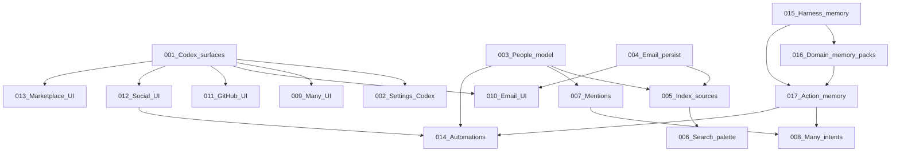

# Implementation Plans — Unificación de fuentes + Codex + memoria

Serie de planes para unificar email, GitHub y social en Dome: persistencia, búsqueda vitaminada, menciones, Many, UI Codex, harness/memoria de dominio y automatizaciones.

**No tocar** [`docs/plans/`](../docs/plans/) (tech-debt, templates). Este árbol es la fuente de ejecución punto a punto.

Ejecutar en el orden de la tabla salvo que las dependencias indiquen lo contrario. Cada executor: leer el plan completo, honrar STOP conditions, actualizar la fila de estado al terminar.

## Execution order & status

| Plan | Title | Priority | Effort | Depends on | Status |
|------|-------|----------|--------|------------|--------|
| 001 | Lenguaje visual Codex para hubs | P0 | M | — | DONE |
| 002 | Terminar Settings Codex | P0 | L | 001 | DONE |
| 003 | Modelo unificado people / identidades | P0 | XL | — | DONE |
| 004 | Persistencia y extracción de email | P0 | XL | — | DONE |
| 005 | Indexar fuentes en FTS/Lance | P0 | XL | 003, 004 | DONE |
| 006 | Buscador vitaminado (⌘K) | P0 | L | 005 | DONE |
| 007 | Sistema de menciones unificado | P0 | L | 003 | DONE |
| 008 | Many: intents + sugerencias visuales | P0 | XL | 007, 017 | DONE |
| 009 | Many UI Codex | P1 | L | 001 | DONE |
| 010 | Tab Email Codex | P1 | L | 001, 004 | DONE |
| 011 | Tab GitHub Codex | P1 | L | 001 | DONE |
| 012 | Tab Social Codex | P1 | L | 001 | DONE |
| 013 | Marketplace / Complementos Codex | P1 | L | 001 | DONE |
| 014 | Automatizaciones de integraciones | P1 | XL | 003, 012, 017 | DONE (STOP) |
| 015 | Harness + cableado de memoria | P0 | L | — | DONE |
| 016 | Packs de memoria de dominio (social + email) | P0 | M | 015 | DONE |
| 017 | Escritura de memoria por acción + relevancia | P0 | L | 015, 016 | DONE |
| 018 | Providers: comments + DM | P0 | XL | 014, 012 | IN PROGRESS |
| 019 | Calendar event inline side panel (no overlay) | P1 | M | — | DONE |
| 020 | Seguimiento full surface inline detail (Minimal + Developer) | P1 | L | 019 | DONE |
| 021 | Seguimiento dashboard único (no técnico) | P1 | L | 020 | DONE |
| 022 | ⌘K buscador unificado (no técnico) | P1 | L | 006, 021 | DONE |
| 023 | Correo superficie agentica (no cliente clásico) | P1 | L | 010, 004, 021 | DONE |
| 024 | Social superficie agentica (crecer / contenido / campañas) | P1 | L | 012, 016, 023 | DONE |

## Dependency graph

## Tracks (pueden avanzar en paralelo)

| Track | Plans | Nota |
|-------|-------|------|
| **UI Codex** | 001 → 002, 009–013 | 001 primero; el resto en paralelo tras 001 |
| **Datos / búsqueda** | 003, 004 → 005 → 006 → 007 | GitHub indexable ya; email necesita 004 |
| **Memoria / harness** | 015 → 016 → 017 | Independiente de UI hasta 008/014 |
| **Many + automations** | 008, 014, **018** | 014 STOP; DMs reales en 018 (comments → DM por provider) |
| **Calendar craft** | **019** | Event detail: Dialog → DetailSheet + motion tokens |

## Decisiones de producto globales

- **Vertical datos:** GitHub (ya en SQLite) → email persistido → social.
- **Memoria:** domains markdown en `{userData}/martin/`, no tablas SQLite de LTM en v1.
- **UI:** patrones Settings/Many actuales (Codex-like); no copiar copy de ChatGPT.
- **People:** identidades internas ligadas a `project_id` / vault; no CRM externo.
- **Automations `#hashtag`→DM:** 014 = draft_only + matrix; **018** = adapters comments/DM por provider + poller live cuando caps lo permitan.

## Cómo ejecutar un plan

1. Abrir el fichero `NNN-….md`.
2. Completar el drift check contra el código actual.
3. Implementar los pasos; un plan ≈ un PR salvo que se indique lo contrario.
4. Validar con los criterios del plan.
5. Marcar Status → DONE en esta tabla y en el frontmatter del plan.

## Formato de cada plan

Objetivo · Drift check · Diseño/datos destino · Implementación · Validación · Criterios de aceptación · STOP · Mantenimiento.
